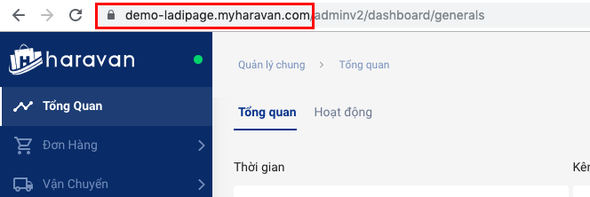

# 2. Đồng bộ đơn hàng từ Landing Page sang Haravan

## **Bước 1 : Tạo tài khoản liên kết.**

**Cách 1 : Tạo tài khoản liên kết từ mục Cài đặt** \
Truy cập trang [builder.ladipage.com](http://builder.ladipage.com/), chọn menu **Cài đặt -> Tích hợp-> Tài khoản liên kết**. Sau đó lựa chọn Loại tài khoản là **Haravan.**

<figure><figcaption></figcaption></figure>

**Cách 2 : Tạo tài khoản liên kết từ mục Landing Pages -> Cấu hình form**

Truy cập trang [builder.ladipage.com](http://builder.ladipage.com/), chọn menu Landing Pages **-> Cấu hình form-> Tạo cấu hình form -> Form data -> Tạo tài khoản liên kết .**&#x53;au đó lựa chọn Loại tài khoản là **Haravan.**

<figure><figcaption>
Chọn Tạo cấu hình form -> Form data 
</figcaption></figure>

<figure><figcaption>
Chọn Tạo tài khoản liên kết
</figcaption></figure>

<figure><figcaption></figcaption></figure>

## **Bước 2:** **Nhập đầy đủ các thông tin:**

**Tên Liên kết:** là tên để phân biệt với các liên kết khác.&#x20;

**API URL:** Đường dẫn trang quản lý Haravan của bạn.

<figure><figcaption></figcaption></figure>

Ấn **(Tiếp tục)** để Lưu tài khoản liên kết.

<figure><figcaption></figcaption></figure>

## Bước 3: **Tạo** cấu hình lưu trữ form.

Vào lại trang builder.ladipage.com, chọn menu **Landing Pages -> Cấu hình form-> Tạo cấu hình form -> Form Data** **.** Bạn bấm nút **Chọn** để sử dụng tài khoản liên kết bạn muốn dùn&#x67;**.**

<figure><figcaption></figcaption></figure>

<figure><figcaption></figcaption></figure>

Nhập **Tên cấu hình** để lưu lại cấu hình form vừa tạo và bấm nút **Hoàn tất**&#x20;

<figure><figcaption></figcaption></figure>

Bạn có thể chọn **thêm tài khoản liên kết** khác cho Cấu hình này. Mỗi cấu hình được chứa tối đa 3 tài khoản liên kết, tương đương với 3 nguồn lưu trữ thông tin khách hàng đồng thời nhận được từ form đăng ký trên Landing Page.

## **Bước 4: thiết lập trên form đăng ký**&#x20;

Quay trở lại form trên trang Landing Page, chọn toàn form bạn đang muốn cài đặt và chọn **"Lưu data":**

.png>)

## **Bước 5 : thiết lập sản phẩm**

&#x20;Sau khi chọn cấu hình form, bạn cần phải vào form đăng ký của bạn, chọn SẢN PHẨM trong Haravan sẽ hiển thị trên form của bạn theo [chi tiết hướng dẫn tại đây](https://help.ladipage.vn/dong-bo-don-hang-sang-cac-nen-tang-website-thuong-mai-dien-tu-va-phan-mem-quan-ly-ban-hang/tao-form-dang-ky-lien-ket-voi-cac-website-thuong-mai-dien-tu-phan-mem-quan-ly-ban-hang).

Vậy là bạn đã hoàn thành việc đồng bộ đơn hàng từ Landing Page sang  mục **Đơn hàng trên Haravan.**

.png>)

.png>)

.png>)
