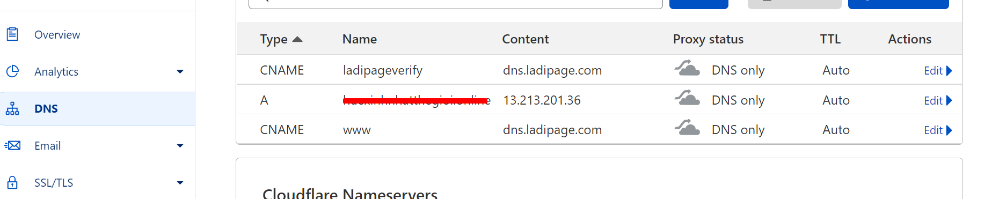
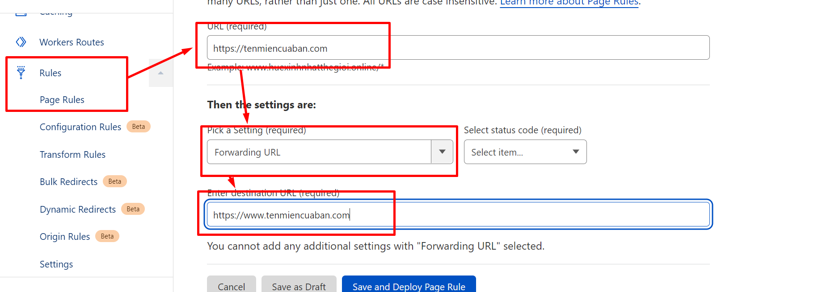

# Trỏ tên miền qua Cloudflare & thủ thuật trong Cloudflare

Trong trường hợp bạn chưa có tài khoản cloudflare, bạn thực hiện các bước sau:

**Bước 1: Đăng ký tài khoản tại** [**https://www.cloudflare.com**](https://www.cloudflare.com/)**.**&#x20;

**Bước 2: Thêm Website vào CloudFlare.**

Đầu tiên bạn bấm Add a Site để thêm tên miền của bạn vào hệ thống CloudFlare. Bạn nhập tên miền chính không có www.

<figure><figcaption></figcaption></figure>

**Bước 3: Lựa chọn Plan.**

CloudFlare có khá nhiều plan với các chức năng cao cấp, tuy nhiên bạn có thể Free Plan.

<figure><figcaption></figcaption></figure>

* Sau khi chọn Free rồi nhấn Confirm Plan, bạn tiếp tục các bước của Cloudflare.

**Bước 4. Xác thực các cấu hình đã có của tên miền.**

* Nếu tên miền đang hoạt động, toàn bộ các bản ghi bạn đã tạo trong quản trị tên miền sẽ được CloudFlare quét và hiển thị lại
* Có thể xuất hiện trường hợp không có bản ghi nào cả, nếu tên miền vừa được đăng ký xong.

**Bước 5: Trỏ Name servers về CloudFlare.**

CloudFlare cung cấp 2 bản ghi Name servers, bạn sao chép 02 Namesever này thay thế cho 02 Nameserver của bên cung cấp tên miền. Trong trường hợp bạn không biết thao tác thay đổi nameserver trong quản trị tên miền, xin vui lòng liên hệ với bên cung cấp tên miền, nhờ hỗ trợ thay đổi Nameserver về 2 bản ghi Name server của Cloudflare.

<figure><figcaption></figcaption></figure>


**Lưu ý:**&#x20;

Khi đã trỏ Nameserver về CloudFlare, cấu hình các bản ghi trong quản trị tên miền sẽ không còn hiệu lực. Tất cả các ghi sẽ được tạo/cập nhật trong tài khoản CloudFlare.


### Tạo bản ghi tên miền về host của LadiPage.

Bạn truy cập vào mục DNS để tạo các bản ghi tên miền.

**1.1  Bản ghi cho việc trỏ Tên miền chính**\
Host record: **www**\
Type (Loại): **CNAME**\
Value (Giá trị): **dns.ladipage.com**

Name: @\
Type: A\
Content: 13.213.201.36\
\
Name: **ladipageverify**\
Type: **CNAME**\
Content: **dns.ladipage.com**

<figure><figcaption></figcaption></figure>

**\*Lưu ý:** tắt biểu tượng đám mây như ảnh hướng dẫn cho bản gh&#x69;**.**

**1.2 Bản ghi cho việc trỏ Tên miền phụ.**

Host record: **khuyenmai** (là tiền tố phụ mà bạn muốn sử dụng. Tên miền phụ sau đó sẽ có dạng khuyenmai.tenmiencuaban.com)\
Type (Loại): **CNAME**\
Value (Giá trị): **dns.ladipage.com**

Host record: **ladipageverify**\
Type (Loại): **CNAME**\
Value (Giá trị): **dns.ladipage.com**

.png>)

### **Thủ thuật Page Rule điều hướng** https://khôngwww sang https://cówww

Vào Dashboad của Cloudflare--> chọn Page Rules---> Create Page Rule.

Điền các thông tin lần lượt như sau:

1. Điền link https không có www.
2. Chọn setting: Fowarding URL + 301- Permanent Redirect.
3. Điền link https có www.

<figure><figcaption></figcaption></figure>

## Video hướng dẫn chi tiết.




[xac-thuc-ten-mien-tai-ladipage.md](xac-thuc-ten-mien-tai-ladipage.md)

