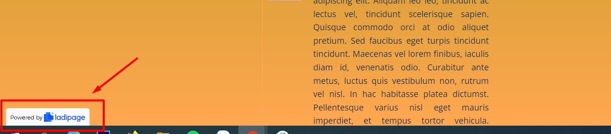

# Tải Landing Page lên hosting riêng

Sau khi thiết kế Landing Page trên nền tảng LadiPage, bạn có thể tải file HTML của Landing Page đó để sử dụng trên hosting riêng của mình.&#x20;

Trên trang **Quản lý Landing Page**, lựa chọn menu tùy chỉnh của Landing Page muốn tải và chọn Export .html như hình dưới đây. Bạn cần xuất bản landing page trước khi thực hiện thao tác tải file .html về máy tính.

<figure><figcaption></figcaption></figure>

Sau khi tải file HTML của Landing Page về máy tính, bạn up file .html lên hosting riêng để sử dụng. Trang landing page gắn vào hosting riêng sẽ có logo của LadiPage ở dưới chân trang như bên dưới.

Để mất đi logo LadiPage trên trang, bạn thực hiện theo 02 bước sau:

**Bước 1: Tạo bản ghi sau trong phần quản lý DNS của tên miền:**

Bản ghi này chỉ có mục đích xác thực tên miền trong tài khoản LadiPage để bỏ logo LadiPage ở chân trang và không ảnh hưởng tới các bản ghi hiện tại của bạn đang có:\
**Host Record:** ladipageverify\
**Type (Loại):** CNAME\
**Value (Giá trị):** [dns.ladipage.com](http://dns.ladipage.com/)

**Bước 2:** **Xác thực tên miền trong tài khoản LadiPage:**

* Trong tài khoản LadiPage, bạn vào mục LandingPage ->Tên miền
* Bấm chọn Tạo tên miền mới.
* Chọn **nền tảng hosting riêng**, điền đúng định dạng tên miền riêng của bạn.
* Bấm xác thực tên miền bạn vừa thêm vào.

<figure><figcaption></figcaption></figure>

<figure><figcaption></figcaption></figure>

Như vậy là bạn có thể dùng trang Landing Page trên hosting riêng mà không bị vướng logo "Landing Page miễn phí".


**Lưu ý:**

* Bạn cần xuất bản landing page trước khi tải file .html.
* Tài khoản LadiPage starter(miễn phí) không hỗ trợ tải file .html.
* Tên miền chọn nền tảng Hosting riêng không hỗ trợ Bật SSL.
* Trang landing page được tải file .html và up lên hosting riêng sẽ có logo LadiPage dưới chân trang đối với tài khoản LadiPage hết hạn.

