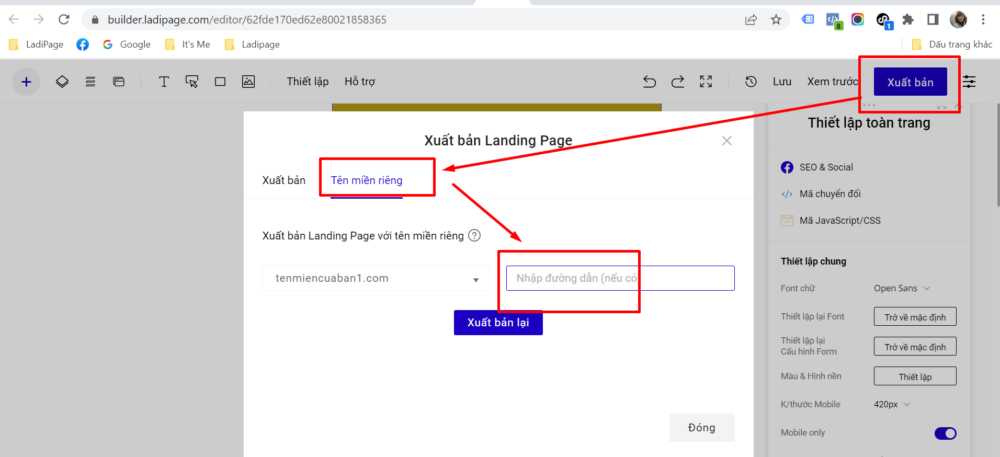

# Xuất bản Landing Page lên nền tảng WordPress

Để tải Landing Page lên website WordPress bạn cần thực hiện theo hai phần sau đây:

## Phần 1: Cài đặt Plugin LadiPage trong Wordpress.

Bước 1: Đăng nhập trang quản trị website WordPress của bạn với **quyền Admin.**

Bước 2: Tại menu **Plugins** chọn **Add New Plugin** để cài đặt plugins mới.

Bước 3:  Chọn Tệp file plugin LadiPage để cài đặt plugin vào Wordpress


Tải tệp cài đặt ứng dụng plugin LadiPage [tại đây](http://v5.help.ladipage.vn/plugin-wp)





Trong trường hợp tải file.ladipage báo lỗi, vui lòng kiểm tra lại thông tin hosting, xem cấp quyền tải file không.


Bước 4: Bấm chọn app LadiApp vừa cài, sau đó sao chép lại nội dung trong 2 ô **API KEY** và **API URL (Lưu ý: bấm Save Changes sau khi lấy API).**

 (2).png>)

## Phần 2: Xuất bản Landing Page thành thư mục con trên Wordpress.

**Bước 1: Tạo bản ghi xác thực tên miền.**

* Bạn cần vào phần quản lý tên miền chính của mình (chính là tên miền ở ô API URL ở phần 1).
* Tạo bản ghi sau trong phần quản lý DNS của tên miền:\
  **Host Record:** ladipageverify\
  **Type (Loại):** CNAME\
  **Value (Giá trị):** [dns.ladipage.com](http://dns.ladipage.com/)

**Ghi chú:** Bản ghi này chỉ có mục đích xác thực tên miền của bạn trong tài khoản LadiPage để bỏ logo LadiPage ở chân trang và không ảnh hưởng tới các bản ghi hiện tại của bạn đang có. Tài khoản LadiPage starter- miễn phí mặc định có logo LadiPage dưới chân tran&#x67;**.**

**Bước 2: Thêm tên miền trong tài khoản LadiPage.**

* Đăng nhập tài khoản LadiPage, chọn mục **LandingPage ->Tên miền** bấm chọn **Tạo tên miền mới (lưu ý xác thực email tài khoản đối với tài khoản LadiPage Starter - Miễn phí để tạo được tên miền mới,** [**hướng dẫn chi tiết tại đây)**](../../vii.-quan-ly-landingpage/chinh-sua-thong-tin-tai-khoan.md)**.**

<figure><figcaption></figcaption></figure>

* Chọn **Nền tảng** **WordPress** sau đó nhập **API URL** và **API KEY** mà bạn vừa sao chép ở bước 4-phần 1.
* Bấm nút **Tạo tên miền** để hoàn tất.

**Bước 3: Xác thực tên miền.**

Sau khi thêm tên miền, bạn bấm vào icon ... chọn Xác thực tên miền.

<figure><figcaption></figcaption></figure>

**Bước 4: Xuất bản landing page với tên miền nền tảng LadiPage.**

1. Trong trang chỉnh sửa landing page, bấm nút **Xuất bản** Landing Page tại thanh công cụ bên phải trong LadiPage Builder.
2. Chọn mục **Tên miền riêng** và chọn **Xuất bản với tên miền riêng.**
3. Tại phần **Chọn tên miền** bạn chọn địa chỉ website WordPress của bạn.
4. Nhập tên thư mục con mà bạn muốn tạo sau dấu "/".
5. Bấm nút **Xuất bản lại** để tải Landing Page lên WordPress. Sau khi xuất bản xong ngay lập tức bạn có thể truy cập vào đường dẫn vừa được xuất bản thành công.

**Lưu ý: Trong trường hợp xuất bản mà bạn gặp thông báo như trường hợp dưới đây:**

.png>)

Bạn cần vào lại phần plugin LadiApp trong quản trị Wordpress, và sao chép đoạn Key trong thông báo trên và dán vào phần như ảnh và ấn Publish.

 (1).png>)

Đường dẫn landing page xuất bản sẽ hiển thị ngay trong tài khoản Wordpress của bạn khi bạn bấm Publish. Bạn sao chép đường dẫn đó và dán vào thanh trình duyệt để ra trang landing page xuất bản.


**Lưu ý:**&#x20;

* Tên miền chọn nền tảng Wordpress sẽ không bật được SSL trong tài khoản LadiPage.
* LadiPage chỉ hỗ trợ xuất bản landing page lên nền tảng Wordpress dưới dạng thư mục con (ví dụ: tenmiencuaban.com/landingpage) và hiển thị nội dung trang xuất bản như đúng thiết kế trong tài khoản LadiPage. Nếu bạn muốn xuất bản với tên miền chính (ví dụ: tenmiencuaban.com) và hiển thị thanh header/footer của wordpress, bạn vui lòng cài đặt trong tài khoản wordpress của bạn. LadiPage sẽ không hỗ trợ phần cài đặt này.
* Các trang landing page xuất bản với nền tảng Wordpress sẽ không có báo cáo của LadiPage (Người truy cập, chuyển đổi, chuyển đổi duy nhất, tỷ lệ chuyển đổi và doanh thu).

