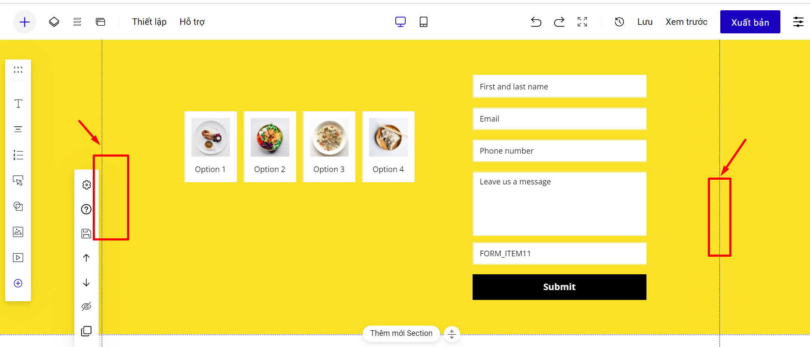

# 1. Các chế độ thiết kế giao diện Landing page

#### Hiện tại landing page có 3 chế độ thiết kế giao diện: Responsive, Mobile Only và Adaptive.

Bấm vào mục Tạo Landing Page mới --> Chọn giao diện --> chọn Kiểu thiết kế bạn muốn sử dụng:

<figure><figcaption></figcaption></figure>

<figure><figcaption></figcaption></figure>

* Sử dụng giao diện mẫu: chọn được 01 trong 03 chế độ thiết kế, nhưng nếu bạn chọn chế độ thiết kế Adaptive thì sẽ chỉ hiển thị giao diện Desktop, giao diện Mobile sẽ trắng tinh và bạn cần thiết kế lại giao diện Mobile từ đầu.
* Sử dụng trang trắng: chọn 01 trong 03 kiểu thiết kế và thiết kế giao diện landing page từ đầu.
* Tải file LadiPage từ máy tính: file bạn trước đó được thiết kế theo kiểu thiết kế nào, thì sẽ GIỮ NGUYÊN như vậy, không có phần chọn thay đổi chế độ thiết kế.
* Chọn các chế độ thiết kế tại:

<figure><figcaption></figcaption></figure>


Sau khi đã chọn kiểu thiết kế và chỉnh sửa giao diện landing page, bạn có thể thay đổi thiết kế từ Responsive sang Mobile Only và ngược lại. Nhưng khi chọn chế độ Adaptive thì **KHÔNG** thay đổi được sang chế độ thiết kế khác.



Chế độ Adaptive chỉ áp dụng cho tài khoản có chế độ Phân quyền tài khoản (Enterprise/Premium/ Business).


## Chế độ Responsive: giao diện desktop và Mobile phụ thuộc lẫn nhau.

Khi thiết kế thì bạn cần phải thiết kế bản Desktop trước.&#x20;

**Thiết kế giao diện Desktop:**

* Trên Desktop bạn nên tạo nhóm các phần tử đi liền nhau, để sang mobile, các phần cũng sẽ đi liền với nhau.
* Các nội dung/hình ảnh chính bạn nên thiết kế trong khung nét đứt để trang xuất bản sẽ hiển thị tối ưu trên mọi giao diện/trình duyệt.

<figure><figcaption></figcaption></figure>

* Bạn có thể chọn khung thiết kế destop theo khung 960px hoặc 1200px.

<figure><figcaption></figcaption></figure>

**Thiết kế giao diện Mobile:**

* Nội dung bản Mobile sẽ phụ thuộc vào các nội dung bạn tạo từ bản Desktop. Bạn KHÔNG KÉO DI CHUYỂN PHẦN TỬ RA KHỎI SECTION ban đầu thiết kế và KHÔNG HỦY NHÓM để không ảnh hưởng tới thiết kế bản desktop.
* Nếu sang thiết kế bản mobile bị lệch, bạn thực hiện kéo thủ công lại để việc hiển thị được đẹp nhất, hoặc chọn sắp xếp tự động toàn trang landing page hoặc sắp xếp tự động theo từng section.

<figure><figcaption></figcaption></figure>

* Phần thiết kế mobile có thể độc lập với bản desktop ở các nội dung:  HÌNH NỀN, MÀU SẮC của phần tử hoặc section bằng cách KHÔNG ĐỒNG BỘ theo hướng dẫn[ tại đây](../xvi.-nang-cao-cho-phan-tu/dong-bo-khong-dong-bo-thiet-ke.md). Nếu bạn thay đổi KÍCH THƯỚC, SIZE CHỮ, VỊ TRÍ PHẦN TỬ giữa desktop và mobile thì không cần phải bật Không đồng bộ.
* Bạn có thể chọn khung thiết kế mobile 420px hoặc 320px.

<figure><figcaption></figcaption></figure>


**Tips:**&#x20;

**Nếu bạn thay đổi nội dung trên mobile thì desktop cũng sẽ thay đổi và ngược lại. Vì vậy nếu bạn thiết kế nội dung cho mobile và desktop khác nhau, bạn cần tạo nội dung đó trong cả 2 giao diện, rồi ẩn phần tử đó ở 1 giao diện, bạn xem hướng dẫn chi tiết** [**tại đây**](https://help.ladipage.vn/thiet-ke-cho-phan-tu/thanh-thiet-ke-nhanh-phan-tu/an-phan-tu-tren-mobile-desktop)**.**


## Chế độ Mobile Only : giao diện desktop và mobile cùng sử dụng giao diện mobile.

Mobile Only là tính năng đặc biệt của LadiPage, cho phép bạn chỉ thiết kế trên giao diện mobile và tắt giao diện desktop. Khi khách hàng truy cập bằng desktop, màn hình sẽ hiển thị bé lại bằng khung hình mobile.

Sử dụng mobile only giúp bạn tiết kiệm thời gian thiết kế để chạy nhanh các chiến dịch quảng cáo đối với các sản phẩm mà nguồn khách hàng truy cập chủ yếu từ các thiết bị di động.

Khi bạn đang ở chế độ thiết kế Responsive, bạn có thể thay đổi để chuyển sang giao diện Mobile Only theo hướng dẫn: vào mục **Thiết lập** ở menu trên cùng và chọn **Thiết lập toàn trang**. Sau đó bật chế độ Mobile only.

<figure><figcaption></figcaption></figure>


Sau khi đã chọn kiểu thiết kế và chỉnh sửa giao diện LandingPage, bạn có thể thay đổi thiết kế từ Responsive sang Mobile Only và ngược lại.


## Chế độ Adaptive: giao diện Desktop và Mobile hoàn toàn độc lập.

Với chế độ Adaptive, bạn cần thiết kế lần lượt cả giao diện desktop và giao diện mobile, nội dung của 2 phiên bản hoàn toàn ĐỘC LẬP với nhau.

Sau khi thiết kế, bạn cần vào cả 2 phiên bản Desktop và Mobile, bấm xuất bản lần lượt các phiên bản để cập nhật và hoàn thiện nội dung thiết kế. **Nếu không xuất bản 1 trong 2 giao diện, thì giao diện đó sẽ ở trạng thái 404 của LadiPage.**


* Chế độ Adaptive chỉ áp dụng cho tài khoản có tính năng phân quyền thành viên Enterprise/Premium/Business.
* Chế độ Adaptive chỉ xuất bản được với tên miền sử dụng nền tảng LadiPage Cloud DNS, không hỗ trợ với các nền tảng khác và tải file .html để up lên hosting riêng.
* Nếu trang đã chọn kiểu thiết kế Adaptive thì bạn sẽ không chuyển được sang kiểu thiết kế Responsive và Mobile only.
* Nhân bản trang kiểu thiết kế Adaptive, chọn kiểu thiết kế cho trang mới là Responsive hoặc mobile only thì sẽ hiển thị giao diện chỉnh sửa desktop của trang gốc, không giữ được giao diện chỉnh sửa mobile của trang gốc.


