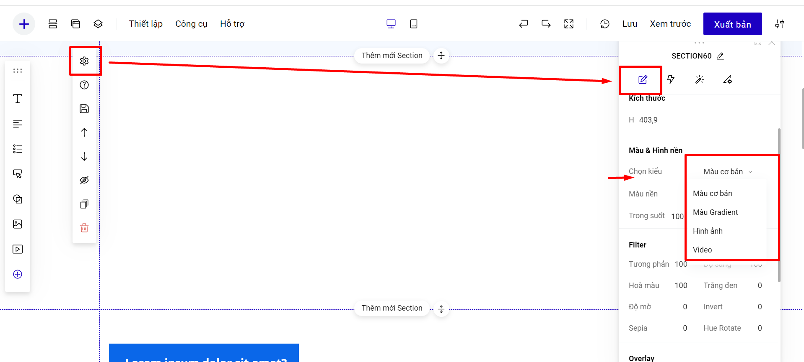

# Các thao tác với Section

## Thay ảnh nền /backgroud cho section.

Bạn có thể sử dụng nền section bằng Màu cơ bản, Màu Gradient, Hình ảnh và Video.&#x20;

<figure><figcaption></figcaption></figure>

Kích thước ảnh nền section bạn có thể tham khảo:

* Desktop: ngang 1960px, chiều dọc tùy ý nhưng nhỏ hơn 800px, đẹp nhất là từ 600 đến 768px.
* Mobile: ngang 420px (hoặc 320px), chiều dọc tùy ý.


**Lưu ý:**&#x20;

* Ảnh tải lên có dung lượng tối đa 5MB và kích thước tối đa 3000px\*3000px.
* Kiểu nền section là video -  LadiPage video sẽ chỉ hỗ trợ cho gói trả phí của LadiPage, dung lượng <5MB (gói PRO, Standard và Lite) và <20MB (gói Business, Premium và Enterprise).
* Kiểu nền video sẽ mặc định ở chế độ tự động chạy và không có tiếng.
* Nếu bạn chọn chế độ Responsive để thiết kế landing page, thì bạn có thể thay đổi nền section bản mobile và desktop khác nhau.


## Lên trên - Xuống dưới.

.png>)

Lên trên - xuống dưới là chức năng giúp bạn thay đổi vị trí của 1 section: đẩy section này lên trước section ở trên hay đẩy xuống dưới section hiện tại.

Ngoài việc di chuyển section bằng nút Lên- Xuống như bên trên, bạn cũng có thể vào mục danh sách Section trên trang để kéo thả chuyển đổi vị trí.

## Ẩn section.

.png>)

Ẩn section là chức năng giúp bạn ẩn toàn bộ section đang chọn, section sẽ không bị xóa đi, nhưng sẽ không hiển thị tới người xem.&#x20;

**Lưu ý: Ẩn section ở desktop và mobile là độc lập với nhau.**

## Nhân bản section.

Nhân bản là chức năng tạo ra một section mới y hệt nội dung và thiết kế của section cũ.

.png>)

## Xóa section.

Xóa section sẽ xóa toàn bộ nội dung và thiết kế của section đó. Bạn có thể Ctrl+Z để hoàn tác lại thao tác đó nếu bấm nhầm.

.png>)


**Lưu ý: Sau khi Lưu Landing Page thì không thể hoàn tác lại thao tác xóa này.**


Ngoài việc xóa  section bằng nút xóa như bên trên, bạn cũng có thể vào mục danh sách Section trên trang Xóa section.

.gif>)

