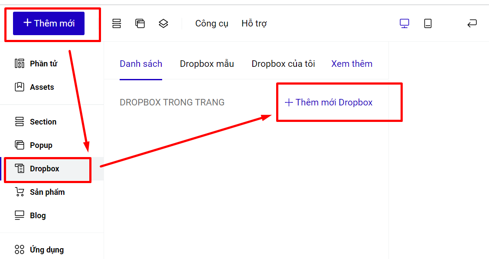

# 5. Dropbox

1. **Tạo nội dung Dropbox**&#x20;

Truy cập nội dung Dropbox ở thanh công cụ bên tay trái builder, bấm chọn mục Thêm mới Dropbox để tạo mới, hoặc bấm chọn Dropbox đã tạo để sửa lại nội dung.

<figure><figcaption></figcaption></figure>

Bạn sẽ tạo nội dung cho Dropbox bằng cách thêm mới các phần tử, nội dung từ mục **Thêm mới--> Phần tử hoặc từ thanh công cụ nhanh.**

Bạn cần ghi nhớ ID của phần tử Dropbox để sử dụng cho mục Sự kiện --> Nhấp Chuột/Rê chuột--> Dropbox.

.png>)

Sau khi đã hoàn thiện nội dung của Dropbox, bạn sẽ đi liên kết hiển thị cho phần tử đến Dropbox bạn đã tạo. Cách đi liên kết tới dropbox: [sự kiện rê chuột đến dropbox](https://help.ladipage.vn/su-kien-cho-phan-tu/su-kien-re-chuot/su-kien-dropbox) và [sự kiện nhấp chuột đến dropbox](https://help.ladipage.vn/su-kien-cho-phan-tu/su-kien-nhap-chuot/su-kien-dropbox).


**So sánh Dropbox và Popup.**&#x20;

1. Khi phần tử được liên kết sự kiện đến popup thì popup hiển thị theo các vị trí hiển thị cố định của popup được thiết lập, KHÔNG phụ thuộc vào vị trí phần tử liên kết đến popup.
2. Khi phần tử được thiết lập đến Dropbox, thì khi dropbox hiển thị theo vị trí thiết lập so với phần tử, dựa vào phần Vị trí, khoảng cách bạn thiết lập cho dropbox và phần tử đó.
3. Dropbox chỉ dùng cho phần liên kết phần tử trong mục Sự kiện, KHÔNG hiển thị độc lập trên trang như popup (thoát trang, vào trang, tới 1 section).



**Lưu ý Dropbox.**

* Sau khi đã hiển thị dropbox, khi click ra ngoài phần tử thì phần dropbox mới bị mất đi, còn không thì nội dung sẽ được hiển thị  luôn luôn trên trang.&#x20;
* Không nên cài đặt bên trong dropbox lại mở 1 dropbox khác.
* Khi bạn tạo dropbox, trong đó có chứa nội dung liên kết đến 1 popup, thì khi mở popup sẽ bị đè dưới dropbox, muốn tắt đi dropbox thì bạn cần thiết lập phần ẩn phần tử cho dropbox ở phần tử liên kết đến popup.

