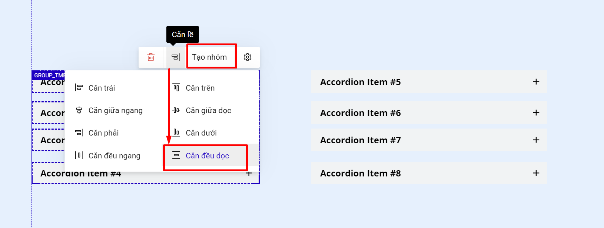

# Accordion

Tính năng Accordion có mục đích sử dụng tương tự như sự kiện Collapse, tuy nhiên thao tác sử dụng sẽ dễ dàng hơn so với sự kiện collapse.&#x20;

Accordion giúp bạn ẩn và hiển thị 1 nội dung trên trang, giúp người dùng có thể chủ động mở rộng/ẩn nội dung để xem, tiết kiệm không gian hiển thị, thường được dùng cho phần Q\&A trên trang landing page.

Để sử dụng Accordion bạn thao tác theo các bước sau:

**Bước 1: Tạo khung Accordion.**

Bạn vào thanh công cụ nhanh --> chọn Accordion.

<figure><figcaption></figcaption></figure>

Hoặc bạn vào Thêm mới--> Phần tử--> Accordion.

<figure><figcaption></figcaption></figure>

**Bước 2: Chỉnh sửa nội dung và thiết lập cho Accordion.**

Accordicon sẽ bao gồm Accordicon\_Menu và Accordicon\_Content.

<figure><figcaption></figcaption></figure>

1. **Accordion\_Menu:**

* Bạn có thể thay đổi nội dung, màu sắc, size, font chữ của văn bản của Accordion\_Menu như thiết lập của phần tử Tiêu đề, chi tiết [tại đây](https://help.ladipage.vn/cac-phan-t-co-ban-tren-landingpage/phan-tu/tieu-de-doan-van-danh-sach).

<figure><figcaption></figcaption></figure>

* Bạn có thể thay đổi biểu tượng và thiết lập cho biểu tượng của Accordicon\_Menu bằng cách bấm vào biểu tượng và thiết lập như trong ảnh:

<figure><figcaption></figcaption></figure>

* Bạn có thể thiết lập màu, kích thước, bo góc...của Accordion\_Menu tại phần Thiết lập.

<figure><figcaption></figcaption></figure>

2\. **Accordion\_Content:**

Bạn thiết lập/thay đổi nội dung cho văn bản như sau:

<figure><figcaption></figcaption></figure>

Bạn có thể thêm các phần tử khác như nút bấm, hình ảnh... tại Accordion\_Content để sử dụng.&#x20;

<figure><figcaption></figcaption></figure>

Khi bạn sử dụng Accordion thì mặc định ở chế độ hiển thị nội dung Accordion\_Content. Nếu bạn muốn ẩn, bạn bấm chọn toàn Accordion rồi chọn Ẩn nội dung như hình bên dưới. Bạn muốn chỉnh sửa nội dung Accordicon\_Content thì bấm Hiện nội dung lại.

<figure><figcaption></figcaption></figure>


**Lưu ý:**

Với Collapse thì bạn nên thiết kế theo hàng, không thiết kế nội dung thành các cột. Còn Accordion có thể xếp thành 2-3 cột tùy theo mục đích của bạn.


<figure><figcaption></figcaption></figure>

<figure><figcaption></figcaption></figure>

Để thiết kế nội dung thành các cột, bạn cần tạo nhóm các nội dung từng cột thành nhóm và chọn căn đều dọc.

<figure><figcaption></figcaption></figure>
