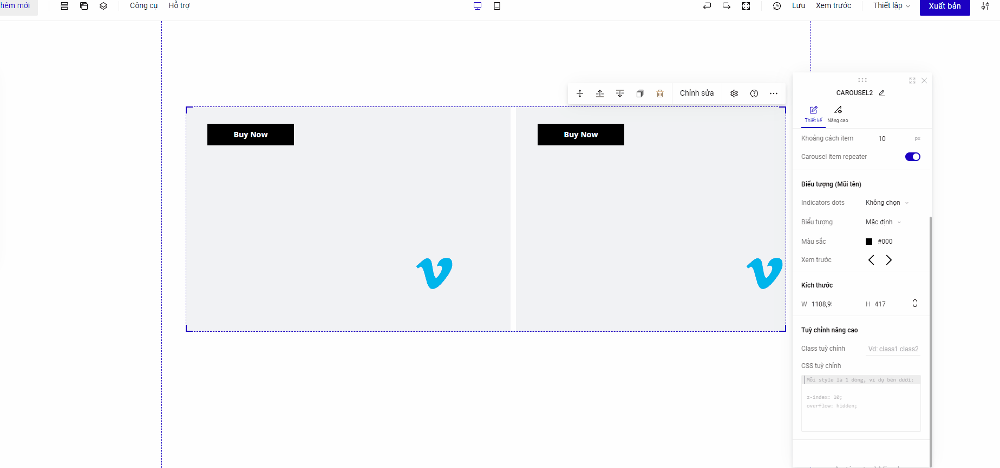

# Carousel V3.1

Tính năng Carousel cho phép bạn tạo hiệu ứng chạy xoay vòng cho các phần tử để hiển thị dưới dạng slide hoặc danh sách sản phẩm.

Bạn vào mục Thêm mới -> Phần tử-> Carousel để chọn sử dụng tính năng này&#x20;

<figure><figcaption></figcaption></figure>

* Bật chế độ Carousel Item Repeater : khi bạn bật tính năng này, thì các carousel items sẽ giống hệt nhau về phần màu sắc/ ảnh nền, bố cục thiết kế cũng như các hiệu ứng sử dụng&#x20;
* Tắt chế độ Carousel Item Repeater : khi bạn tắt tính năng này thì các carousel items sẽ thiết kế hoàn toàn độc lập với nhau&#x20;

<figure><figcaption>
Cách chỉnh sửa Carousel 
</figcaption></figure>


Với chế độ Repeater, khi sử dụng các phần tử : Nhóm nút bấm, form, carousel, collection list, tabs, table, survey, accordion, countdown, notify, spin lucky, review, group , product list, cart button sẽ hiển thị độc lập ở  carousel\_items sử dụng phần tử, không hiển thị repeat ở tất cả các carousel\_items


