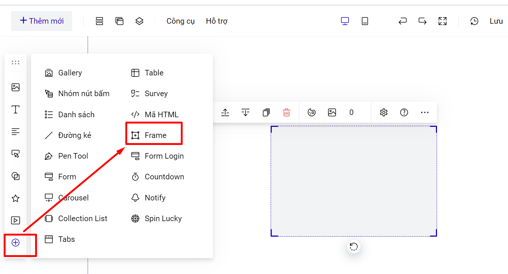
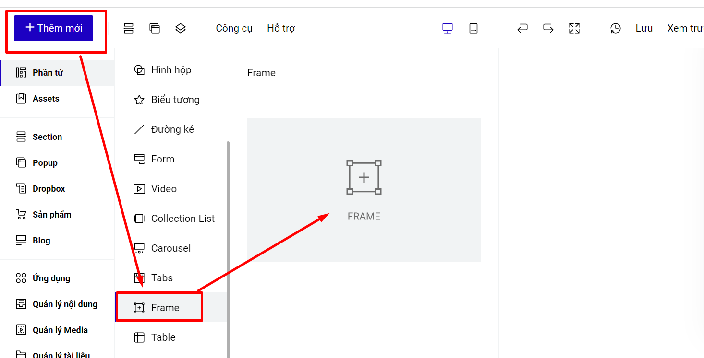

# Frame

Frame là một tính năng mạnh mẽ giúp bạn có thể thay đổi thiết kế của các phần tử giống nhau cùng một lúc. Tất cả các thiết kế có thể được đồng bộ giữa các frame, **ngoại trừ việc thay ảnh và thay chữ.** Cách làm như sau:

* Thêm mới **Frame** và đưa các phần tử vào trong và sắp xếp theo ý. Bạn có thể thiết kế Frame như thiết kế một [**hình hộp**](broken-reference)**,** hoặc có thể thiết kế trong suốt để ẩn frame.

Bạn vào thanh công cụ nhanh --> Frame.

<figure><figcaption></figcaption></figure>

Hoặc vào phần Thêm mới--> Phần tử--> Frame.

<figure><figcaption></figcaption></figure>

* Nhân bản Frame vừa tạo để sao chép bố cục và thiết kế. Bạn có thể thay ảnh và chữ.
* Khi thay đổi thiết kế nội dung của một frame, các frame liên quan sẽ thay đổi theo nội dung đó.
* Khi thêm phần tử vào frame, thì phần tử đó sẽ thuộc frame luôn, không cần tạo nhóm.
* Cài đặt hiệu ứng hiển thị cho frame, thì các phần tử trong frame cũng sẽ hoạt động hiệu ứng đó.

