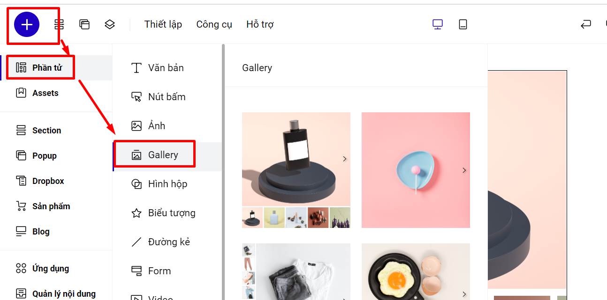
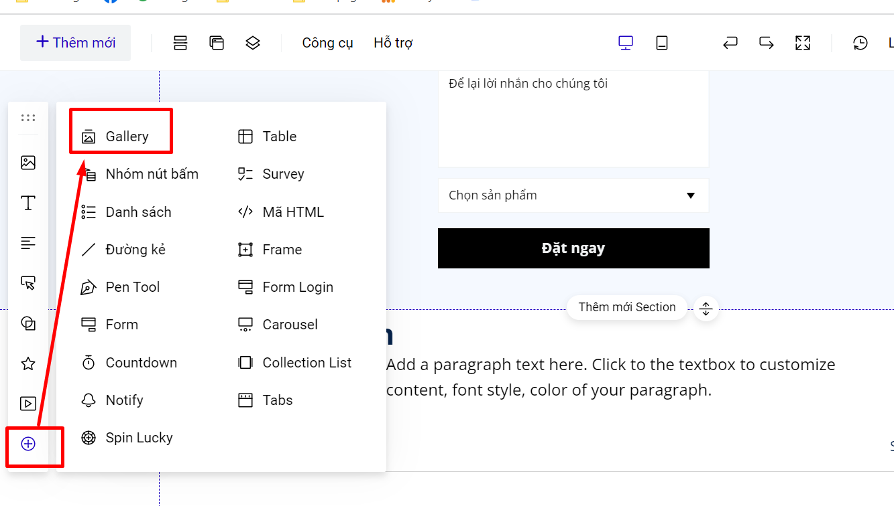
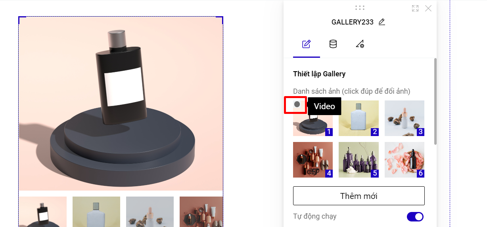
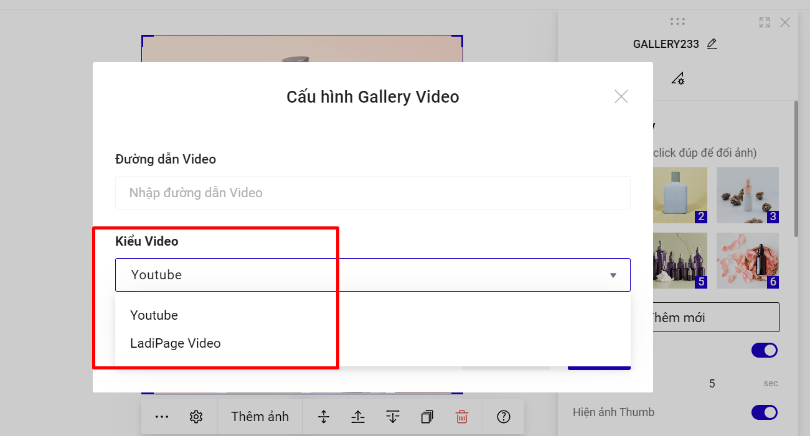
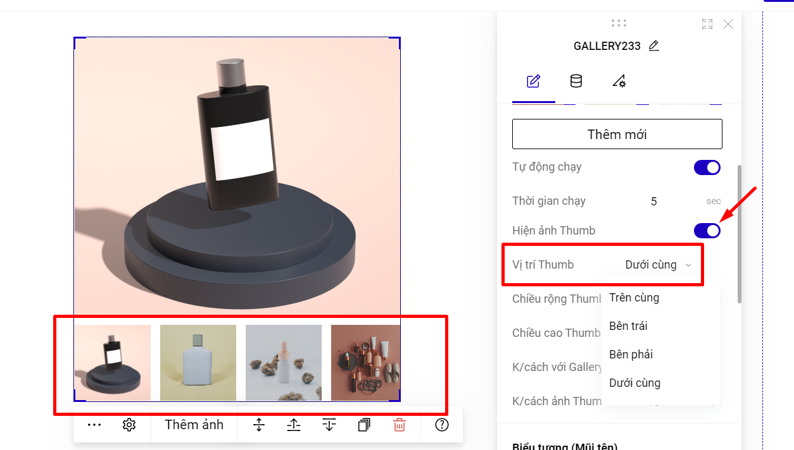
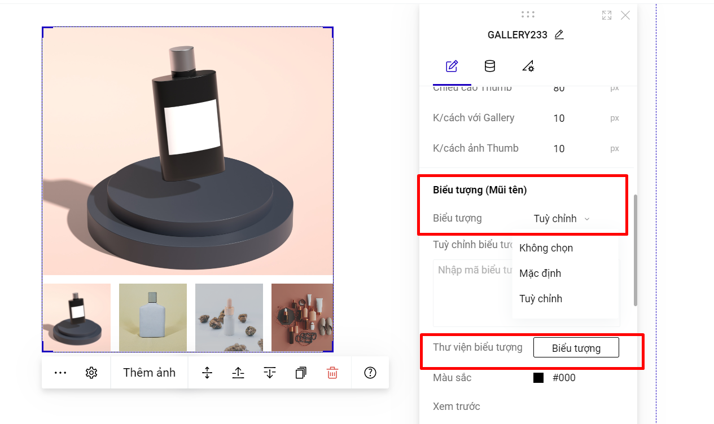

# Gallery

Tính năng này cho phép bạn có thể dễ dàng tạo Gallery ảnh/video chỉ với vài bước đơn giản, giúp tăng trải nghiệm khách hàng khi xem hình ảnh/video về sản phẩm. Để thêm Gallery vào Landing Page bạn có thể làm theo các bước sau đây:

**Bước 1: Tạo khung Gallery.**

Bạn bấm chọn Thêm mới--> Phần tử --> Gallery.&#x20;

<figure><figcaption></figcaption></figure>

Hoặc sử dụng thanh công cụ nhanh để sử dụng Gallery:

<figure><figcaption></figcaption></figure>

Bạn kéo các góc của Gallery để tùy chỉnh khung hiển thị Gallery hoặc tùy chỉnh tại phần Kích thước:

<figure><figcaption></figcaption></figure>

**Bước 2: Thêm ảnh hoặc video vào Gallery:**

Bạn có thể thêm ảnh tại thanh thiết kế nhanh hoặc tại mục Thêm mới tại Thiết lập Gallery hoặc click đúp vào ảnh để đổi ảnh. Bạn có thể chọn nhiều ảnh bằng cách bấm giữ nút **Shift** hoặc nút **Ctrl** trên bàn phím đồng thời click chuột vào các ảnh muốn chọn.

**Lưu ý: Các ảnh thêm vào Gallery nên để kích thước đồng đều để hiển thị được đẹp nhất.**

<figure><figcaption></figcaption></figure>

Để sử dụng video bạn bấm vào icon như hình bên dưới. Bạn có thể sử dụng video từ link youtube hoặc video tải từ máy tính.

<figure><figcaption></figcaption></figure>

<figure><figcaption></figcaption></figure>

**Lưu ý:** **Video từ máy tính hỗ trợ cho tài khoản LadiPage trả phí, dung lượng tối đa <5MB (Gói Pro/ Standard/ Lite) và <20MB (Gói Business/ Premium/ Enterprise)**.

Khi bạn sử dụng video trong Gallery, hình đại diện hiển thị của video chính là hình ảnh đang hiển thị trên slide Gallery.

Bạn có thể tùy chỉnh thứ tự hiển thị hình ảnh/video của Gallery bằng cách bấm vào ảnh rồi thay đổi vị trí trong danh sách ảnh của Gallery.

**Bước 3: Các thiết lập khác cho Gallery.**&#x20;

* Thiết lập tự động chạy, Thời gian chạy (thời gian hiển thị ảnh/video tiếp theo trong Gallery). Cơ chế chuyển tiếp ảnh/video là 1-2-3-4-4-3-2-1.
* Hiển thị thumb Gallery: Hình ảnh thumb là tập hợp các ảnh/video theo thứ tự trong danh sách ảnh Gallery với kích thước nhỏ.

<figure><figcaption></figcaption></figure>

* Biểu tượng (mũi tên): Bạn có thể sử dụng biểu tượng mặc định của LadiPage hoặc tùy chỉnh biểu tượng bằng cách chọn biểu tượng từ kho biểu tượng. Bạn có thể thay đổi màu sắc của biểu tượng nhưng **KHÔNG** tùy chỉnh được kích thước của biểu tượng.

<figure><figcaption></figcaption></figure>

Nếu bạn không muốn sử dụng nút bấm chuyển tiếp trên Gallery, bạn có thể thêm nút bấm ngoài Gallery và sử dụng sự kiện chuyển tab, chi tiết chuyển tab [tại đây](https://help.ladipage.vn/su-kien-cho-phan-tu/su-kien-nhap-chuot/su-kien-chuyen-tab).

<figure><figcaption></figcaption></figure>

* Thiết lập Full Width: full width giúp hiển thị ảnh/video của Gallery ở chế độ toàn màn hình. Khi thiết lập full width, bạn nên tải ảnh có kích thước chiều rộng là 1960px, chiều cao tùy ý.

**Video hướng dẫn chi tiết:**

