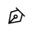
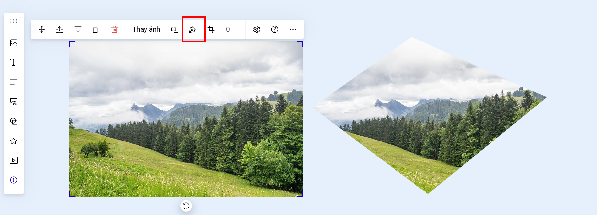

# Cắt hình ảnh

Để cắt ảnh bạn có thể sử dụng crop hoặc pentool.

1. **Crop ảnh:**

Bạn vào mục cắt ảnh như bên dưới để cắt ảnh.

<figure><figcaption></figcaption></figure>

Bạn co kéo các góc của ảnh tùy chỉnh theo khung cắt ảnh, hoặc di chuyển ảnh tùy biến theo khung crop ảnh, sau đó bạn bấm xong để hoàn thiện phần cắt ảnh.&#x20;

<figure><figcaption></figcaption></figure>

**2. Pentool:**

Để sử dụng pentool, bạn vào icon  để tùy chỉnh cắt ảnh theo nhu cầu.

<figure><figcaption></figcaption></figure>

Bạn đặt bút vào điểm đầu tiên rồi kéo chuột tới điểm thứ 2 và Enter để ghi nhận điểm thứ 2, các điểm khác cũng làm tương tự. Pentool sẽ kết thúc khi điểm cuối cùng trùng khớp với điểm đầu tiên.&#x20;

Sau khi kết thúc bạn bấm lưu để được ảnh cắt. Bạn có thể hoàn tác lại thao tác hoặc xóa bỏ phần thao tác cắt ảnh pentool này.

<figure><figcaption></figcaption></figure>
