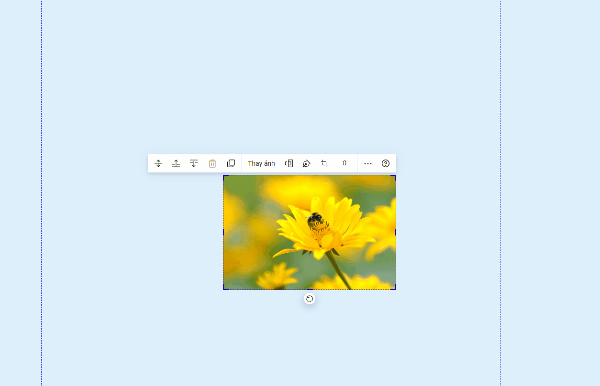
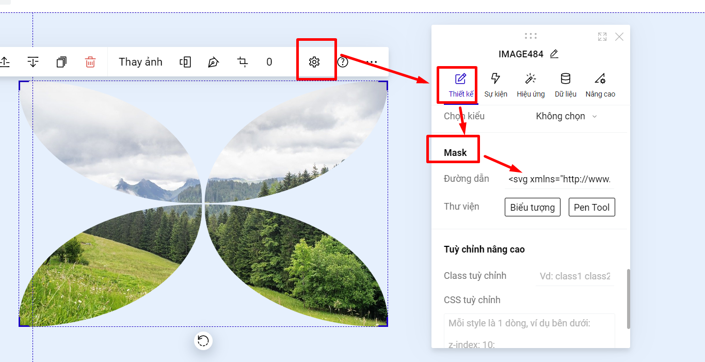

# Mask cho ảnh

Mask là một lớp hiệu ứng theo nhiều hình dạng khác nhau chèn lên ảnh. Để sử dụng, bạn bấm chuột **Chọn ảnh,** sau đó chọn biểu tượng **Mask:**&#x20;

**Khi thêm hiệu ứng Mask.**

.png>)

Để xóa không sử dụng mask nữa, bạn cần vào **Thiết lập --> Thiết kế của ảnh-->** kéo xuống phần Mask-->  Bỏ đi đường dẫn của biểu tượng.

<figure><figcaption></figcaption></figure>
