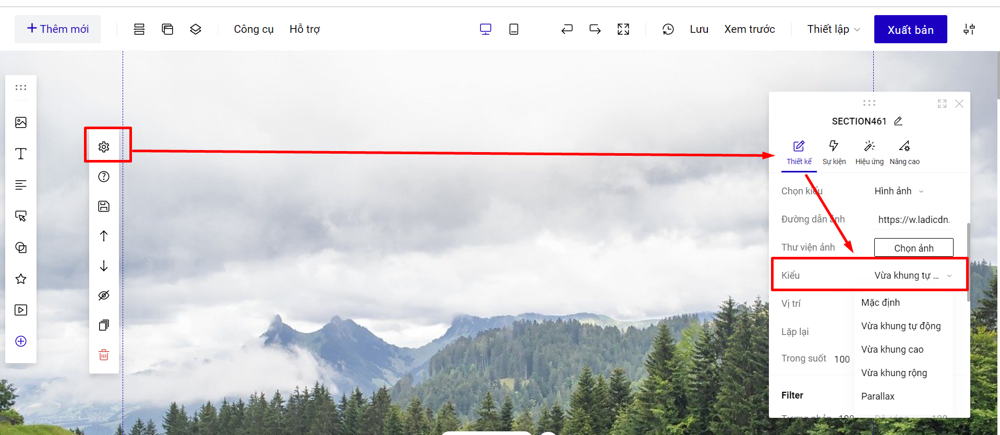
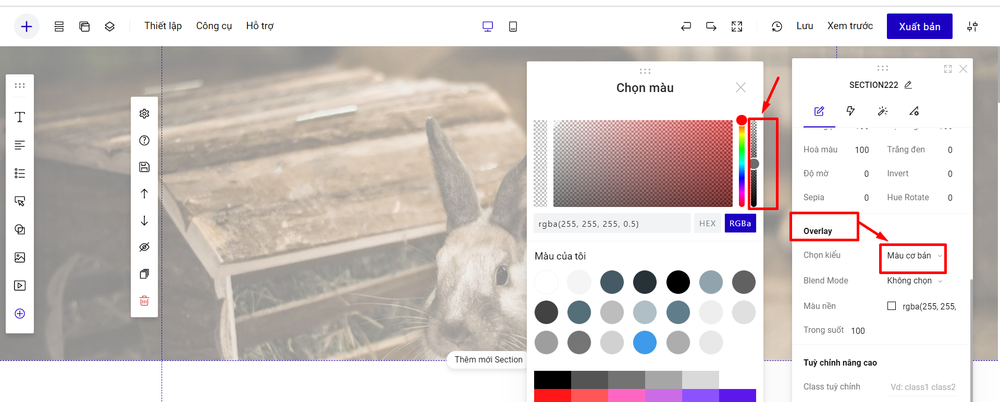

# Thay nền/background cho section

Phần nền của một section có thể thể hiện dưới 3 dạng: **Hình ảnh, Màu sắc hoặc Video.**

1. **Thay ảnh làm hình nền:**

Để thay ảnh làm nền bạn lựa chọn thiết lập như hình dưới:

<figure><figcaption></figcaption></figure>

Cửa sổ quản lý thư viện hiện ra bạn bấm nút Chọn tệp để tải ảnh từ máy tính của mình lên thư viện.

.png>)

Chọn ảnh bạn vừa tải lên từ danh sách ảnh trong thư viện sau đó bấm nút **Sử dụng** để chèn ảnh vào Landing Page hoặc bạn có thể click đúp vào ảnh muốn chèn.&#x20;

.png>)

Bạn có thể chọn các kiểu cho ảnh nền section: Vừa khung tự động, Mặc định, Vừa khung cao, Vừa khung rộng và Parallax hoặc Tùy Chỉnh lại kiểu hiển thị của ảnh&#x20;

<figure><figcaption></figcaption></figure>

* Các kiểu "Vừa khung tự động; Vừa khung cao; Vừa khung rộng" sẽ cân đối chiều dọc, chiều ngang của ảnh cho vừa khung hình.&#x20;
* Kiểu parallax là kiểu hiển thị ghim ảnh khi cuộn chuột.

**Giao diện mobile không hỗ trợ kiểu Parallax, nên trên thiết kế mobile, bạn không đồng bộ thiết kế desktop Mobile và chọn kiểu khác cho ảnh nền section mobile.**

<figure><figcaption></figcaption></figure>

* **Tùy chỉnh lại ảnh hiển thị**: trong trường hợp bạn tải lên 1 ảnh nhỏ, nhưng muốn nó hiển thị vừa màn hình theo cách lặp lại liên tục cách ảnh hoặc giãn ảnh theo kích thước tùy biến, thì bạn có thể sử dụng  mục tùy chỉnh&#x20;

Bạn thay đổi thông số ở mục kích thước bằng cách chọn sẵn thông số gợi ý ( 100% 100% là vừa     màn hình , 50px 50px là tạo lặp lại các ảnh kích thước 50px ). Bạn sửa các thông số 50px theo nhu cầu của bạn&#x20;

<figure><figcaption>
Ví dụ trường hợp chọn  kích thước 100% 100%
</figcaption></figure>

<figure><figcaption>
Ví dụ về trường hợp chọn kích thước 50px 50px 
</figcaption></figure>

Bạn có thể tạo màu/hình ảnh phủ trên ảnh nền section bằng cách sử dụng Overlay. Bạn vào mục Overlay --> chọn kiểu (Màu cơ bản/Màu gradient)--> Tùy chỉnh thanh độ phủ Opacity như hình bên dưới:

<figure><figcaption></figcaption></figure>

Nếu bạn chọn Overlay kiểu hình ảnh, bạn có thể sử dụng thêm Blend Mode và Trong suốt để thiết kế thêm sinh động:

<figure><figcaption></figcaption></figure>


* Bạn có thể tải ảnh dung lượng dưới 5MB và kích thước dưới 3000\*3000px.
* Kích thước cho ảnh nền section bạn có thể tham khảo:

Desktop: ngang 1960px, chiều dọc tùy ý nhưng nhỏ hơn 800px, đẹp nhất là từ 600 đến 768px

Mobile: ngang 420px (hoặc 320px), chiều dọc tùy ý.

* Bạn nên tối ưu lại dung lượng ảnh trước khi đưa lên builder sử dụng, để đảm bảo trang có tốc độ load tốt nhất. Ví dụ về công cụ hỗ trợ tối ưu dung lượng mà giữ được chất lượng ảnh [https://tinypng.com/](https://tinypng.com/).


**2. Thay video làm hình nền section.**

Để thay **video** làm nền, bạn lựa chọn thiết lập như hình dưới:

<figure><figcaption></figcaption></figure>

Bạn có thể chèn trực tiếp link của Youtube hoặc dùng LadiPage Video bằng cách tải trực tiếp video lên builder.


* Tính năng LadiPage Video chỉ áp dụng cho tài khoản trả phí trở lên và dung lượng video tải lên phải dưới 5Mb (đối với gói Pro/Standard/Lite), dưới 20 Mb (đối với gói có tính năng phân quyền Premium/Enterprise/Business)
* Khi chèn Video Backgroud trong builder sẽ không hiển thị, phải xuất bản ra thì mới nhìn thấy nội dung video.
* Nền section là video thì video sẽ tự động chạy và không có tiếng.


**3. Nền section chọn kiểu Màu cơ bản hoặc Màu gradient.**

Bạn có thể đồ màu nền cho section bằng cách sử dụng Màu cơ bản hoặc Màu Gradient:

<figure><figcaption></figcaption></figure>


**Lưu ý:**&#x20;

* Nếu bạn thiết kế landing page chọn kiểu thiết kế là Responsvie, bạn có thể tùy chỉnh nền section giao diện Desktop và mobile khác nhau bằng cách chọn không đồng bộ thiết kế, chi tiết [tại đây](https://help.ladipage.vn/nang-cao-cho-phan-tu/dong-bo-khong-dong-bo-thiet-ke).

