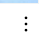

# Thêm mới hình ảnh

Để thêm mới hình ảnh, bạn có thể lựa chọn 2 cách:

1. **Tải ảnh từ máy tính.**

Tại thanh công cụ nhanh, bạn chọn hình ảnh và tải tệp từ máy tính.

<figure><figcaption></figcaption></figure>

Hoặc vào phần **`Thêm mới` -> Phần tử-`Hình ảnh`**

.png>)

Bạn bấm nút **Chọn tệp** để tải một ảnh hoặc tải nhiều ảnh cùng một lúc từ máy tính của mình lên thư viện ảnh.

Chọn ảnh mà bạn vừa tải lên từ danh sách ảnh trong thư viện sau đó bấm nút **Sử dụng** để chèn ảnh vào Landing Page hoặc bạn có thể click đúp vào ảnh muốn chèn.&#x20;

.png>)


**Lưu ý:**&#x20;

* Định dạng ảnh hỗ trợ tải lên tài khoản: png, jpg, gif, jpeg, svg và ico.
* Bạn có thể tải ảnh dung lượng dưới 5MB và kích thước dưới 3000\*3000px.
* Bạn nên tối ưu lại dung lượng ảnh trước khi đưa lên builder sử dụng, để đảm bảo trang có tốc độ load tốt nhất. Ví dụ về công cụ hỗ trợ tối ưu dung lượng mà giữ được chất lượng ảnh [https://tinypng.com/](https://tinypng.com/).


**2. Tìm ảnh từ kho ảnh miễn phí Unsplash, Pixabay, Pexels.**

\
Bạn hoàn toàn có thể tìm những bức ảnh miễn phí đẹp và chất lượng cao từ kho ảnh hơn 1 triệu bức của **Unsplash, Pixabay, Pexels**. LadiPage đã tích hợp ngay trên builder để bạn có thể tìm kiếm và sử dụng thuận tiện hơn. Kho ảnh miễn phí này hỗ trợ cho các tài khoản trả phí của LadiPage.

.png>)

**Lưu ý: Bạn cần tìm hình ảnh bằng với từ khóa Tiếng Anh.**

#### **3. Cách lấy link ảnh đã tải lên tài khoản LadiPage.**

**Cách 1:** Bạn vào mục Thiết lập--> Thiết kế--> Sao chép đường dẫn ảnh như trong hình dưới đây.

<figure><figcaption></figcaption></figure>

**Cách 2:** Bạn vào mục thêm mới--> Ảnh hoặc vào mục Xem thêm để ra thư viện ảnh của bạn--> Chuột phải vào ảnh muốn lấy link--> Chọn sao chép địa chỉ hình ảnh.

<figure><figcaption></figcaption></figure>

**4. Xóa ảnh ra khỏi thư viện ảnh.**

**Bước 1:** Bạn vào thư viện ảnh bằng cách bấm Thêm mới--> vào mục Phần tử--> Ảnh--> Chọn xem thêm.

<figure><figcaption></figcaption></figure>

**Bước 2: Xóa ảnh trong thư viện ảnh.**

Bạn bấm vào icon  rồi chọn thao tác Xóa. Hiện tại LadiPage hỗ trợ xóa từng ảnh một, chưa hỗ trợ xóa nhiều ảnh cùng một lúc. Khi đã xóa ảnh thì không khôi phục được ảnh đã xóa.

<figure><figcaption></figcaption></figure>
