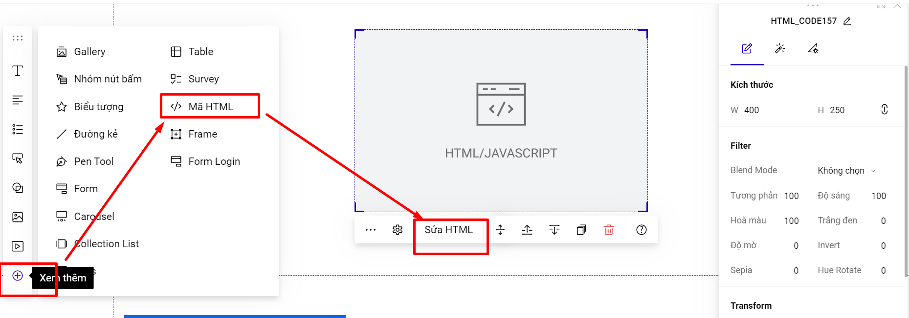

# HTML

Phần tử HTML cho phép bạn chèn các đoạn mã HTML vào Landing Page của mình, có thể phục vụ cho các mục đích như chèn mã nhúng các tiện ích.&#x20;

Để chèn phần tử HTML bạn có thể chọn Mã HTML tại thanh công cụ nhanh.

<figure><figcaption></figcaption></figure>

hoặc vào mục Thêm mới--> Phần tử--> Mã Html

<figure><figcaption></figcaption></figure>

**Lưu ý:**&#x20;

**Khi bạn thêm mã HTML sẽ không hiển thị luôn nội dung của HTML bạn thêm vào, bạn cần xuất bản hoặc xem trước trang landing page để kiểm tra hoạt động/hiển thị của HTML.**

