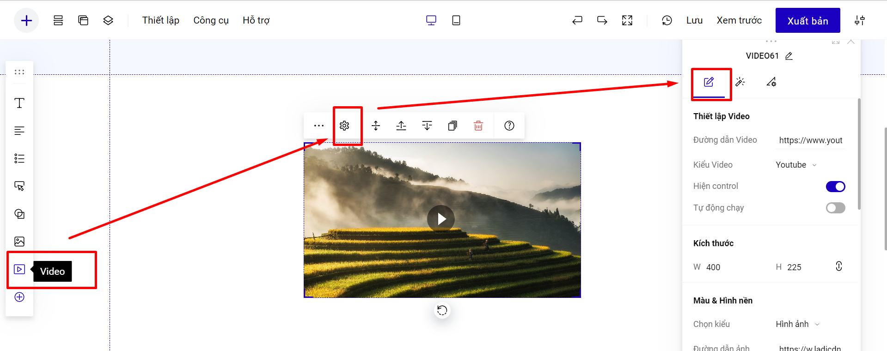
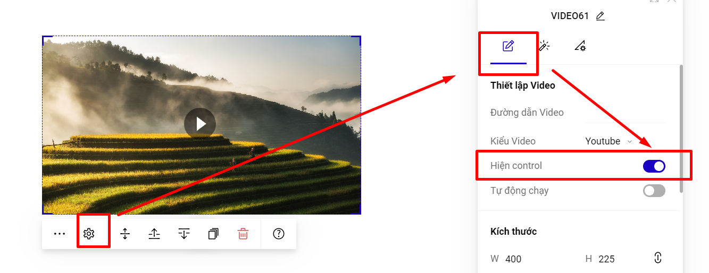

# Video

Bạn có thể thêm video để sử dụng theo bước sau:&#x20;

**Bước 1: Thêm khung video:**

Bạn thêm video tại thanh công cụ nhanh:

<figure><figcaption></figcaption></figure>

Hoặc bạn vào mục Thêm mới--> Phần tử--> Video:

<figure><figcaption></figcaption></figure>

**Bước 2: Cài đặt video hiển thị.**

**Cách 1: Chèn video từ Youtube (áp dụng cho tất cả các tài khoản của LadiPage).**

1\. Bạn chọn kiểu video là Youtube.\
2\. Nhập link Video Youtube của bạn vào ô **Đường dẫn video.**

<figure><figcaption></figcaption></figure>

**Cách 2: Chèn video trực tiếp vào Landing Page (áp dụng cho tài khoản trả phí).**

**Lưu ý: Dung lượng video tải lên phải dưới 5Mb với gói PRO/ Standard/ Lite và dưới 20Mb với tài khoản Business/ Premium/Enterprise.**

1\. Bạn chọn kiểu video là **LadiPage Video**.\
2\. Tải video của bạn lên tài khoản và sử dụng.

<figure><figcaption></figcaption></figure>

**Lưu ý:**&#x20;

* Ảnh nền (thumb) video kiểu LadiPage video sẽ hiển thị ảnh nền của video mặc định của LadiPage, vì vậy mình có thể thay đổi phần ảnh này.
* Video kiểu LadiPage video sẽ tự động lặp lại sau khi video đó chạy hết.

**Bước 4: Thiết lập cho video.**

* **Thiết lập Hiện Control:** phần cho phép khách hàng thao tác vào việc thay đổi thời gian xem video.&#x20;

<figure><figcaption></figcaption></figure>

.png>)

* **Thiết lập tự động chạy video:**

1. Video ở chế độ **Tự động chạy - Có**, sẽ tự động phát khi kéo đến Section chứa Video. Và khi ở chế độ này, bản DESKTOP/MOBILE video sẽ tự động Không có tiếng.
2. Nếu trên trang có nhiều hơn 1 video, thì khi video này được bấm chạy (Play) các video khác sẽ tự động được tạm dừng (Pause) (kể cả khi đang chạy (Play) trước đó). Tuy nhiên video được bật đồng thời 2 chế độ sau sẽ không tự động tạm dừng (Pause): **Hiện Control - Không, Tự động chạy - Có.**
3. Trong trường hợp bạn thiết lập video ở chế độ **Tự động chạy - Không**, thao tác bấm play ở bản mobile có thể hơi khó khăn cho khách hàng. Vì vậy bạn có thể thêm chữ  **preload** vào mục Class TÙY CHỈNH ở video. Lưu ý, code này sẽ làm tăng thời gian tải trang&#x20;

.png>)

* **Thiết lập nền (thumb) của video**: Bạn có thể thay đổi nền của video bằng màu cơ bản, hình ảnh hoặc màu gradient.

<figure><figcaption></figcaption></figure>


**Lưu ý:  Youtube Video và LadiPage Video sẽ không gắn được tracking đo lường cho video trên Landing Page.**


