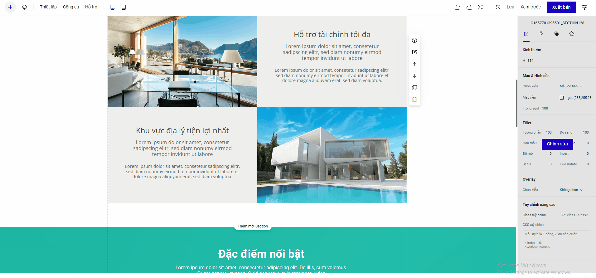

# 13. Quản lý Font

Cho phép bạn tải các file font chữ của mình lên để sử dụng cho các phần tử text.

Các file font sau khi được tải lên và lưu trữ trong phần quản lý font thì sẽ tự động hiện ra trong danh sách chọn font ở các phần tử khi bấm vào mục Chọn từ thư viện.

.png>)
