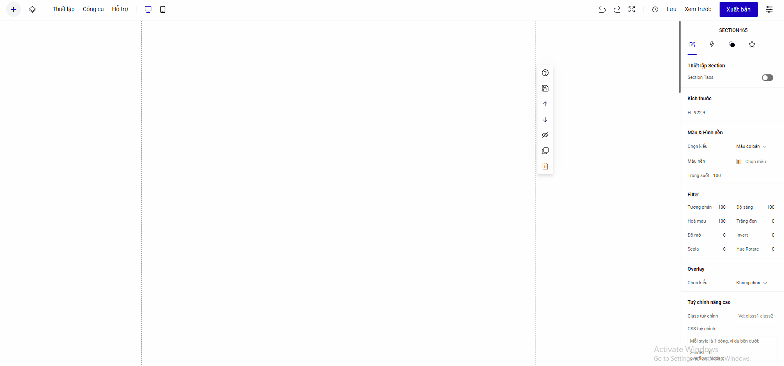

# 11. Quản lý Media

Phần Quản lý Media dùng để quản lý các nội dung liên quan đến Ảnh, Video trong tài khoản LadiPage của bạn

Bạn có thể vào trực tiếp phần quản lý Media để thêm, xóa ảnh/video và sử dụng cho trang Landing Page của bạn&#x20;

