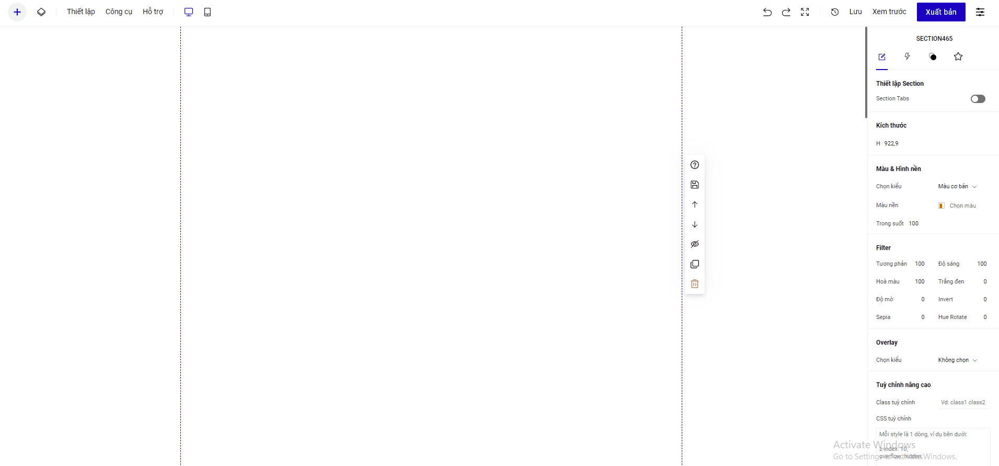

# Metu

**Bước 1: Tích hợp ứng dụng Metu vào tài khoản LadiPage**&#x20;

Truy cập trang builder.ladipage.com, chọn menu **Tích hợp -> Tài khoản liên kết -> Tạo tài khoản liên kết.** Sau đó lựa chọn Loại tài khoản là **Metu**

.png>)

Điền đầy đủ các thông tin ở tài khoản liên kết và bấm **Thêm tài khoản**&#x20;

**Tên liên kết:** là tên để phân biệt với các liên kết khác.&#x20;

**Token:** api kết nối lấy trong tài khoản của Metu.&#x20;

.png>)

**\*Cách lấy Token Metu**&#x20;

Đăng nhập tài khoản Metu, vào phần Quản lý Menu ở thanh công cụ bên tay trái , chọn Tạo Menu hoặc Chỉnh sửa 1 Menu đã tạo trước đó:

.png>)

.png>)

Kết nối thành công sẽ hiện Metu ở tài khoản liên kết:

.png>)

**Bước 2: Hiển thị menu đã tạo ở Metu trên các landing page của bạn**

Ở thanh công cụ trên cùng builder , vào phần  **Thêm mới -> Ứng dụng -> chọn Metu**

**Chọn cấu hình Metu của bạn sẽ hiển thị trên trang Landing Page**&#x20;

* Chọn Bật sử dụng ứng dụng Metu
* Chọn cấu hình: tên tài khoản liên kết của Metu bạn đã thiết lập ở bước 1
* Menu hiển thị: chọn tên Menu bạn muốn hiển thị trên trang Landing Page từ danh sách các menu đã tạo của bạn trong Metu

