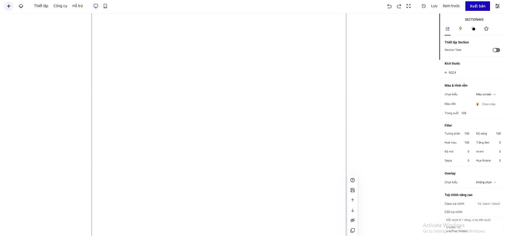

# Notify

Ở thanh công cụ , vào phần **Thêm mới ->  Ứng dụng -> chọn Notify**

**Nguyên lý của tính năng Notify**: hiển thị những nội dung được chuẩn bị sẵn trong Google Sheet hoặc Collection

**Chỉnh sửa hiển thị Notify** : cho phép bạn thay đổi màu chữ, màu nền của Notify ở phần Màu chữ , Màu và hình nền&#x20;

.png>)

## Cách 1 : Tạo nội dung Notify từ Google sheet&#x20;

**Bước 1**: Tạo Google Sheet với những nội dung có sẵn

Tạo một Google Sheet với 4 cột nội dung chính với các tiêu đề : **Title, Content, Time, Image**  và bạn điền tạo nội dung các cột. Trang tính tạo nội dung, phải là nằm ở vị trí đầu tiên trên Bảng tính của bạn

.png>)

Để có link ảnh, bạn có thể up ảnh lên thư viện ảnh của LadiPage và ấn chuột phải chọn Copy image address ( Sao chép địa chỉ hình ảnh)

.png>)

**Bước 2**: Bật chế độ CÔNG KHAI cho sheet của bạn&#x20;

.png>)

.png>)

**Bước 3**: **Quay trở lại đường link tranh tính lúc đầu** và copy ID của Google Sheet và dán vào mục Google Sheet ID trong thiết lập của tính năng Notify.


\*Lưu ý: lấy ID của google sheet gốc, không phải ID của đường link sau khi đã xuất bản ở bước 2


## Cách 2 : Tạo nội dung Notify từ Collection&#x20;

Bấm Notify từ phần Ứng dụng, rồi chọn Kiểu dữ liệu là Collection , bấm để tạo mới Collection hoặc sử dụng các Collection đã tạo sẵn&#x20;

Thao tác bạn có thể theo dõi trong nội dung hướng dẫn ở video

.png>)


Dữ liệu notify sẽ hiển thị nội dung ở 4 cột : Title, Content, Time, Image.Các trường nội dung là Không bắt buộc


Danh sách các Collecton đã tạo sẽ quản lý trong mục : Thêm mới- Quản lý nội dung&#x20;

