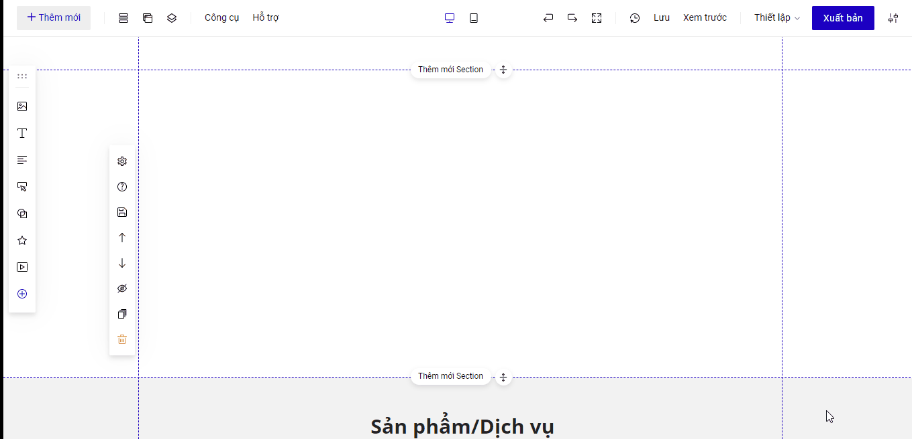

# Review

Ở thanh công cụ , vào phần **Thêm mới ->  Ứng dụng -> chọn Review**

<figure><figcaption></figcaption></figure>

**Nguyên lý của tính năng Review**: hiển thị những nội dung được chuẩn bị sẵn trong Google Sheet hoặc Collection

**Chỉnh sửa hiển thị Review**: cho phép bạn thay đổi số lượng các đánh giá , hiển thị có thanh kéo để kéo xem nhiều đánh giá&#x20;

<figure><figcaption></figcaption></figure>

## Cách 1 : Tạo nội dung Review từ Google sheet&#x20;

**Bước 1**: Tạo Google Sheet với những nội dung có sẵn hoặc lấy mẫu [**tại đây**](https://docs.google.com/spreadsheets/d/1nFcHfSy-UBwL3WJd-oIulrBe_mXS4oNea5gNiWlnWeE/edit#gid=0)**.**

Tạo một Google Sheet với  cột nội dung chính với các tiêu đề : **Name, Content, Image, Star, Like, Time ,Verify , SellerName, SellerContent , SellerLike** và bạn điền tạo nội dung các cột. Trang tính tạo nội dung phải là nằm ở vị trí đầu tiên trên Bảng tính của bạn

<figure><figcaption></figcaption></figure>

Để có link ảnh, bạn có thể up ảnh lên thư viện ảnh của LadiPage và ấn chuột phải chọn Copy image address ( Sao chép địa chỉ hình ảnh)

.png>)

**Bước 2**: Bật chế độ CÔNG KHAI cho sheet của bạn&#x20;

<figure><figcaption></figcaption></figure>

.png>)

**Bước 3**: **Quay trở lại đường link tranh tính lúc đầu** và copy ID của Google Sheet và dán vào mục Google Sheet ID trong thiết lập của tính năng Review.


\*Lưu ý: lấy ID của google sheet gốc, không phải ID của đường link sau khi đã xuất bản ở bước 2


## Cách 2 : Tạo nội dung Review từ Collection&#x20;

Bấm Review từ phần Ứng dụng, rồi chọn Kiểu dữ liệu là Collection , bấm để tạo mới Collection hoặc sử dụng các Collection đã tạo sẵn&#x20;

Thao tác bạn có thể theo dõi trong nội dung hướng dẫn ở video

<figure><figcaption></figcaption></figure>

<figure><figcaption></figcaption></figure>


Dữ liệu review sẽ hiển thị nội dung ở 10 cột : **Name, Content, Image, Star, Like, Time ,Verify , SellerName, SellerContent , SellerLike .**


Danh sách các Collecton đã tạo sẽ quản lý trong mục : Thêm mới- Quản lý nội dung&#x20;

