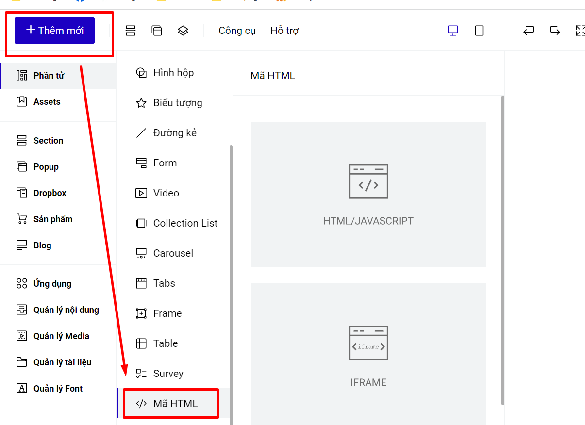

# 2. Chèn bản đồ (Google Maps)

Để chèn bản đồ từ Google Maps vào Landing Page bạn có thể thực hiện theo các bước sau:

1\. Truy cập [https://www.google.com/maps](https://www.google.com/maps)\
2\. Nhập địa chỉ bạn muốn hiển thị trên bản đồ, sau khi ra kết quả đúng theo ý mình bạn bấm chọn **Chia sẻ**.

<figure><figcaption></figcaption></figure>

3\. Chọn mục Nhúng bản đồ, sau đó chọn kích thước và bấm nút sao chép mã HTML.

.png>)

4\. Tại trang giao diện chỉnh sửa Landing Page, tại thanh công cụ nhanh bên trái chọn **Mã HTML.**

<figure><figcaption></figcaption></figure>

Hoặc bạn vào mục Thêm mới--> Phần tử--> Mã HTML.

<figure><figcaption></figcaption></figure>

\
5\. Bấm chọn Sửa HTML sau đó dán đoạn mã HTML vừa copy được từ Google Maps vào và bấm nút cập nhật. Sau đó di chuyển phần tử đến vị trí mong muốn hiển thị trên Landing Page.

.png>)

.png>)

Trang chỉnh sửa sẽ không sẽ không hiển thị nội dung của mã nhúng HTML, bạn xuất bản hoặc xem trước trang để thấy hiển thị của HTML thêm vào.


**Tips: Thay width=100% height=100% nếu bạn muốn khung maps hiển thị theo khung HTML bạn đã kéo ban đầu.**

