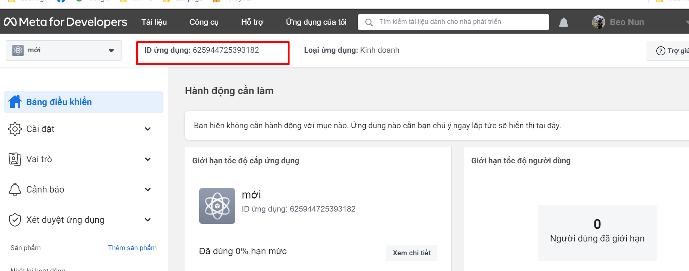

# 7. Facebook Comment

Facebook Comment cho phép mọi người bình luận về nội dung trên trang web của bạn bằng tài khoản Facebook của họ. Để chèn Facebook Comment vào Landing Page bạn có thể làm theo các bước sau:

**Bước 1. Tạo app bình luận tại** [**https://developers.facebook.com/**](https://developers.facebook.com/)

Bạn truy cập vào [https://developers.facebook.com/](https://developers.facebook.com/) sau đó click chọn **Ứng dụng của tôi** và chọn Tạo ứng dụng.

.png>)

Nhập tên App và địa chỉ email sau đó bấm Tạo ID ứng dụng.

.png>)

Chọn mục Thông tin cơ bản, sau đó nhập các thông tin sau:

* Miền ứng dụng: Tên miền xuất bản Landing Page của bạn.
* URL Chính sách quyền riêng tư: Tên miền xuất bản Landing Page.
* URL Điều khoản dịch vụ: Tên miền xuất bản Landing Page.
* Hạng mục: Chọn **Mua sắm.**

Sau đó bấm nút **Lưu thay đổi.**

.png>)

Thêm thành viên quản trị bình luận tại mục Vai trò.

.png>)

Bạn sẽ lấy ID ứng dụng ở đây để sử dụng cho bước 2:

<figure><figcaption></figcaption></figure>


Nếu bạn đã tạo App trước đó rồi và chọn app đó thì vui lòng kiểm tra lại mục Cài đặt -> Thông tin cơ bản và kiểm tra lại mục Miền ứng dụng, URL chính sách quyền riêng tư và URL Điều khoản dịch vụ xem đã đúng với đường dẫn xuất bản chưa.


**Bước 2. Lấy mã nhúng bình luận vào Landing Page.**

Để lấy mã nhúng bình luận Facebook vào Landing Page bạn truy cập đường dẫn: [https://developers.facebook.com/docs/plugins/comments/](https://developers.facebook.com/docs/plugins/comments/)

.png>)

**Chọn ứng dụng** bạn vừa tạo sau đó sao chép 2 đoạn mã ở **Step 2** và **Step 3** để chuẩn bị nhúng vào Landing Page.

.png>)

Quay trở lại LadiPage Builder, chọn **Thiết lập** -> **Mã Javascript/CSS.**

.png>)

Dán các đoạn mã sau:

* `<meta property="fb:app_id" content="ID của ứng dụng bạn tạo ở bước 1" />` vào **Trước thẻ \</head>**
* Đoạn mã trong **Step 2** vào **Trước thẻ \</body>**

.png>)

.png>)

Tiếp tục chọn **Thêm mới** và chọn **Mã HTML.** Chọn **Sửa HTML** và dán đoạn mã trong **Step 3** vào khung nhập mã sau đó bấm nút **Cập nhật** rồi di chuyển phần tử Mã HTML đến vị trí muốn hiển thị bình luận.&#x20;

.png>)


Nếu bạn muốn khung bình luận hiển thị rộng hết chiều ngang của Landing Page và có thể xem được nhiều bình luận trong khung cuộn vui lòng làm theo các bước sau:

1\. Chọn phần tử sau đó chọn biểu tượng Thuộc tính -  trên Thanh thiết kế để vào phần **Thiết lập** phần tử.

2\. Chọn phần **`Thiết kế`** -> **Tùy chỉnh nâng cao** sau đó dán đoạn mã sau vào khung **CSS tùy chỉnh.**\
`width: 100%;`\
`overflow: scroll;`


.png>)

&#x20;

