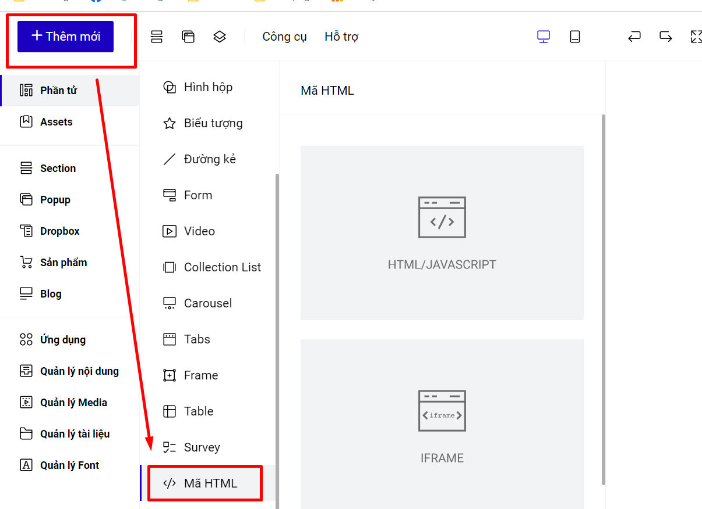

# 1. Nhúng video từ Facebook

**Bước 1: Lấy mã iFrame của video bạn cần nhúng:**

.png>)

.png>)

**Bước 2: Dán mã iFrame vào tính năng Thêm mới- Phần tử -  Mã HTML.**

Tại thanh công cụ nhanh.

<figure><figcaption></figcaption></figure>

Hoặc bạn vào phần thêm mới--> phần tử--> Mã html.

<figure><figcaption></figcaption></figure>

.png>)

Trang chỉnh sửa sẽ không sẽ không hiển thị nội dung của mã nhúng HTML, bạn xuất bản hoặc xem trước trang để thấy hiển thị của HTML thêm vào.


**Tips:** **Thay width=100% height=100% nếu bạn muốn khung video fanpage hiển thị theo khung HTML bạn đã kéo ban đầu.**

