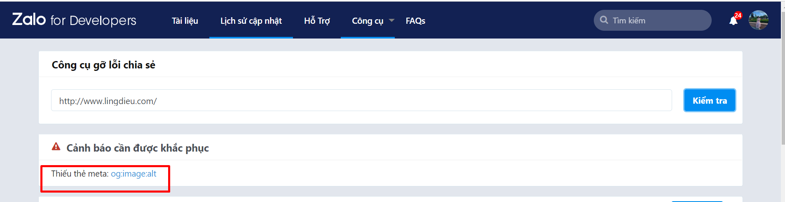

# 6. Sửa lỗi chia sẻ trên Facebook và Zalo

Nếu nội dung/hình ảnh khi chia sẻ qua Facebook/Zalo không đúng với nội dung/hình cài đặt, bạn thao tác theo cách sau.

Bạn truy cập vào đường dẫn sau:

Facebook: [https://developers.facebook.com/tools/debug/](https://developers.facebook.com/tools/debug/) \
Zalo: [https://developers.zalo.me/tools/debug-sharing](https://developers.zalo.me/tools/debug-sharing)

Và thao tác các bước như sau:

Bước 1: Nhập tên miền landing page.

Bước 2: Click vào “Sửa lỗi”.

Bước 3: Click vào “Thu thập lại” đến khi hiện thị nội dung/ hình ảnh chia sẻ đúng như ở bên dưới.

.png>)


**Lưu ý:**&#x20;

* Nếu bấm thu thập lại vẫn không hiển thị hình ảnh đúng, bạn thay đổi định dạng ảnh cài đặt từ png sang jpg và để kích thước ảnh gợi ý: 1200\*630px.
* Đăng xuất tài khoản Facebook và Zalo rồi mới chia sẻ lại link để kiểm tra thay đổi.
* Phần gợi ý thiếu thẻ alt của ảnh chia sẻ không ảnh hưởng tới hoạt động và hiển thị của trang landing page khi khách hàng truy cập hoặc chia sẻ.


<figure><figcaption></figcaption></figure>
