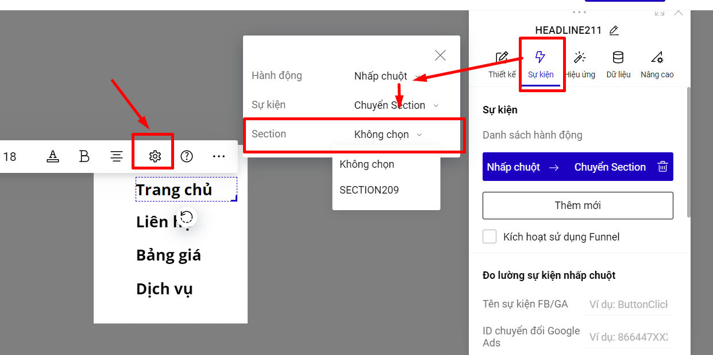

# 5. Tạo menu bản mobile

**Bước 1: Thêm mới icon menu.**

<figure><figcaption></figcaption></figure>

Hoặc bạn vào phần Thêm mới--> Phần tử--> Biểu tượng và tìm kiếm với từ khóa Menu.

**Bước 2: Tạo popup nội dung menu.**

<figure><figcaption></figcaption></figure>

**Bước 3: Liên kết các mục menu đến section tương ứng hoặc tới trang khác.** \
**(Xem thêm hướng dẫn** [**liên kết đến section**](broken-reference) **và** [**liên kết mở liên kết**](https://help.ladipage.vn/su-kien-cho-phan-tu/su-kien-nhap-chuot/su-kien-mo-lien-ket)**).**

<figure><figcaption></figcaption></figure>


**Lưu ý:**&#x20;

* **Bạn có thể cài đặt vị trí hiển thị của Popup như mình mong muốn.**


<figure><figcaption></figcaption></figure>


* **Popup nội dung menu sẽ hiển thị khi khách hàng bấm vào icon menu, vì vậy không cài đặt hiển thị cho popup này.**


<figure><figcaption></figcaption></figure>

**Bước 4: Liên kết icon tới popup.**

**Bạn vào phần thiết lập--> Sự kiện--> Chọn hành động nhấp chuột--> Sự kiện mở popup--> Chọn popup nội dung menu.**

<figure><figcaption></figcaption></figure>

**Bước 5: Ghim icon ở đầu trang trong suốt quá trình khách hàng cuộn chuột. Bạn có thể chọn vị trí hiển thị của icon menu này theo vị trí ghim**

<figure><figcaption></figcaption></figure>

Nếu bạn thiết kế kiểu Responsive, bạn có thể thiết kế menu desktop và mobile khác biệt nhau bằng cách **Ẩn các nội dung menu của desktop trong thiết kế bản mobile.**

<figure><figcaption></figcaption></figure>
