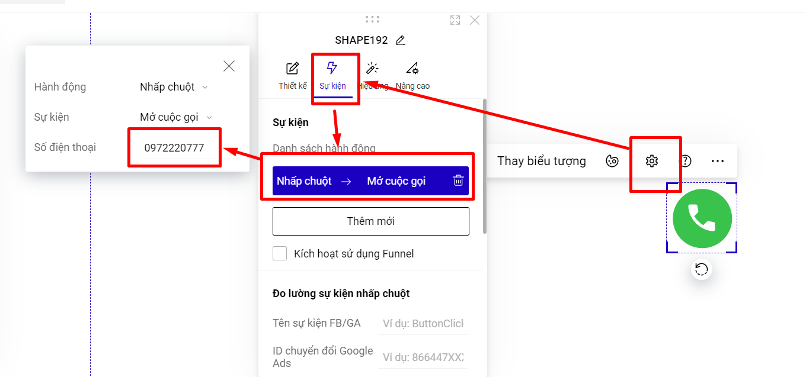

# 3. Tạo nút gọi cố định ở góc trang (call)

**Bước 1: Thêm mới biểu tượng điện thoại tại thanh công cụ nhanh:**

<figure><figcaption></figcaption></figure>

Hoặc bạn vào phần Thêm mới--> Phần tử--> Biểu tượng.

<figure><figcaption></figcaption></figure>

Ngoài ra bạn có thể tải hình ảnh hoặc ảnh gif có hiệu ứng rung như mong muốn lên.

**Bước 2: Thiết lập sự kiện mở cuộc gọi và điền số thoại của bạn:**

Bạn vào phần **Thiết lập--> Sự kiện--> Hành động Nhấp chuột--> chọn Sự kiện Mở cuộc gọi** và điền số điện thoại bạn muốn.

<figure><figcaption></figcaption></figure>

**Bước 3: Thiết lập ghim phần tử và chọn vị trí ghim:**

Bạn vào phần **Thiết lập--> Nâng cao--> Ghim phần tử** và thiết lập vị trí ghim phần tử mà bạn mong muốn.

<figure><figcaption></figcaption></figure>

**Bước 4: Hiệu ứng cho nút call.**

Bạn có thể tải ảnh GIF nút call trên google để có sẵn hiệu ứng, hoặc vào thiết lập của phần tử để chọn hiệu ứng phù hợp.

<figure><figcaption></figcaption></figure>

