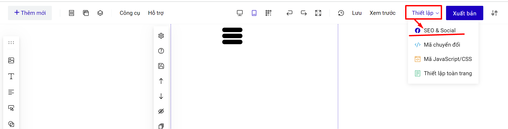
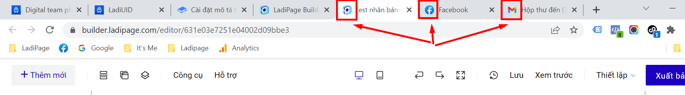

# 1. Cài đặt mô tả trang SEO & Social

Các cài đặt từ khóa SEO về trang và gắn mã tracking nằm trong mục **Thiết lập--> SEO & Social.**&#x20;

<figure><figcaption></figcaption></figure>

Phần cài đặt SEO & Social cho phép bạn tùy chỉnh các mục như Tiêu đề trang, Mô tả trang, Từ khóa về trang, Hình ảnh khi chia sẻ và Hình ảnh Favicon. Các nội dung này sẽ hiển thị khi bạn gửi đường dẫn hay đăng đường dẫn url trên faceb, zalo, các ứng dụng mạng xã hội ...

.png>)

Mô tả trang và hình ảnh khi chia sẻ là nội dung sẽ hiển thị khi bạn gửi đường dẫn hay đăng đường dẫn url trên faceb, zalo, các ứng dụng mạng xã hội ...

* **Tiêu đề trang:** Có độ dài trong khoảng 50-60 ký tự (không vượt quá 512px).Chứa từ khóa chính, từ khóa càng nằm về phía trái càng tốt. Nội dung trong thẻ tiêu đề có thể khác đôi chút so với tiêu đề của bài viết.
* **Mô tả trang:** Có độ dài từ 120 – 180 ký tự (không vượt quá 930px). Có chứa từ khóa, từ khóa càng nằm về phía trái càng tốt.
* **Từ khóa:** Nên chọn những từ khóa cụ thể về sản phẩm và doanh nghiệp LadiPage không giới hạn các ký tự, tuy nhiên nên tạo trong giới hạn để hiển thị trên Google không bị cắt và được tối ưu.
* **Hình ảnh khi chia sẻ:** Sử dụng ảnh có kích thước gợi ý 1200\*620px, nên sử dụng định dạng jpg cho ảnh chia sẻ.
* **Hình ảnh Favicon:** là icon sẽ hiển thị trên trình duyệt khi bạn truy cập, ví dụ về favicon. Hình ảnh favicon nên để ảnh vuông, kích thước gợi ý 256px\*256px.

<figure><figcaption></figcaption></figure>

* **Canonical URL:** Hỗ trợ trong SEO. Canonical URL (hay còn gọi là Rel Canonical) là thành phần HTML nhằm khai báo URL gốc của trang bị trùng lặp nội dung với công cụ tìm kiếm. Sử dụng thẻ Canonical trong trường hợp nội dung bị Duplicate hoặc giống nhau trên nhiều URL. Nếu có nội dung giống hoặc tương tự trong các URL khác nhau. Bạn có thể dùng nó để chỉ định loại nào là phiên bản chính và sau đó index nó.
* **Sử dụng Lazyload:** Giúp trang xuất bản của bạn có tốc độ load trang tối ưu nhất có thể.
* **Googlebot chỉ mục**: Googlebot là tên gọi chung cho [trình thu thập dữ liệu web](https://developers.google.com/search/docs/fundamentals/how-search-works?hl=vi) của Google. Googlebot là tên gọi chung cho hai loại trình thu thập dữ liệu khác nhau: trình thu thập dữ liệu trên máy tính (Googlebot Desktop) – mô phỏng người dùng trên máy tính, và trình thu thập trên thiết bị di động (Googlebot Smartphone) – mô phỏng người dùng trên thiết bị di động.
