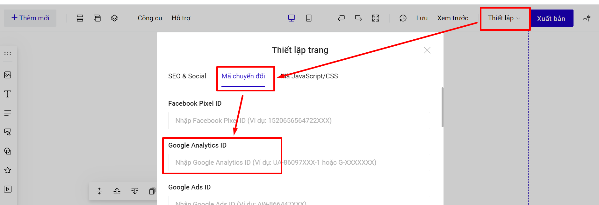
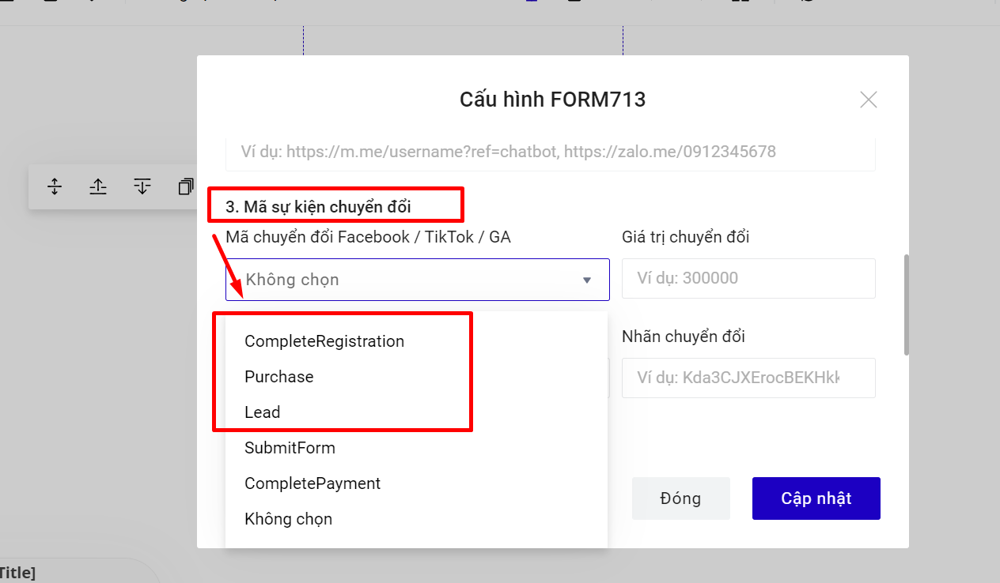
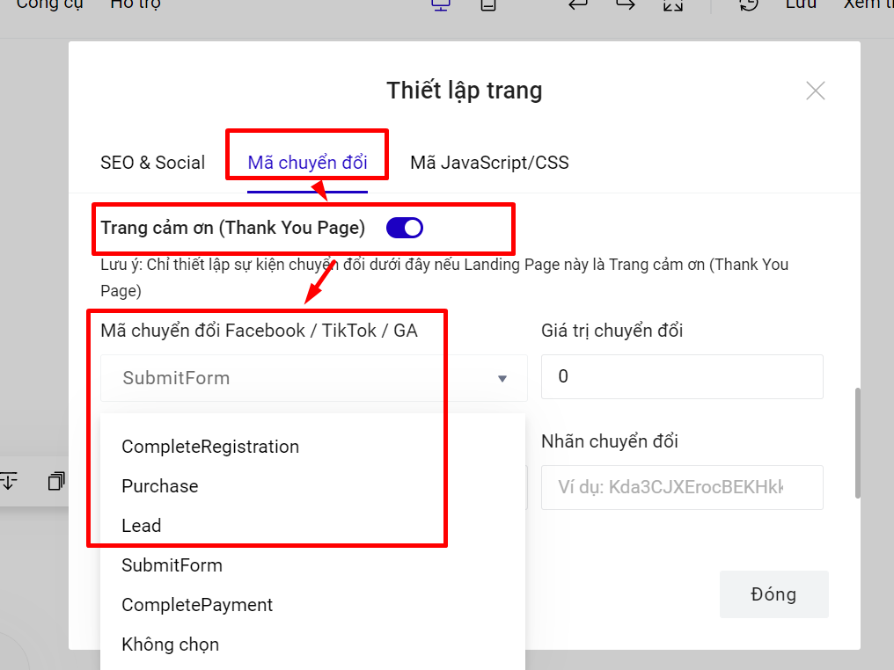

# Hướng dẫn cài đặt Google Analytics trên LadiPage

Cài đặt Google Analytics (GA) trên Landing Page sẽ giúp bạn thống kê và đo lường được các chỉ số cần thiết như lượng người truy cập, nguồn truy cập, số lượng chuyển đổi, hành vi người dùng trên trang.

Trước tiên bạn cần có tài khoản Google Analytics, cách khởi tạo vui lòng xem hướng dẫn của Google [tại đây.](https://support.google.com/analytics/answer/1008015) Sau đó chúng ta sẽ bắt đầu gắn mã trên LadiPage.

## Bước 1: Gắn mã ID theo dõi toàn trang landing page.


Nếu bạn Sử dụng GA cũ thì có thể theo các bước sau, còn nếu bạn sử dụng GA 4 thì theo dõi cách lấy ID [tại đây](https://help.ladipage.vn/theo-doi-va-do-luong-landing-page/ma-theo-doi-va-chuyen-doi/huong-dan-cai-dat-google-analytics-tren-ladipage/huong-dan-lay-ma-google-analytics-4).


Lấy mã ID theo dõi trong phần **Admin -> Cài đặt thuộc tính**:

.png>)

Gắn mã ID vừa lấy được trong phần **thiết lập mã chuyển đổi** trên LadiPage builder:

<figure><figcaption></figcaption></figure>

Như vậy là bạn đã gắn xong phần mã cơ sở. Lúc này các dữ liệu liên quan đến truy cập sẽ được cập nhật.

## Bước 2: Cài đặt theo dõi form đăng k&#xFD;**.**

Nếu bạn chỉ cài đặt ID như bước 1, bạn sẽ chỉ theo dõi được lượt view toàn trang trang landing page. Để theo dõi lượt hoàn tất form đăng ký, cần thao tác:

**Lưu data của form --> Sự kiện mã chuyển đổi  --> Chọn sử dụng bạn muốn sử dụng: Hoàn thành đăng ký (Complete Registration), Mua hàng (Purchase), và Lead** (sự kiện SubmitForm và completePayment là 2 sự kiện của tiktok pixel)

.png>)

<figure><figcaption></figcaption></figure>

Như vậy là bạn đã cài đặt xong theo dõi sự kiện chuyển đổi ở form. Bạn cần xuất bản trang Landing Page để lưu thay đổi này.&#x20;

## Bước 3.Cài đặt theo dõi sự kiện nhấp chuột (nếu có)

Bình thường để đo lường các sự kiện các bạn cần gắn một đoạn code theo hướng dẫn của Google. **LadiPage Builder** đã **cài đặt sẵn** các công thức này, bạn chỉ cần định danh nút bấm đó bằng một cái tên, hệ thống sẽ tự động tạo code và trả về kết quả cho Google Analytics.&#x20;

Ví dụ bạn muốn theo dõi hành vi nhấp chuột vào nút bấm Liên hệ với chúng tôi.

<figure><figcaption></figcaption></figure>

* Chọn nút và trong thiết lập chọn phần **Sự kiện.**
* Chọn mục **Đo lường sự kiện nhấp chuột.**
* Đặt tên cho nút trong mục **Tên sự kiện, ví dụ: lienhe.**

Vậy là bạn đã cài đặt theo dõi thành công cho sự kiện nhấp chuột vào nút nút bấm. Bạn cần xuất bản trang Landing Page để lưu thay đổi này.


**Lưu ý:** các nút submit trên form đăng ký KHÔNG có phần gắn mã sự  kiện. Muốn đo lường cho form, bạn vào mục Lưu data  của form > Mã theo dõi sự kiện.


## Bước 4: Kiểm tra hoạt động của mã Google Analytics.

Để kiểm tra xem Google Analytics đã ghi nhận những sự kiện mà bạn đã cài đặt ở trên hay chưa, các bạn cần tải ứng dụng [Google Tag Assistant](https://chrome.google.com/webstore/detail/tag-assistant-by-google/kejbdjndbnbjgmefkgdddjlbokphdefk?hl=en) và cài đặt trên trình duyệt Chrome.

Sau khi ứng dụng đã hiển thị trên trình duyệt, bạn bật trang landing page cần kiểm tra, và chọn **Enable** sau đó **F5 để tải lại trang**.

.png>)

Tiến hành thao tác các hành vi nhấp chuột và theo dõi sự kiện được ghi nhận thành công.

Ngoài ra bạn có thể kiểm tra đo lường ở thời gian thực trên Google Analytics ở mục sau:

.png>)

Bạn cần chờ một khoảng thời gian để dữ liệu ghi nhận trên báo cáo tại mục **Hành vi -> Sự kiện.**

Như vậy là bạn đã hoàn thành xong toàn bộ quy trình cài đặt **Google Analytics** để theo dõi chuyển đổi.

## Cài đặt giá trị tiền tệ cho sự kiện.

Trong trường hợp bạn cần gắn mã tùy chỉnh nâng cao để bổ sung giá trị tiền tệ cho sự kiện hoàn tất form đăng ký thì bạn cũng cần bổ sung mã tùy chỉnh của Google Analytics dưới đây:

> gtag('event','CompleteRegistration', { 'event\_category': 'LadiPageConversion', 'event\_label': '[http://ladi.demopage.me/thoitrang](http://ladi.demopage.me/thoitrang)', 'value': '1' });
>
> Trong đó:&#x20;
>
> * CompleteRegistration: tên sự kiện
> * LadiPageConversion: tên category
> * [http://ladi.demopage.me/thoitrang](http://ladi.demopage.me/thoitrang): tên label
> * 1: là value

.png>)


**Lưu ý:**&#x20;

* Trong phần mã tùy chỉnh nâng cao, đoạn mã sự kiện sẽ không có thẻ mở và đóng \;

Trong đó:&#x20;

* CompleteRegistration: tên sự kiện.
* LadiPageConversion: tên category.
* [http://ladi.demopage.me/thoitrang](http://ladi.demopage.me/thoitrang): tên label.
* 1: là value.

.png>)

Xuất bản để lưu thay đổi.


**Lưu ý:** Không chọn mã sự kiện chuyển đổi trong form nếu đã gắn mã code theo dõi trên trang cảm ơn.


