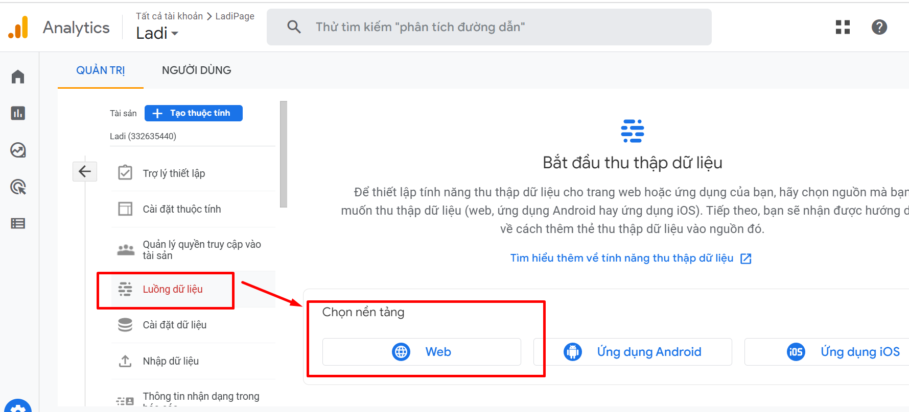
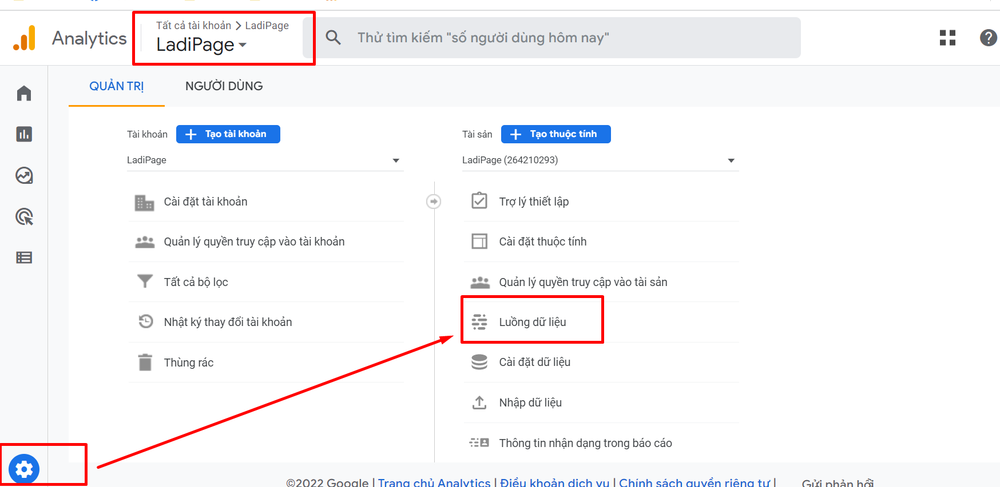
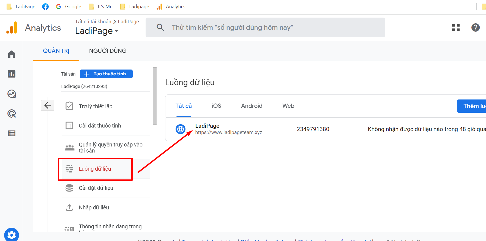
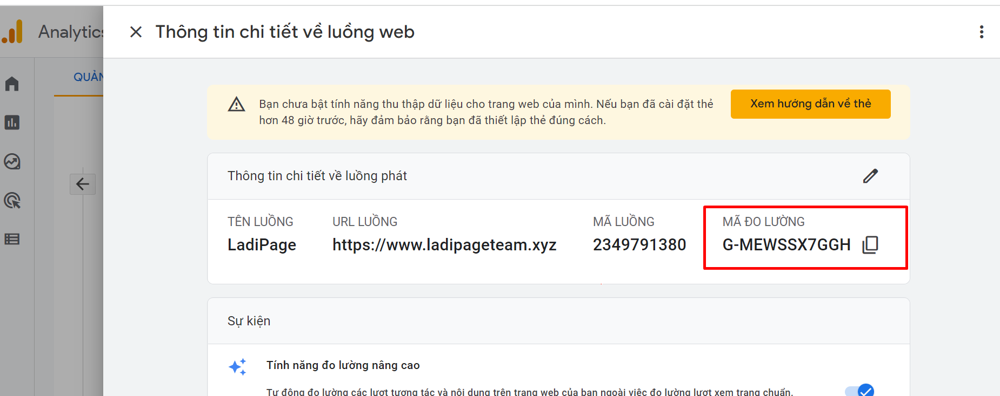

# Hướng dẫn lấy mã  Google Analytics 4

Phiên bản mới nhất của nền tảng phân tích web của Google, được gọi là Google Analytics (GA) 4, cập nhật vào14/10/2020. Loại thuộc tính mới bao gồm mở rộng thông tin chi tiết về dự đoán, tích hợp sâu hơn với Google Ads, khả năng đo lường trên nhiều thiết bị và kiểm soát dữ liệu chi tiết hơn.

#### Trường hợp 1: Tạo một thuộc tính mới (Property) cho Google Analytics 4

**Bước 1:** Trong tài khoản GA, bạn truy cập vào phần quản trị --> Nhấn tạo mới thuộc tính.

.png>)

**Bước 2:** Tiếp theo bạn điền thông tin thuộc tính mới theo các bước của GA  4:

* Tên thuộc tính
* Ngành nghề
* Múi giờ
* Loại tiền tệ
* Nhấn “Save” để tiếp tục cài đặt

.png>)

**Bước 3:** Tiếp theo chọn loại thu thập dữ liệu trong Google Analytics 4 là “web”.

<figure><figcaption></figcaption></figure>

**Bước 4:** Thiết lập luồng dữ liệu.

Sau đó cài đặt thông tin thu thập dữ liệu cho website của bạn, sau đó nhấn “Tạo luồng” để tiếp tục cài đặt.

.png>)

**URL trang web là tên miền của bạn dùng để xuất bản trang landing page.**

Sau khi nhấn “Tạo luồng” mà hình tiếp theo sẽ hiển thị thông tin về thuộc tính và cách cài đặt. Bạn sao chép Mã đo lường có định dạng: G-AAAAA, mã này chính là **ID** của GA4 để cài đặt ID GA của landing page.

.png>)

**Trường hợp 2: Trong GA đã có thuộc tính GA4.**

Nếu bạn đã tạo sẵn thuộc tính cho GA4, bạn lấy ID GA4 theo cách sau.

Bước 1: Bạn chọn Thuộc tính có sẵn trong tài khoản GA.

<figure><figcaption></figcaption></figure>

Bạn vào mục Quản trị của thuộc tính, chọn luồng dữ liệu.

<figure><figcaption></figcaption></figure>

Bạn chọn luồng dữ liệu có sẵn và sao chép ID GA4.

<figure><figcaption></figcaption></figure>

<figure><figcaption></figcaption></figure>

Bạn có thể tham khảo thêm bài hướng dẫn của Google về thiết lập GA4 [`tại đây`](https://support.google.com/analytics/answer/9304153?hl=en#zippy=%2Cweb)
