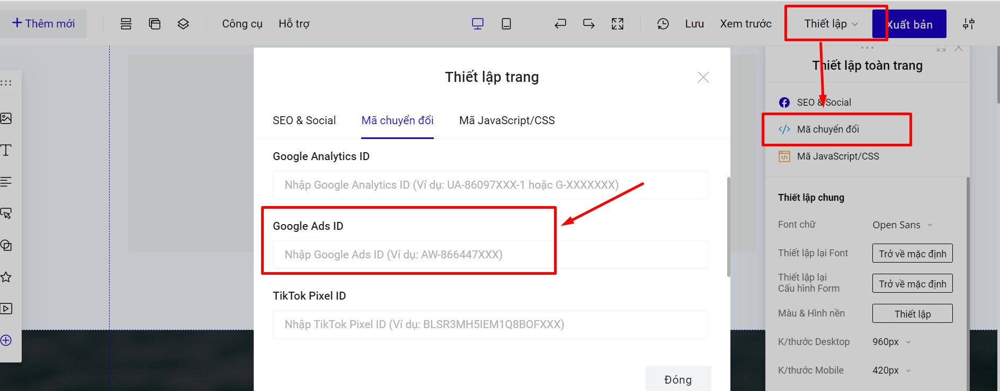

# Hướng dẫn cài đặt mã Google Ads trên LadiPage

> Tính năng theo dõi chuyển đổi của Google Ads cho bạn biết hành động xảy ra sau khi khách hàng nhấp vào quảng cáo của bạn – họ đã mua sản phẩm, đăng ký nhận bản tin, gọi đến doanh nghiệp hay tải ứng dụng của bạn xuống. Khi một khách hàng hoàn thành một hành động mà bạn đã xác định là có giá trị, những hành động này của khách hàng được gọi là lượt chuyển đổi. _(Theo Google Ads Support)._

Để theo dõi các chuyển đổi trên Landing Page và ghi nhận trên Google Ads, bạn chỉ cần làm theo các bước sau, chủ yếu là lấy được các mã ID cơ bản, không cần gắn các đoạn code phức tạp:

## **Bước 1: Truy cập tài khoản Google Ads, lấy Google Ads ID và nhãn chuyển đổi**&#x20;

## **Bước 2 : Truy cập builder chỉnh sửa trang landingpage, mục Thiết lập -> Mã chuyển đổi -> Google Ads ID**&#x20;

Bạn chèn ID vào mục hướng dẫn như trong ảnh&#x20;

<figure><figcaption></figcaption></figure>


**Lưu ý:**

Bạn chỉ dán ID google ads tại mục mã chuyển đổi, chứ không dán cả đoạn mã sự kiện. Nếu bạn có đoạn mã sự kiện google ads thì bạn dán vào thẻ head của Mã JavaScript/Css.


## Bước 3: Gắn ID và nhãn chuyển đổi vào sự kiện trên LadiPage

1. **Sự kiện hoàn tất form đăng ký.**

Để theo dõi sự kiện hoàn tất form đăng ký, bạn vào phần **Lưu data** của form, sau đó trong mục mã sự kiện chuyển đổi, nhập **ID chuyển đổi** và **Nhãn chuyển đổi** đã lấy từ tài khoản google ads và điền vào 2 ô tương ứng ở mục **Mã chuyển đổi Google Ads**:

.png>)

Sau đó bấm **Cập nhật** và xuất bản trang để lưu thay đổi.

**2. Sự kiện nhấp chuột cho nút bấm.**

Bạn vào phần thiết lập của nút bấm, nhập ID chuyển đổi và nhãn chuyển đổi vào phần **đo lường sự kiện nhấp chuột:**

<figure><figcaption></figcaption></figure>

Sau đó bấm **Cập nhật** và xuất bản trang để lưu thay đổi.


Lưu ý: chỉ cần nhập các ID như hướng dẫn, không cần gắn thêm đoạn code nào cả.



Lưu ý: các nút submit trên form đăng ký KHÔNG có phần gắn mã sự  kiện. Muốn đo lường cho form, bạn vào mục Lưu data  của form **-->** Mã theo dõi sự kiện.


## Bước 4: Kiểm tra hoạt động của mã Google Ads trên trang

Để kiểm tra xem Google Ads đã ghi nhận những sự kiện mà bạn đã cài đặt ở trên hay chưa, các bạn cần tải ứng dụng [Google Tag Assistant](https://chrome.google.com/webstore/detail/tag-assistant-by-google/kejbdjndbnbjgmefkgdddjlbokphdefk?hl=en) và cài đặt trên trình duyệt Chrome.

Sau khi ứng dụng đã hiển thị trên trình duyệt, bạn bật trang landing page cần kiểm tra, và chọn **Enable** sau đó **F5 để tải lại trang**.

.png>)
