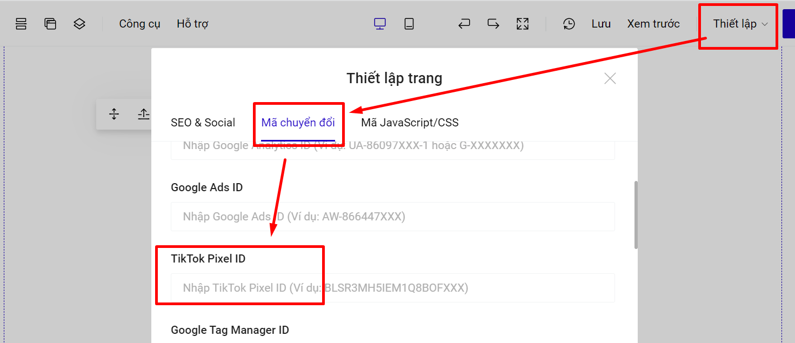

# Hướng dẫn cài đặt Tiktok pixel

Để thêm tiktok pixel vào landing page, bạn tạo 1 landing page chính và 1 landing page cảm ơn cho phần form đăng ký. Bạn thực hiện theo các bước sau:&#x20;

### **Bước 1: Vào giao diện ads manager tiktok -> Công cụ-> Sự kiện**

<figure><figcaption></figcaption></figure>

### Bước 2: Chọn “Web Events“.

### Bước 3: Lựa chọn phần “Set-up Web Event“.

### Bước 4: Chọn “Tiktok Pixel“.

### Bước 5: Đặt tên “Pixel“ Vidu: 1000 đơn pixel và lựa chọn theo hướng dẫn.

### Bước 6: Lựa chọn theo hướng dẫn và Chọn “ Create “

### Bước 7: Copy code pixel và gắn vào landing page.

* Chọn “Next“.
* **Sao chép đoạn mã trên vào thẻ head của landing page.**

<figure><figcaption></figcaption></figure>

Hoặc bạn lấy ID tiktok trong đoạn code pixel tiktok trên cho vào mục Thiết lập --> mã chuyển đổi--> mục Tiktok Pixel ID để điền thông tin ID của bạn.

<figure><figcaption></figcaption></figure>

### Bước 8: Cài đặt sự kiện hoàn tất đăng ký cho tiktok.&#x20;

Có 2 cách để bạn sử dụng cài đặt sự kiện cho Tiktok.

## Cách 1: Cài đặt sự kiện tiktok pixel trong LadiPage.

**Trường hợp 1:** Bạn sử dụng popup cảm ơn mặc định hoặc popup cảm ơn riêng.

* **Bạn vào phần Form đăng ký --> Lưu data --> Mã sự kiện chuyển đổi    --> Chọn sự kiện SubmitForm hoặc CompletePaymen**. Tiktok khuyên dùng sự kiện **CompleteRegistration**  cho hoàn tất đăng k&#xFD;**.**

<figure><figcaption></figcaption></figure>



**Trường hợp 2: Sử dụng trang cảm ơn riêng.**

* Tại trang cảm ơn riêng, bạn điền ID Titkok pixel.

<figure><figcaption></figcaption></figure>

* Bật Trang cảm ơn và chọn **Mã sự kiện chuyển đổi   --> Chọn sự kiện SubmitForm hoặc CompletePaymen**. Tiktok khuyên dùng sự kiện **CompleteRegistration**  cho hoàn tất đăng k&#xFD;**.**




**Lưu ý:**

Nếu bạn dùng trang cảm ơn riêng, chọn sự kiện tại trang cảm ơn riêng rồi thì không chọn sự kiện trong phần Lưu data của Form đăng ký.


## **Cách 2: Cài đặt sự kiện trong tài khoản Tiktok pixel**

**Với cách này áp dụng cho landing page sử dụng trang cảm ơn riêng.**

* Chọn URL Keyword và Complete Setup.

* Giao diện đúng khi chọn sẽ ra như hình bên dưới.

* Setup sự kiện Pixel.

* Sự kiện Viewpage.

**Tại đây bạn dán link landing page chính của bạn.**

**Lưu ý: bên dưới chọn theo hướng dẫn.**

* Setup sự kiện Complete (hoàn tất đăng ký), chọn phần thêm sự kiện bên dưới.

**Bước tiếp: Chọn sự kiện “Complete“**

Thêm lệnh “track = complete“ và bấm chọn “ô vuông +“

**Tại đây bạn dán link trang landing page cảm ơn.**

Phần dưới chọn: Once

