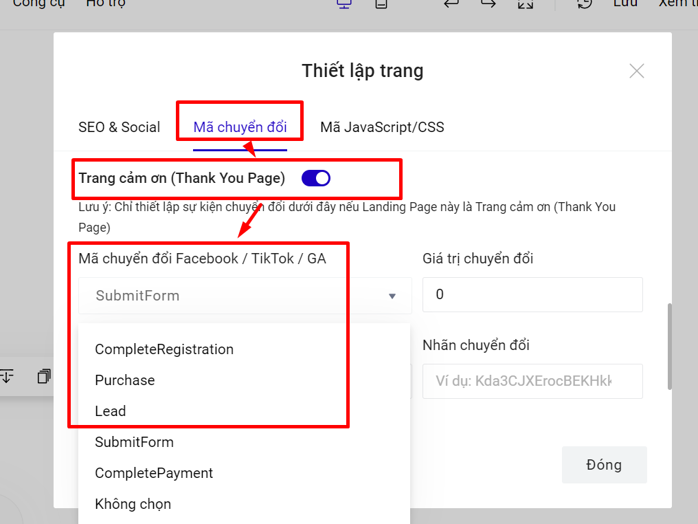

# Hướng dẫn chèn Facebook Pixel trên LadiPage

Facebook Pixel là một đoạn mã (JavaScript) mà Facebook cung cấp cho các nhà quảng cáo. Khi bạn chèn đoạn mã này vào trang landing page, Facebook sẽ hỗ trợ theo dõi và đo lường các sự kiện trên trang landing page.

Để cài đặt Facebook Pixel bạn làm theo các bước sau đây:

## Cài đặt mã Pixel cơ sở

Trước hết bạn cần tạo mã Pixel cho tài khoản quảng cáo của mình theo những bước dưới đây:

**Bước 1:** Truy cập vào Trình quản lý quảng cáo: &#x20;

[https://adsmanager.facebook.com/adsmanager/manage/campaigns](https://adsmanager.facebook.com/adsmanager/manage/campaigns)

**Bước 2:** Nhấp vào thanh **Trình quản lý quảng cáo**, chọn **Tất cả công cụ -> Cài đặt cho doanh nghiệp**&#x20;

<figure><figcaption></figcaption></figure>

**Bước 3:** Thiết lập pixel . Bạn chọn mục **Nguồn dữ liệu-> Pixel**

<figure><figcaption></figcaption></figure>

Bấm **Thêm -> Tiếp tục để thêm mới ID facebook pixel**&#x20;

<figure><figcaption></figcaption></figure>

**Bước 4:** Trong hộp thoại, chọn **Tự cài đặt mã thủ công**.

<figure><figcaption></figcaption></figure>

**Bước 5:** Hộp thoại **Cài đặt mã pixel** hiện lê&#x6E;**,** chọn **Tiếp tục** và không cần làm theo các bước mà facebook hướng dẫn trong hộp thoại.&#x20;

<figure><figcaption></figcaption></figure>

**Bước 6:** Trong hộp thoại **Thiết lập sự kiện**, chọn **Thêm mã sự kiện theo cách thủ công.**

<figure><figcaption></figcaption></figure>

**Bước 7:** Hộp thoại danh sách các mã sự kiện tiêu chuẩn hiện lên, bạn ấn **Xong** để hoàn tất.

<figure><figcaption></figcaption></figure>

**Bước 8:** Lúc này, việc tạo Pixel hoàn tất, bạn tìm mã ID pixel của mình và sao chép:

<figure><figcaption></figcaption></figure>

**Bước 9:** Quay trở lại builder trang thiết kế Landing Page, vào phần **Thiết lập mã chuyển đổi** và dán mã pixel ID vừa sao chép vào ô Facebook Pixel ID:

<figure><figcaption></figcaption></figure>

Vậy là bạn đã hoàn thành cài đặt mã pixel cơ sở. Khi đã cài đặt mã cơ sở, LadiPage đã cài sẵn các mã tiêu chuẩn dưới đây để theo dõi và trả về các dữ liệu sau cho Pixel:

* Page view
* View content

## Cài đặt theo dõi sự kiện hoàn thành form đăng ký.

Khi khách hàng điền form đăng ký, bạn sẽ tự định nghĩa hành động đó có nghĩa là **Hoàn thành đăng ký (Complete Registration),** hay là **Mua hàng (Purchase),** hay là **Lead,** tùy thuộc vào tính chất nội dung của form và mục đích tối ưu quảng cáo của bạn. Ngoài 3 chuyển đổi trên, bạn có thể tham khảo thêm các chuyển đổi của facebook pixel [tại đây](https://www.facebook.com/business/help/402791146561655?id=1205376682832142).

**LadiPage đã cài đặt sẵn 03 mã sự kiện tiêu chuẩn: Complete Registration, Purchase và Lead, vì vậy bạn chỉ việc chọn mã phù hợp trong danh sách là xong, không cần cài thêm đoạn code nào cả.**&#x20;

Bạn chỉ cần chọn form và vào phần Lưu data:

.png>)

Trong phần Mã sự kiện chuyển đổi, bạn chọn một trong 3 sự kiện **Complete Registration, Purchase và Lead** (sự kiện SubmitForm và completePayment là 2 sự kiện của tiktok pixel) danh sách mã sự kiện mà bạn muốn ghi nhận. **Chỉ cần chọn, không cần thêm code nào cả vì LadiPage đã cài đặt sẵn code:**

<figure><figcaption></figcaption></figure>

Trong trường hợp bạn cần thêm phần giá trị chuyển đổi (giá trị tiền tệ) trong quảng cáo facebook pixel thì bạn sẽ điền thêm phần giá tri đó, nếu không thì sẽ để trống.

Nếu bạn không muốn sử dụng 1 trong 3 sự kiện tiêu chuẩn trên, bạn có thể thêm sự kiện facebook pixel vào phần Mã tùy chỉnh nâng cao. Khi đó bạn sẽ không chọn mã sự kiện chuyển đổi ở trên nữa.&#x20;

Ví dụ bạn muốn thêm sự kiện pixel AddToCart: fbq('track', 'AddToCart');

<figure><figcaption></figcaption></figure>

Bạn bấm cập nhật để lưu thay đổi.

## Cài đặt theo dõi các sự kiện nhấp chuột.&#x20;

Nếu bạn muốn theo dõi các nút bấm hoặc một hành vi nhấp chuột vào đâu đó trên trang thì bạn cần sử dụng **mã sự kiện tùy chỉnh (custom event).**&#x20;

Bình thường để tạo custom event các bạn cần tạo một đoạn code theo hướng dẫn của Facebook. Tuy nhiên trên **LadiPage Builder,** chúng tôi đã **cài đặt sẵn** các công thức tùy chỉnh, bạn chỉ cần định danh nút bấm đó bằng một cái tên, hệ thống sẽ tự động tạo code đó và trả về kết quả cho Pixel.&#x20;

Ví dụ bạn muốn theo dõi hành vi nhấp chuột vào nút CTA Liên hệ với chúng tôi:

<figure><figcaption></figcaption></figure>

* Chọn nút và trong Thiết lập chọn phần **Sự kiện.**
* Chọn mục **Đo lường sự kiện nhấp chuột.**
* Đặt tên cho nút trong mục **Tên sự kiện, ví dụ: lienhe**

Vậy là bạn đã cài đặt theo dõi thành công cho sự kiện nhấp chuột vào nút Liên hệ với chúng tôi.&#x20;


**Lưu ý:** Các nút submit trên form đăng ký KHÔNG có phần gắn mã sự kiện. Muốn đo lường cho form, bạn vào mục Lưu data  của form --> Mã theo dõi sự kiện.


## Kiểm tra hoạt động của Pixel

Sau khi đã cài đặt xong các mã theo dõi chuyển đổi, bạn có thể kiểm tra hoạt động của pixel bằng 2 cách:

**Cách 1: Sử dụng Facebook Pixel Helper**&#x20;

Việc cài đặt tiện ích [_Facebook Pixel Helper_](https://chrome.google.com/webstore/detail/facebook-pixel-helper/fdgfkebogiimcoedlicjlajpkdmockpc?hl=vi) trên trình duyệt Chrome giúp bạn dễ dàng kiểm tra hoạt động của Facebook Pixel trên trang tất cả các trang website và Landing Page có gắn Pixel.

Lưu ý là tiện ích Facebook Pixel Helper hoạt động trên Chrome nên trước đó bạn cần cài đặt trình duyệt Chrome.

Các bước cài đặt tiện ích Facebook Pixel Helper như sau:

1. Truy cập [_Facebook Pixel Helper_](https://chrome.google.com/webstore/detail/facebook-pixel-helper/fdgfkebogiimcoedlicjlajpkdmockpc?hl=vi) .
2. Nhấp vào + Add to Chrome (Thêm vào Chrome).
3. Nhấp vào Add extension (Thêm tiện ích).
4. Sau khi cài đặt tiện ích này thành công, bạn sẽ nhìn thấy thông báo cho biết plugin đã được thêm vào Chrome và một biểu tượng nhỏ sẽ hiển thị trong thanh địa chỉ.
5. Nếu các sự kiện được cài đặt trên Landing Page hoạt động thành công thì sẽ được tích xanh.

.png>)

Truy cập trang và thực hiện các hành vi nhấp chuột cũng như điền form rồi theo dõi tích xanh trên add-on Pixel Helper:

**Cách 2: Sử dụng công cụ Test event trên Facebook.**

.png>)

Truy cập vào trình quản lý pixel và vào mục Test events (kiểm nghiệm sự kiện).

Nhập đường dẫn Landing Page của bạn và mở trang rồi thao tác các sự kiện nhấp chuột, điền form.

Nếu pixel hoạt động thì các sự kiện bạn đã cài đặt sẽ được ghi nhận ở mục này:

.png>)

Như vậy là bạn đã hoàn thành xong toàn bộ quy trình cài đặt Facebook Pixel để theo dõi chuyển đổi.

## Thêm giá trị tiền tệ cho sự kiện

Khi gắn các mã **Hoàn thành đăng ký (Complete Registration),** hay là **Mua hàng (Purchase),** hay là **Lead,** bạn sẽ bắt gặp thông báo yêu cầu bổ sung giá trị tiền tệ của Facebook:

.png>)

Việc thiếu giá trị tiền tệ **không làm ảnh hưởng đến việc ghi nhận chuyển đổi,** nên **nếu bạn không bổ sung** thì việc theo dõi và đo lường sự kiện trên trang **vẫn hoạt động bình thường.**

Bổ sung giá trị tiền tệ sẽ giúp Facebook tính toán chi phí cho mỗi chuyển đổi. Nếu bạn không quan trọng phần này thì không cần bổ sung.&#x20;

Nếu vẫn cần bổ sung, bạn vào lại **cấu hình lưu data** của form phần **mã sự kiện chuyển đổi**:


**Lưu ý:** Bạn chỉ sử dụng 1 trong 2 cách cài đặt dưới đây, KHÔNG sử dụng đồng thời cả 2 vị trí thiết lập mã sự kiện chuyển đổi.


**Cách 1**: Sử dụng phần mã sự kiện chuyển đổi + giá trị chuyển đổi của form LadiPage.

Mã chuyển đổi Facebook/Google Analytics: chọn mã sự kiện bạn muốn sử dụng.

Giá trị chuyển đổi: giá trị đơn hàng bạn muốn thiết lập trong facebook pixel.

.png>)

**Cách 2**: Sử dụng phần mã sự kiện chuyển đổi + giá trị chuyển đổi của Facebook.

.png>)

Trong mục mã chuyển đổi, để **Không chọn.**\
Trong phần **mã tùy chỉnh nâng cao,** nhập đoạn mã code sau:

```
fbq('track', 'Purchase', { value: 50000, currency: 'VND' });
```


Trong đó:

* Purchase: loại mã sự kiện bạn muốn đặt, có thể thay bằng CompleteRegistration hoặc Lead.
* Currency: loại tiền bạn đang cài đặt để chạy quảng cáo.
* Value: giá trị đơn hàng.

Bấm **Cập nhật** và xuất bản lại Landing Page để lưu thay đổi.

Nếu bạn đồng thời gắn mã Google Analytics cho sự kiện này thì khi đã chọn mục **Không chọn** phía trên, bạn cần bổ sung thêm đoạn mã code của Google Analytics trong phần mã tùy chỉnh nâng cao, ngay phía dưới đoạn mã Pixel bạn vừa thêm ở trên. Xem hướng dẫn [tại đây.](/broken/pages/-LwSn8wrbUMdFs-9e_7E#ma-tuy-chinh-nang-cao)

## Cài đặt theo dõi cho trang cảm ơn khác.

Trong trường hợp bạn sử dụng Trang cảm ơn khác để điều hướng sau khi hoàn thành form đăng ký, bạn cần cài đặt cả ID pixel và code theo dõi chuyển đổi trên trang cảm ơn này.

1. **Nhập pixel ID tại thiết lập của trang cảm ơn.**

<figure><figcaption></figcaption></figure>

**2. Nhập mã code theo dõi sự kiện hoàn thành form theo 1 trong 2 cách sau:**

**Cách 1: Bật Trang cảm ơn tại Mã chuyển đổi.**

<figure><figcaption></figcaption></figure>

Bạn chọn 1 trong 3 sự kiện tiêu chuẩn facebook pixel có sẵn tại LadiPage là CompleteRegistration, Purchase hoặc Lead (sự kiện SubmitForm và completePayment là 2 sự kiện của tiktok pixel).

**Cách 2: Thêm mã sự kiện** **tại thẻ body trong phần Mã javascript:**

Bạn có thể sử dụng đoạn mã gợi ý dưới đây vào thẻ body của landing page.

```
<script>fbq('track', 'Purchase', { value: 30000, currency: 'VND' })</script>;
```

Trong đó Purchase là tên sự kiện, bạn có thể thay đổi tùy ý.

<figure><figcaption></figcaption></figure>

Xuất bản để lưu thay đổi.


**Lưu ý:** Không chọn mã sự kiện chuyển đổi trong form nếu đã gắn mã code theo dõi trên trang cảm ơn.

