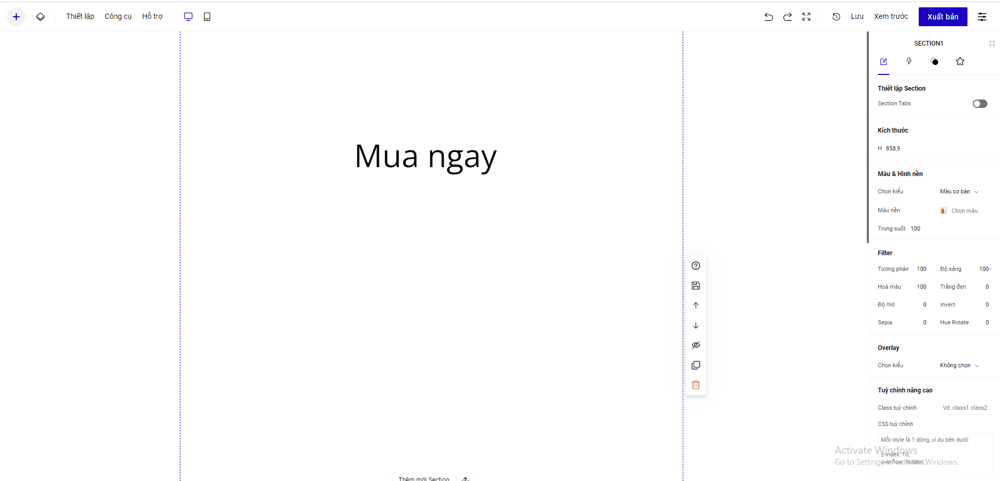

# 3. Hiệu ứng Animated

Để hiểu hơn về hiệu ứng Animated, bạn có thể tham khảo demo của các kiểu hiệu ứng Animated tại đây: [https://ladipage.vn/animated-headlines](https://ladipage.vn/animated-headlines?fbclid=IwAR2CMArKsmT4J8Zdz8oucndKxPnbnts8mQ6Mduoi7671aII2IpmUW3SIjGc).

Để cài đặt hiệu ứng Animated, bạn thực hiện các bước sau:&#x20;

* Bôi đen phần chữ muốn làm hiệu ứng.
* Chọn phần **Hiệu ứng** và chọn hiệu ứng mong muốn ở danh sách.
* Chữ hiển thị: nhập các nội dung muốn hiển thị mỗi lần thay đổi hiệu ứng (như ví dụ ở trên). Mỗi nội dung là một dòng.
* Sau khi tùy chỉnh, phần chữ lựa chọn hiện màu ghi mờ là thành công.

<figure><figcaption></figcaption></figure>


**Lưu ý:**

Bạn có thể thiết lập hiệu ứng Animated cho tiêu đề/tiêu đề trong nút bấm. Nội dung cài đặt hiệu ứng Animated không nên để quá dài.

