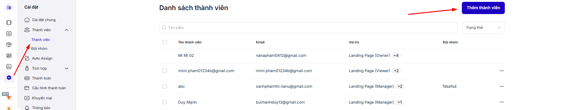

# Bộ lọc

Các bộ lọc này giúp bạn **nhanh chóng phân loại và quản lý giao dịch** theo nhiều tiêu chí khác nhau.

<figure><figcaption></figcaption></figure>

## Bộ lọc - trả lời cho câu hỏi : xem cái gì&#x20;

&#x20;Bộ lọc mặc định mà LadiWork cung cấp để bạn nhanh chóng tìm các nhóm giao dịch theo trạng thái:

* **Tất cả giao dịch đã xóa** → Hiển thị tất cả các giao dịch đã bị xóa (chỉ admin hoặc user có quyền mới xem được).
* **Tất cả giao dịch đã thất bại** → Tập hợp các giao dịch đã thất bại, hữu ích để phân tích lý do mất khách hàng.
* **Tất cả giao dịch đang mở**→ Các giao dịch đang mở và còn hoạt động , dùng để theo dõi quy trình hiện tại.
* **Tất cả giao dịch thành công** → Các giao dịch đã chốt thành công , thường dùng để báo cáo doanh thu.
* **Tât cả giao dịch bị đình trệ**  → Các giao dịch bị “đình trệ” quá số ngày quy định → cảnh báo để follow-up.

👉 **Tác dụng**: Giúp bạn nhanh chóng tìm giao dịch theo tình huống, đồng thời dọn dẹp dữ liệu&#x20;

##

