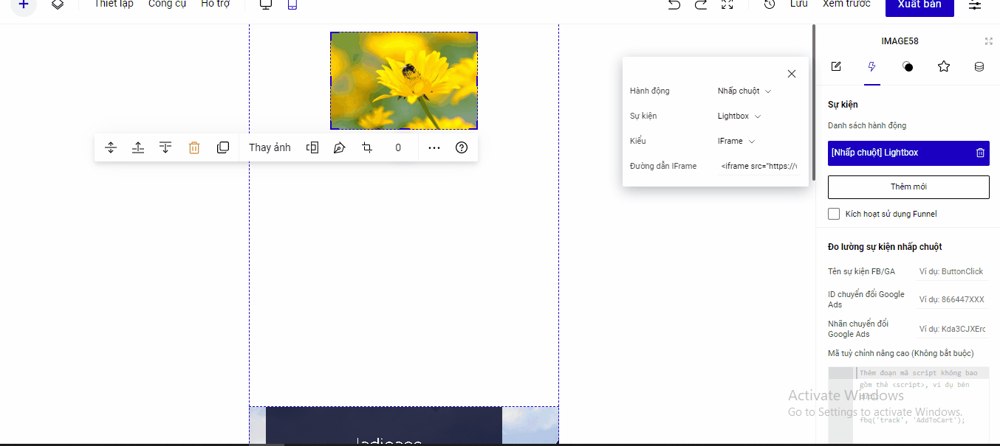

# Lightbox iFrame

iFrame là một đoạn mã nhúng hiển thị. Bất cứ ứng dụng nào có mã này đều có thể hiển thị trên Landing Page, ví dụ nhúng bản đồ, video từ fanpage.

Bạn theo tác đi liên kiết tới Lightbox Iframe như sau:

Bạn vào phần Thiết lập của phần tử--> chọn Sự kiện--> Hành động nhấp chuột --> Lightbox--> Chọn kiểu Iframe--> Nhập mã nhúng của Iframe.

<figure><figcaption></figcaption></figure>

Ví dụ để chèn iframe cho google map, bạn sao chép iframe từ google map như bên dưới và dán vào mục Đường dẫn Iframe.

.png>)

Phần hiển thị của iframe sau khi chèn thành công&#x20;

Kích thước hiển thị của Iframe khi xuất bản sẽ phụ thuộc vào kích thước width và height trong đoạn mã nhúng bạn lấy, kích thước này bạn có thể tùy chỉnh theo ý mình.

<figure><figcaption></figcaption></figure>
