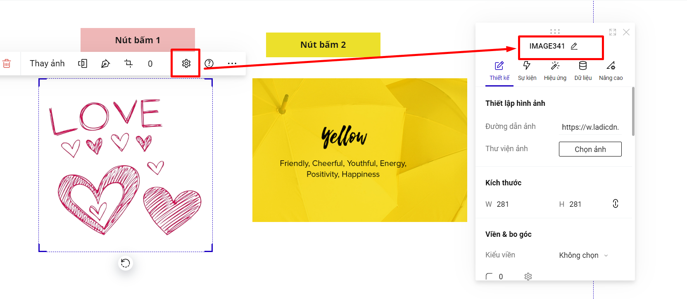
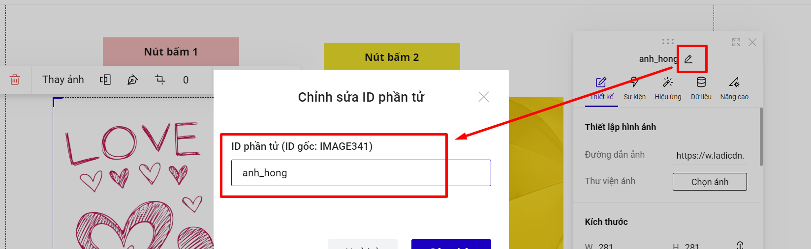
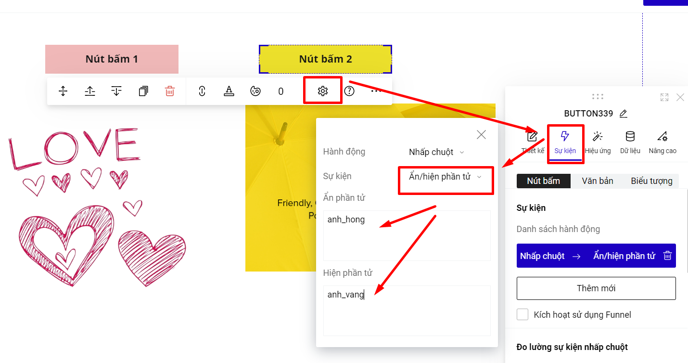

# Sự kiện ẩn/hiện phần tử

Là tính năng giúp bạn ẩn các đoạn nội dung, và chỉ hiển thị khi click vào nút bấm tương ứng.

Ví dụ về ẩn hiện phần tử.

Ví dụ cài đặt ẩn hiện để bấm vào nút bấm 1 hiện ra ảnh màu hồng, ẩn ảnh màu vàng và bấm vào nút bấm màu vàng sẽ hiện ra ảnh màu vàng, ẩn ảnh màu hồng.

<figure><figcaption></figcaption></figure>

Để thực hiện, bạn thao tác thao tác theo các bước sau:

**Bước 1. Kiểm tra ID phần tử ảnh màu hồng và ảnh màu vàng.**

<figure><figcaption></figcaption></figure>

Bạn có thể thay đổi ID phần tử để sử dụng cho các phần sau được dễ dàng hơn. ví dụ ID hình ảnh tương ứng là anh\__hong và anh\_vang._

<figure><figcaption></figcaption></figure>

**Bước 2: Cài đặt sự kiện ẩn hiện cho nút bấm 1 để bấm vào nút bấm 1 hiện ra ảnh màu hồng, ẩn ảnh màu vàng.**

Bạn vào phần Thiết lập của phần tử--> chọn Sự kiện--> Hành động nhấp chuột --> chọn Ẩn/hiện phần tử.

Ẩn phần tử: dán ID phần tử muốn ẩn, ở đây là ID của ảnh màu vàng: anh\_vang.

Hiện phần tử: dán ID phần tử muốn hiện, ở đây là ID của ảnh màu hồng: anh\_hong.

<figure><figcaption></figcaption></figure>

**Bước 2: Cài đặt sự kiện ẩn hiện cho nút bấm 2 để bấm vào nút bấm 2 hiện ra ảnh màu vàng, ẩn ảnh màu hồng.**

Bạn cũng sẽ cài đặt tương tự ở bước 1 như hình bên dưới:

<figure><figcaption></figcaption></figure>

Nếu bạn có nhiều nút bấm cần đi ẩn hiện, và muốn bấm vào nút bấm tiếp theo sẽ đổi màu nền và đổi màu chữ, bạn có thể sử dụng nhóm nút bấm.

<figure><figcaption></figcaption></figure>

Bạn thêm nhóm nút bấm bằng cách Thêm mới--> Phần tử--> Nút bấm --> Nhóm nút bấm.

<figure><figcaption></figcaption></figure>

Bạn cài đặt hiệu ứng lựa chọn trong phần Thiết lập của nhóm nút bấm--> Hiệu ứng--> Hiệu ứng lựa chọn --> màu chữ/ màu nền và màu viền.

<figure><figcaption></figcaption></figure>


**Lưu ý:**

Bạn có muốn ẩn/hiện bao nhiêu phần tử, bạn sẽ dán danh sách bây nhiêu ID phần tử, mỗi ID là 1 dòng.


