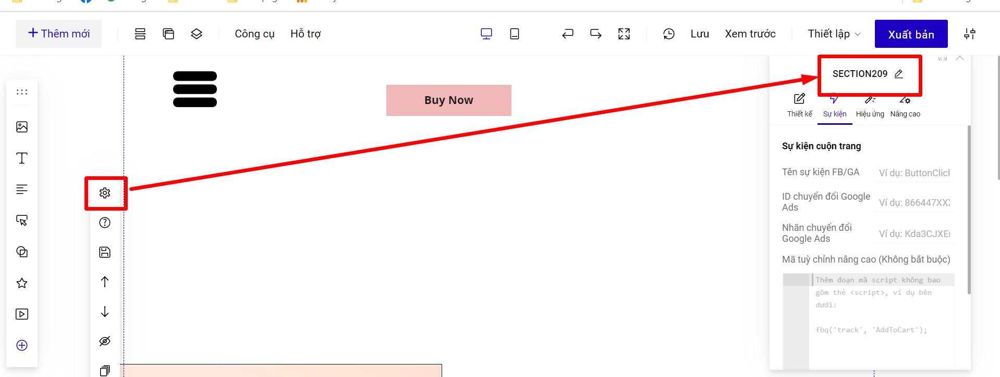
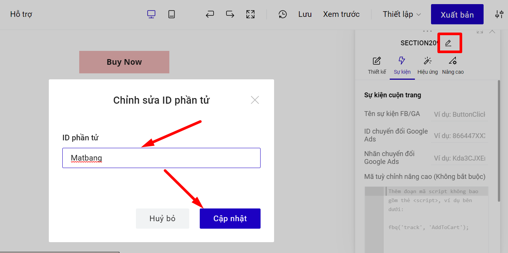

# Sự kiện chuyển section

Sự kiện chuyển Section thường được ứng dụng cho Menu ở đầu trang để khách hàng bấm vào đề mục sẽ được chuyển đến phần section tương ứng, hoặc bấm vào phần tử sẽ kéo tới form đăng ký (form đăng ký nằm trên section).

**Ví dụ hoạt động của sự kiện chuyển Section:**



Để thiết lập, bạn làm theo hướng dẫn dưới đây:\
**Bước 1:** Chọn section cần chuyển --> kiểm tra ID section ở thiết lập. Ví dụ: SECTION209.

<figure><figcaption></figcaption></figure>

Phần ID section này bạn có thể thay đổi theo ý của mình.

<figure><figcaption></figcaption></figure>

**Bước 2: Vào mục thiết lập của phần tử --> Sự kiện -->** chọn Hành động **Nhấp chuột**--> **Chuyển section**, sau đó tìm số hiệu section đã xem ở bước 1.

<figure><figcaption></figcaption></figure>
