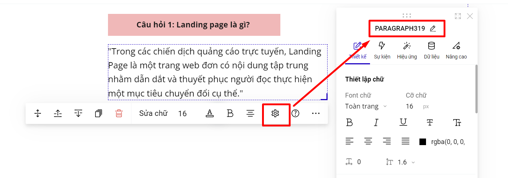
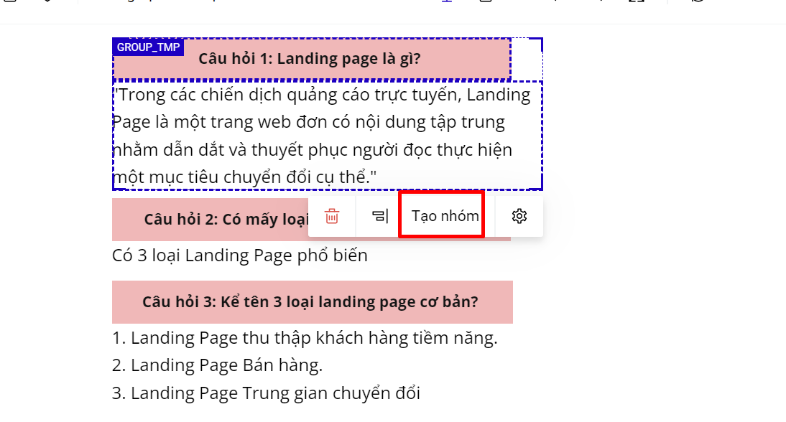
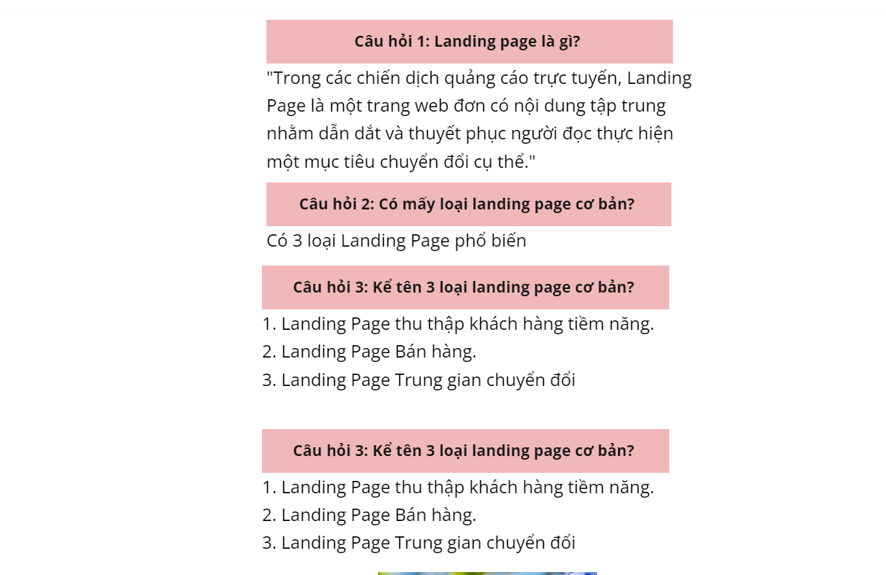

# Sự kiện Collapse

Sự kiện Collapse là tính năng hữu ích giúp bạn ẩn và hiển thị 1 nội dung trên trang, giúp người dùng có thể chủ động mở rộng/ẩn nội dung để xem, tiết kiệm không gian hiển thị, thường được dùng cho phần Q\&A trên trang landing page.

Cơ chế hoạt động của Collapse: Bấm lần 1 hiển thị ra nội dung chi tiết, bấm lần 2 sẽ ẩn nội dung chi tiết đó.

Ví dụ về hiển thị Collapse.

Để đi sự kiện tới collapse, bạn thực hiện các bước sau.&#x20;

Ví dụ thao tác sự kiện Collpase để bấm vào câu hỏi 1, sẽ hiển thị ra câu trả lời

**Bước 1: Kiểm tra ID phần tử muốn liên kết Collapse đến (ở đây là ID của câu trả lời).**

<figure><figcaption></figcaption></figure>

Ví dụ ID là: PARAGRAPH319.

**Bước 2: Cài đặt sự kiện Collapse cho phần tử tới phần tử ở bước 1 (Ở đây cài đặt sự kiện cho phần tử câu hỏi)**

<figure><figcaption></figcaption></figure>

Bạn sẽ dán ID phần tử muốn Collapse đến (Ở đây là dán ID phần tử câu trả lời). Bạn có thể cài đặt hiển thị nội dung chi tiết (câu trả lời) ngay khi khách truy cập vào trang landing page.

**Bước 3: Nếu bạn có nhiều câu hỏi và câu trả lời, bạn muốn khi xuất bản sẽ  hiển thị khoảng cách các câu hỏi và câu trả lời được đều, bạn tạo nhóm câu hỏi và câu trả lời lại với nhau.**

<figure><figcaption></figcaption></figure>

Sau đó bạn quét chuột cho toàn bộ các nhóm câu hỏi và câu trả lời, chọn căn đều dọc để được hiển thị đẹp.

<figure><figcaption></figcaption></figure>


**Lưu ý:**

* Phần sự kiện áp dụng tối ưu nhất cho việc hiển thị nội dung Trên/Dưới, ví dụ Tiêu đề (có sự kiện Collapse- đến Nội Dung nằm ở dưới Tiêu đề).
* Không dùng sự kiện Collapse đến ID section.
* Không nên thiết kế sự kiện Collapse dạng ngang như dưới.


<figure><figcaption></figcaption></figure>

* Nên sử dụng sự kiện Collapse theo hàng dọc.

<figure><figcaption></figcaption></figure>
