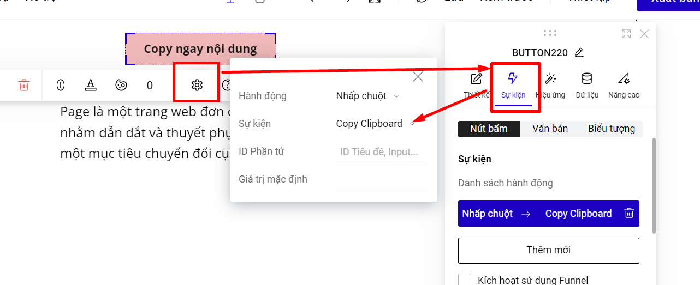
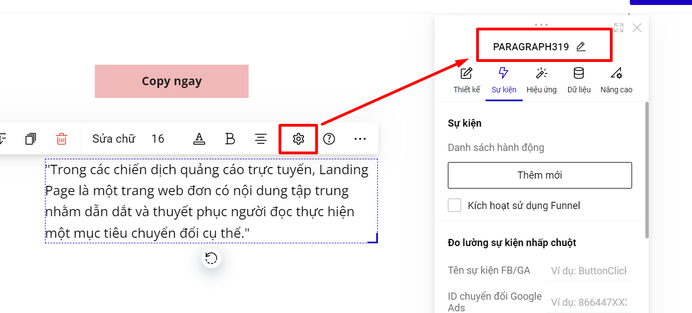
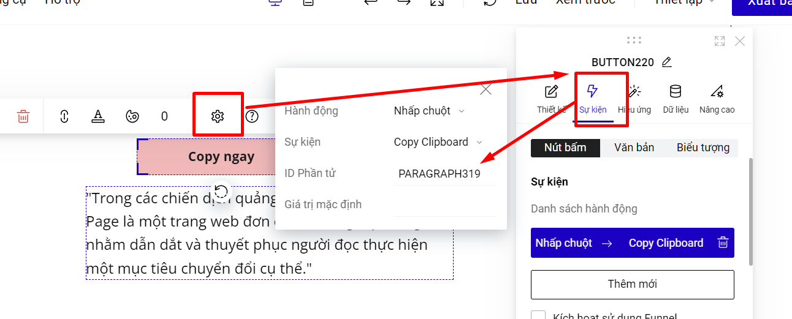
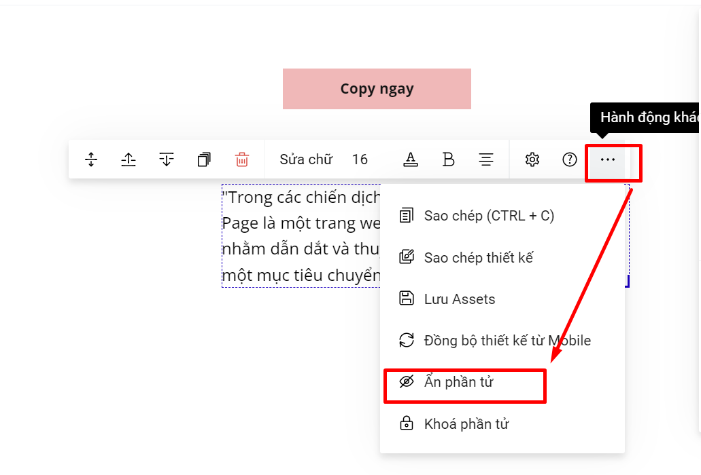

# Sự kiện Copy Clipboard

Sự kiện này cho phép bạn khi click vào 1 phần tử thì sẽ copy lại được nội dung bạn đã thiết lập trong mục sự kiện.

Ví dụ về sự kiện Copy Clipboard.

<figure><figcaption></figcaption></figure>

Để cài đặt sự kiện Copy Clipboard, bạn thao tác như sau:

Bạn vào phần Thiết lập của phần tử--> chọn Sự kiện--> Hành động nhấp chuột --> Clipboard--> Nhập ID phần tử bạn muốn khách hàng bấm vào sẽ sao chép nội dung phần tử đó hoặc điền Giá trị mặc định.

<figure><figcaption></figcaption></figure>

ID phần tử: là ID của phần tử trên trang landing page của bạn, mà bạn muốn khi khách hàng bấm vào phần tử sẽ sao chép được thông tin đó.

Gía trị mặc định: trong trường hợp phần ID phần tử để trống, bạn có thể thiết lập 1 giá trị ở mục giá trị mặc định để khác hàng có thể copy được phần thông tin đó.

Ví dụ bạn muốn khách bấm vào nút bấm Copy Ngay sẽ ra nội dung đoạn text ở dưới, bạn có thể sao chép ID đoạn text rồi dán vào mục ID phần tử của phần cài đặt của sự kiên Copy Clipboard.

<figure><figcaption></figcaption></figure>

<figure><figcaption></figcaption></figure>

Nếu bạn không muốn hiển thị nội dung copy trên landing page, bạn có thể ẩn nội dung đó.

<figure><figcaption></figcaption></figure>


Nếu KHÔNG có ID phần tử thì sẽ lấy theo giá trị mặc định, nếu có cả 2 thì sẽ ưu tiên lấy theo ID phần tử.



ID phần tử KHÔNG áp dụng cho Group, Form, chỉ áp dụng cho từng phần tử riêng lẻ: ảnh, text, các trường dữ liệu của form, không áp dụng cho trường tải file của form.

