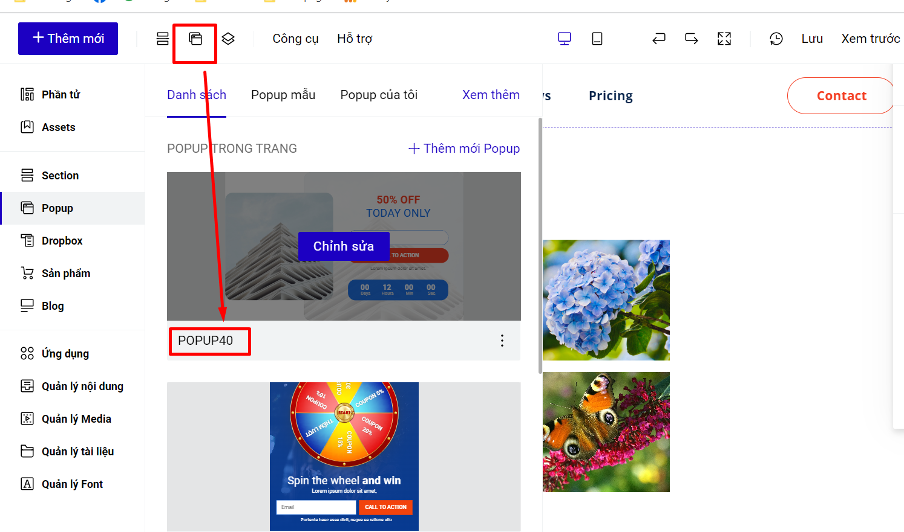
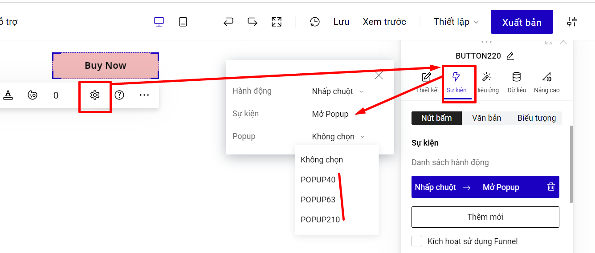

# Sự kiện mở popup

Sự kiện mở popup thường được ứng dụng khi click vào một nút bấm, hoặc click vào một đầu mục để hiển thị ra popup có thông tin chi tiết hơn. Ví dụ:



Các bước thực hiện như sau:\
**Bước 1:** Kiểm tra ID Popup cần liên kết tại mục Popup.

<figure><figcaption></figcaption></figure>

Nếu bạn chưa có popup, bạn tham khảo cách tạo popup [tại đây](https://help.ladipage.vn/cac-phan-t-co-ban-tren-landingpage/popup).

\
**Bước 2:** Bạn vào phần **Thiết lập** của phần tử muốn đi sự kiện mở popup--> **Sự kiện-->** chọn Hành động **Nhấp chuột --> chọn ID Popup** đã kiểm tra ở bước 1.

<figure><figcaption></figcaption></figure>
