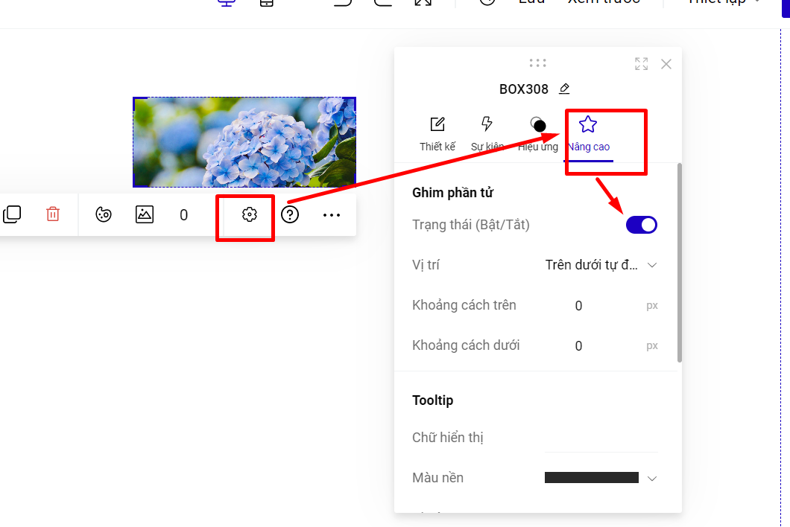

# 3. Ghim phần tử

Ghim phần tử là tính năng giúp bạn **cố định** một phần tử (có thể là hình ảnh, nút bấm, nhóm phần tử, section...) **tại một vị trí** trên trang trong suốt quá trình cuộn chuột.&#x20;

**Ghim phần tử thường dùng cho thanh menu, nút kêu gọi hành động, nút gọi trực tiếp để làm nổi bật và bạn muốn khách hàng lưu ý về các tính năng trên.**

Để ghim phần tử, bạn vào Thiết lập --> chọn **Nâng cao --> Ghim phần tử** lựa chọn **Có.**

<figure><figcaption></figcaption></figure>

Bạn chọn **Vị trí** bạn muốn hiển thị. Nếu chọn các vị trí ở trên cùng hoặc dưới cùng, bạn có thể chỉnh thêm **Khoảng cách** so với mép màn hình, thường là **10 -15px.**


**Lưu ý:**

**Bạn chỉ có thể ghim section khi chiều cao section dưới 150px.**

