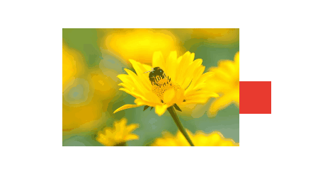

# 2. Hiệu ứng rê chuột

## Hiệu ứng thay đổi màu khi khách hàng rê chuột tới phần tử.&#x20;

Hiệu ứng rê chuột giúp tăng sự nổi bật cho phần tử, kích thích người dùng bấm vào phần tử. Ví dụ:&#x20;

Để cài đặt hiệu ứng rê chuột đổi màu, bạn vào Thiết lập --> Hiệu ứng-->  Hiệu ứng rê chuột--> Chọn màu bạn muốn khách hàng bấm vào đổi màu.

<figure><figcaption></figcaption></figure>

## Hiệu ứng phóng to&#x20;

Hiệu ứng phóng to nút khi bạn di chuyển chuột vào được hiển thị như sau:

Để thiết lập hiệu ứng này, bạn chọn Thiết lập-> Hiệu ứng -> Hiệu ứng rê chuột -> chọn Phóng to, bạn điền % kích thước muốn phóng to.

<figure><figcaption></figcaption></figure>

### Trắng đen&#x20;

Giúp bạn tạo filter trắng đen ( thường áp dụng cho ảnh ) , tỷ lệ phần trăm càng cao thì filter càng rõ rệt&#x20;

<figure><figcaption></figcaption></figure>

### Ontop (lên trên)&#x20;

Trong trường hợp phần tử bạn đang thiết lập nằm dưới 1 phần tử khác, thì phần nội dung ontop sẽ giúp phần tử đó hiển thị phía trên khi chạy hiệu ứng.

