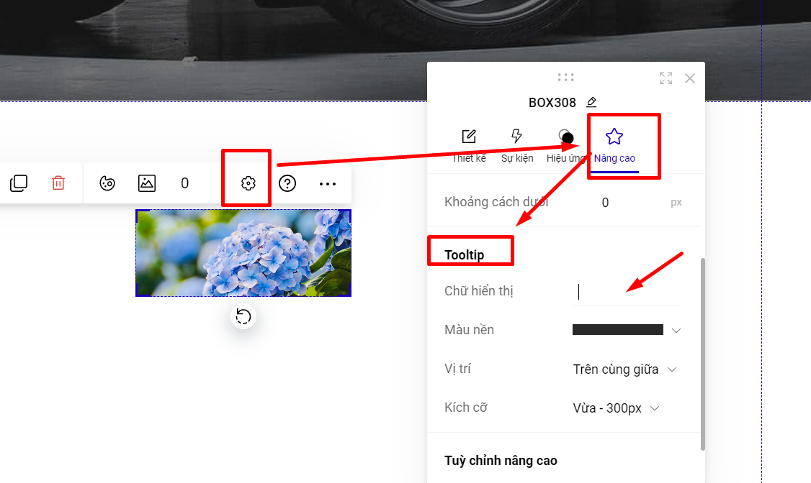

# 4. Tooltip

**Tooltip** là một chú thích xuất hiện khi rê chuột lên 1 đối tượng nào đó như văn bản, hình ảnh và các phần tử khác (không áp dụng đối tượng là Group).

Để thiết lập Tooltip, bạn vào phần **Thiết lập -->** chọn **Nâng cao --> Tooltip -->** điền **Chữ hiển thị.**

<figure><figcaption></figcaption></figure>

Bạn thiết lập các nội dung liên quan đến Chữ hiển thị (nội dung khi di chuột vào phần tử); màu nền, vị trí hiển thị và kích cỡ của tooltip bạn muốn sử dụng.
