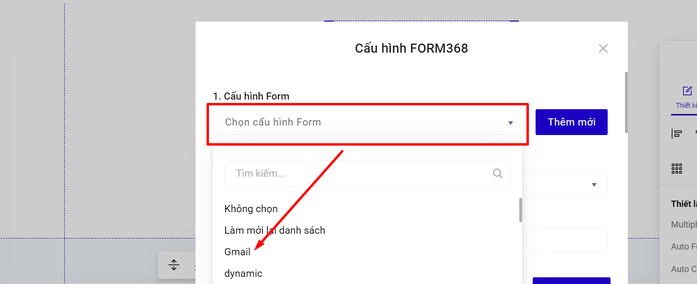
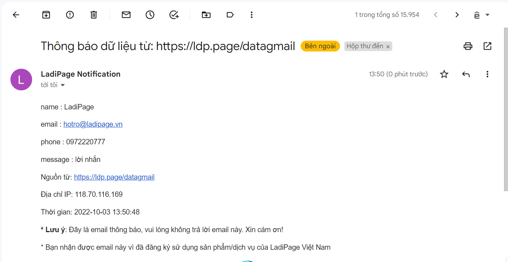

# Lưu data về Email

## **Bước 1: Tạo tài khoản liên kết.**

**Cách 1 : Tạo tài khoản liên kết từ mục Cài đặt** \
Truy cập trang [builder.ladipage.com](http://builder.ladipage.com/), chọn menu **Cài đặt -> Tích hợp-> Tài khoản liên kết**. Sau đó lựa chọn Loại tài khoản là **Email**

<figure><figcaption></figcaption></figure>

**Cách 3 : Tạo tài khoản liên kết từ mục Landing Pages -> Cấu hình form**

Truy cập trang [builder.ladipage.com](http://builder.ladipage.com/), chọn menu **Landing Pages -> Cấu hình form-> Tạo cấu hình form -> Form data -> Tạo tài khoản liên kết .**&#x53;au đó lựa chọn Loại tài khoản là **Email**

<figure><figcaption>
Chọn Tạo cấu hình form -> Form data 
</figcaption></figure>

<figure><figcaption>
Chọn Tạo tài khoản liên kết
</figcaption></figure>

<figure><figcaption></figcaption></figure>

**Cách 3:** Truy cập builder chỉnh sửa trang landingpage muốn lưu data về Email, ở phần **Form đăng ký--> mục Lưu data --> bấm Thêm mới --> chọn Tạo liên kết ->Loại tài khoản là Email.** 

<figure><figcaption></figcaption></figure>

## **Bước 2:** Nhập đầy đủ các thông tin.

**Tên Liên kết:** là tên để phân biệt với các liên kết khác. \
**Email Nhận Thông Báo**: là email bạn muốn nhận được data khách hàng, email này không nhất thiết phải trùng với email đăng ký tài khoản LadiPage.\
Ấn Thêm tài khoản để Lưu.

.png>)

## Bước 3: **Tạo** cấu hình lưu trữ form.&#x20;

Vào lại trang builder.ladipage.com, chọn menu **Lading Pages -> Cấu hình Form -> Tạo cấu hình form.**

<figure><figcaption></figcaption></figure>

Bấm nút **Chọn** để sử dụng tài khoản liên kết bạn muốn dùng.

Nhập **Tên cấu hình** để lưu lại cấu hình form vừa tạo và bấm nút **Hoàn tất.**

.png>)

Bạn có thể chọn **thêm tài khoản liên kết** khác cho Cấu hình này. Mỗi cấu hình được chứa tối đa 3 tài khoản liên kết, tương đương với 3 nguồn lưu trữ thông tin khách hàng đồng thời nhận được từ form đăng ký trên Landing Page.

## **Bước 4: Chọn cấu hình form cho Form đăng ký.**

Quay trở lại form trên trang Landing Page, chọn toàn form bạn đang muốn cài đặt và chọn **"Lưu data".**

.png>)

Chọn cấu hình phù hợp trong danh sách cấu hình form đã được cài đặt ở bước 3, sau đó bấm **Cập nhật** để hoàn thành.

<figure><figcaption></figcaption></figure>

**Data trả về Email sẽ gồm các thông tin như bên dưới.**

* Tên (tiêu đề) email là mặc định từ hệ thống, nên bạn không thể thay đổi được nội dung tiêu đề mail.
* Các trường của form đăng ký.
* Link landing page (URL) khách hàng điền data.
* Địa chỉ IP mạng của khách hàng điền form.
* Thời gian đăng ký data thành công.

<figure><figcaption></figcaption></figure>
