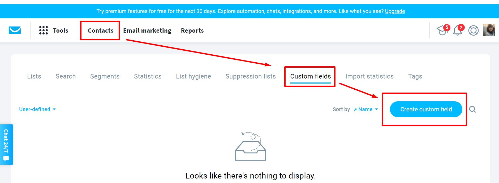
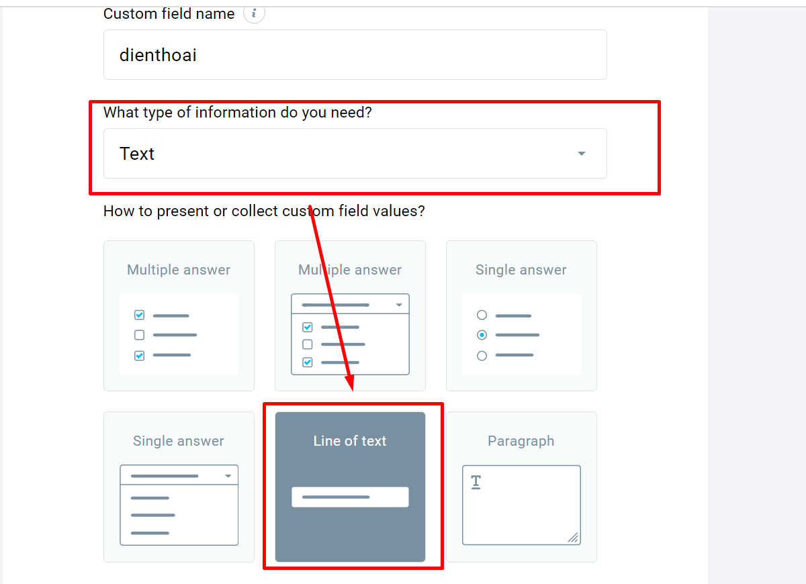
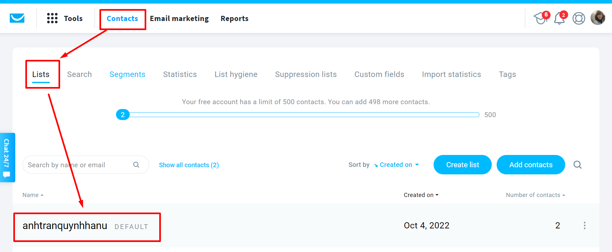

# Lưu data về GetResponse

**Bước 1: Tạo tài khoản liên kết.** 
---------------------------------------

**Cách 1 : Tạo tài khoản liên kết từ mục Cài đặt** \
Truy cập trang [builder.ladipage.com](http://builder.ladipage.com/), chọn menu **Cài đặt -> Tích hợp-> Tài khoản liên kết**. Sau đó lựa chọn Loại tài khoản là **GetResponse**

<figure><figcaption></figcaption></figure>

**Cách 2 : Tạo tài khoản liên kết từ mục Landing Pages -> Cấu hình form**

Truy cập trang [builder.ladipage.com](http://builder.ladipage.com/), chọn menu **Landing Pages -> Cấu hình form-> Tạo cấu hình form -> Form data -> Tạo tài khoản liên kết .**&#x53;au đó lựa chọn Loại tài khoản là **GetResponse**

<figure><figcaption>
Chọn Tạo cấu hình form -> Form data 
</figcaption></figure>

<figure><figcaption>
Chọn Tạo tài khoản liên kết
</figcaption></figure>

<figure><figcaption></figcaption></figure>

**Cách 3 :** Truy cập builder chỉnh sửa trang landingpage muốn lưu data về **GetResponse**, ở phần **Form đăng ký --> mục Lưu data--> bấm Thêm mới ---> chọn Tạo liên kết ->Loại tài khoản là GetResponse**.

<figure><figcaption></figcaption></figure>

**Bước 2:** Nhập đầy đủ các thông tin:

**Tên Liên kết:** là tên để phân biệt với các liên kết khác.&#x20;

**API KEY**: là api key kết nối lấy trong tài khoản GetResponse.

Ấn Thêm tài khoản để Lưu.

.png>)

**\*Cách lấy API KEY của GetResponse**

Đăng nhập tài khoản GetResponse, di chuột vào biểu tượng MENU tài khoản ở phía trên góc phải màn hình, chọn Tích hợp và API (Intergrations and API).

<figure><figcaption></figcaption></figure>

## Bước 3: **Tạo** cấu hình lưu trữ form.

Vào lại trang builder.ladipage.com, chọn menu **Landing Page**s **-> Cấu hình Form -> Tạo cấu hình form.** Bấm nút **Chọn** để sử dụng tài khoản liên kết bạn muốn dùn&#x67;**.**

<figure><figcaption></figcaption></figure>

**Kết nối các thông tin:**

.png>)

* **Tên lưu trữ**: là tên gợi nhắc cho cấu hình form này.
* **Campaign:** Bạn chọn campaign trong danh sách campaign của Getresponse mà bạn muốn data về.
* **Đồng bộ các trường thông tin:**&#x20;

Bên tay trái là các trường thông tin bạn đã tạo trên form ở landing page, bạn cần lấy Tên Lấy Dữ Liệu của các trường của LadiPage như bên dưới:

<figure><figcaption></figcaption></figure>

Bên phải là các trường thông tin bạn tạo trên GetRespons&#x65;**:** Bạn sử dụng các **trường mặc định của Getresponse, riêng trường Số điện thoại hoặc các trường  bạn tạo trên LadiPage không có trường mặc định tương ứng  trên Getresponse thì bạn cần tạo trường tùy chỉnh như sau:**

Bạn vào phần Custom fields (Trường tùy chỉnh) --> Create custom field (tạo trường tùy chỉnh).

<figure><figcaption></figcaption></figure>

<figure><figcaption></figcaption></figure>

Bạn có thể chọn **thêm tài khoản liên kết** khác cho Cấu hình này. Mỗi cấu hình được chứa tối đa 3 tài khoản liên kết, tương đương với 3 nguồn lưu trữ thông tin khách hàng đồng thời nhận được từ form đăng ký trên Landing Page.

## **Bước 4: Thiết lập Lưu data cho form**

&#x20;Quay trở lại form trên trang Landing Page, chọn toàn form bạn đang muốn cài đặt và chọn **"Lưu data":**

.png>)

## **Bước 5: Sử dụng cấu hình form**

Chọn cấu hình phù hợp trong danh sách cấu hình form đã được cài đặt ở bước 3, sau đó bấm **Cập nhật** để hoàn thành.

Data trả về Getresponse ở phần List --> bạn chọn đúng Campaign đã kết nối để kiểm tra data.

<figure><figcaption></figcaption></figure>


**Lưu ý:**

* Form đăng ký bắt buộc phải có trường Email và sử dụng trường Email mặc định của Getresponse.

