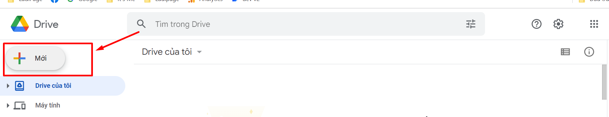
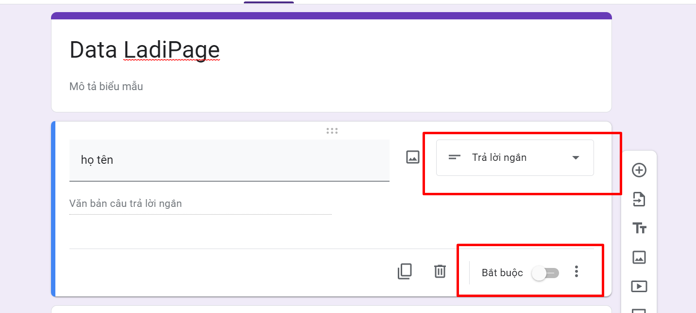
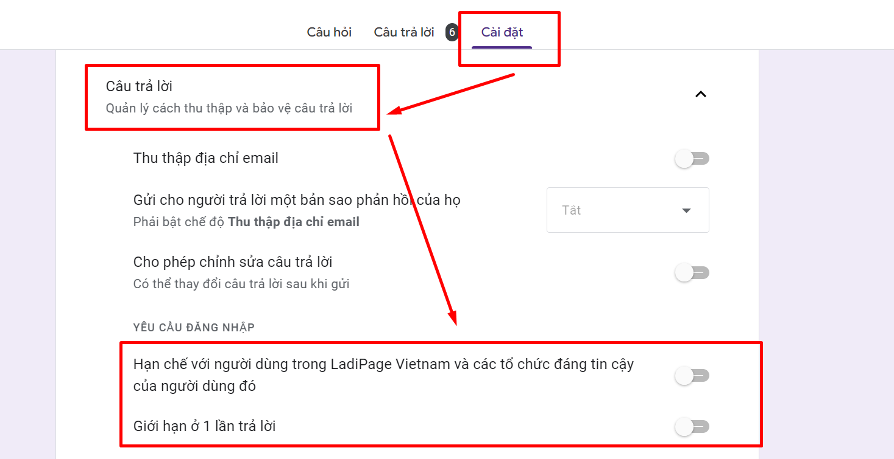
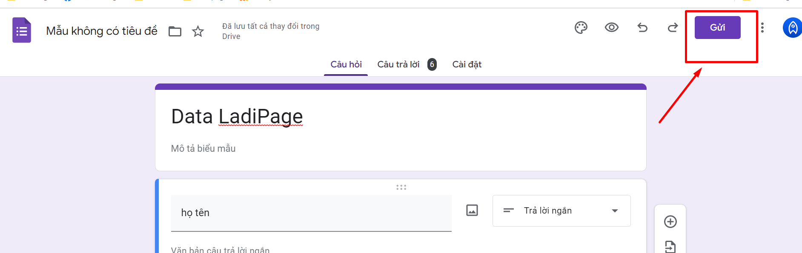
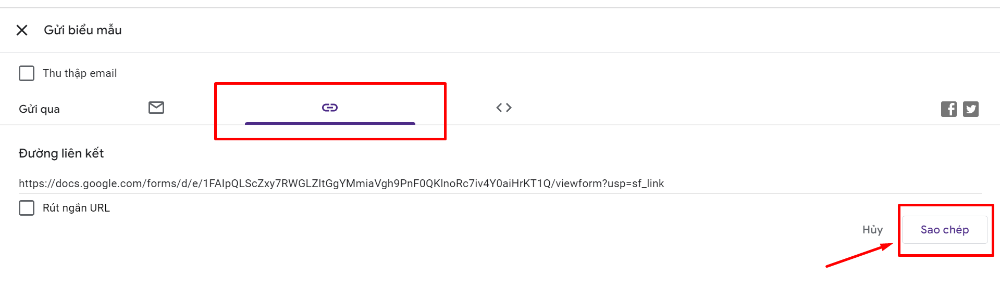
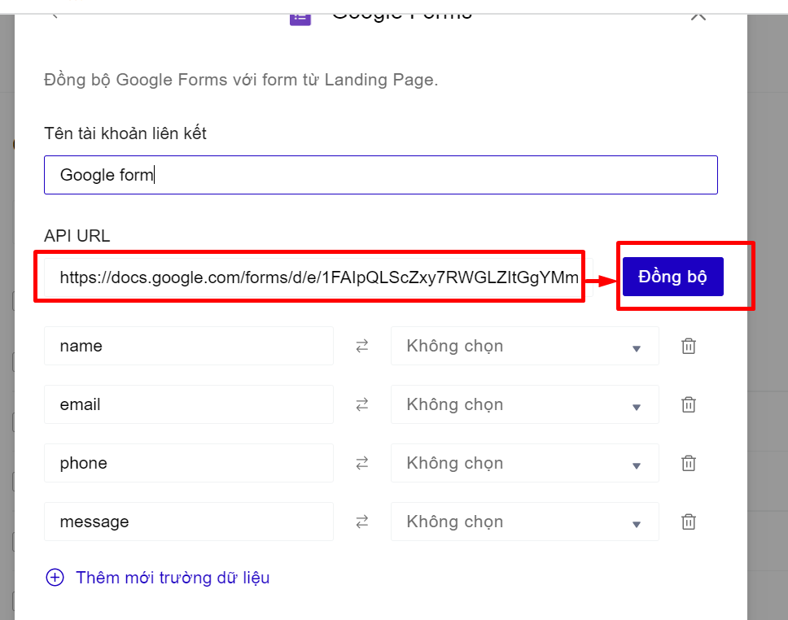
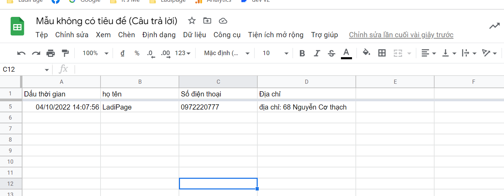

# Lưu data về Google Forms

I. **Cách tạo Google Form.**

Để tạo Google form, bạn thực hiện các thao tác sau:

Bước 1. Tạo google form: Bạn vào Drive của Gmail--> Mới -> Google biểu mẫu.

<figure><figcaption></figcaption></figure>

Bước 2: Cài đặt cho google form:

* Tất cả các câu trả lời của google form để dạng câu trả lời ngắn và không bắt buộc.

<figure><figcaption></figcaption></figure>

* Phần cài đặt của google form --> Câu trả lời --> Phần Yêu cầu đăng nhập --> Bỏ tích chọn Hạn chế như ở bên dưới.

<figure><figcaption></figcaption></figure>

* Lấy Link Google Form để tạo tài khoản liên kết tại LadiPage: Bạn vào phần Gửi --> sao chép đường dẫn của Google Form.

<figure><figcaption></figcaption></figure>

<figure><figcaption></figcaption></figure>

**II. Cấu hình form cho form đăng ký.**

## **Bước 1: Tạo tài khoản liên kết.**

**Cách 1: Tạo tài khoản liên kết từ mục Landing Pages -> Cấu hình form**

Truy cập trang [builder.ladipage.com](http://builder.ladipage.com/), chọn menu **Landing Pages -> Cấu hình form-> Tạo cấu hình form -> Form data -> Tạo tài khoản liên kết .**&#x53;au đó lựa chọn Loại tài khoản là **Google Forms**

<figure><figcaption>
Chọn Tạo cấu hình form -> Form data 
</figcaption></figure>

<figure><figcaption>
Chọn Tạo tài khoản liên kết
</figcaption></figure>

<figure><figcaption></figcaption></figure>

**Cách 2 :** Truy cập builder chỉnh sửa trang landingpage muốn lưu data về **Google Form**, ở phần **Form đăng ký --> mục Lưu data --> bấm Thêm mới  --> chọn Tạo liên kết -->Loại tài khoản là Google Form.**

<figure><figcaption></figcaption></figure>

## Bước 2: Cấu hình tài khoản liên kết.

* Nhập **Tên liên kết**: là tên gợi nhắc cho cấu hình lưu trữ này.
* Nhập API URL là đường dẫn của Google Form là đường dẫn sao chép ở phần I. Cách tạo google form. --> Bấm đồng bộ.

<figure><figcaption></figcaption></figure>

* **Đồng bộ các trường thông tin.**

Bên tay trái là các trường thông tin bạn đã tạo trên form ở landing page, bạn cần lấy Tên Lấy Dữ Liệu của các trường của LadiPage như bên dưới:

<figure><figcaption></figcaption></figure>

Bên phải là các trường thông tin bạn tạo trên Google Form

Bấm Lưu lại để tạo xong thao tác tạo cấu hình form.

Bạn có thể chọn **thêm tài khoản liên kết** khác cho Cấu hình này. Mỗi cấu hình được chứa tối đa 3 tài khoản liên kết, tương đương với 3 nguồn lưu trữ thông tin khách hàng đồng thời nhận được từ form đăng ký trên Landing Page.

## **Bước 3: Thiết lập Lưu data cho form**&#x20;

Quay trở lại form trên trang Landing Page, chọn toàn form bạn đang muốn cài đặt và chọn **"Lưu data":**

.png>)

## **Bước 4:** **Sử dụng cấu hình form**&#x20;

Chọn cấu hình phù hợp trong danh sách cấu hình form đã được cài đặt ở bước 3, sau đó bấm **Cập nhật** để hoàn thành.

Ví dụ về Data trả về Google Form:

<figure><figcaption></figcaption></figure>


**Lưu ý:**

* Tạo tài khoản liên kết Google Form sẽ ra phần cấu hình form luôn, nên danh sách tài khoản liên kết sẽ không có tài khoản liên kêt Google Form.
* Data trả về Google Form sẽ **không có Backup data** từ LadiPage, **không có trường URL** và **không có IP khách hàng** điền form.

