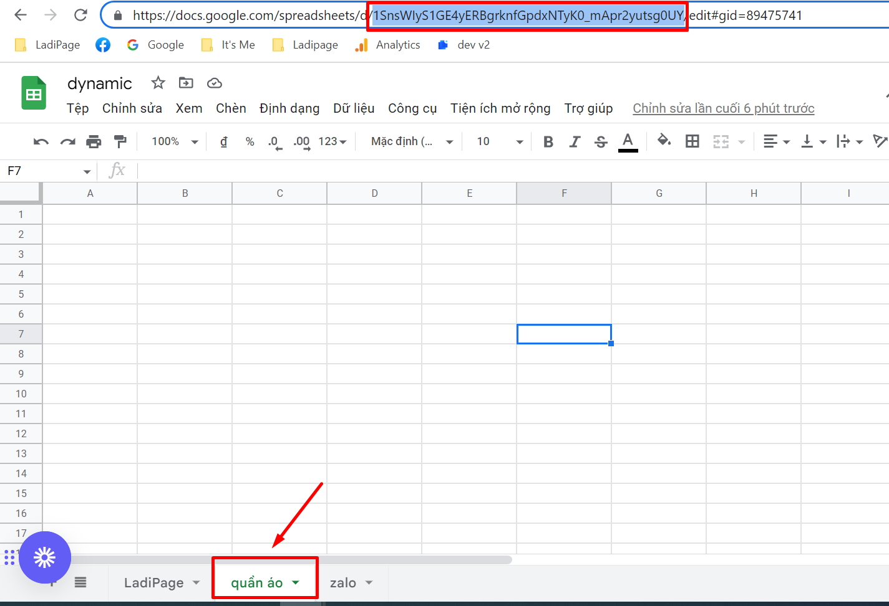
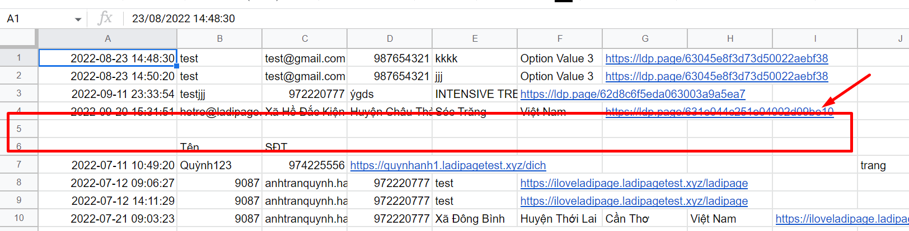
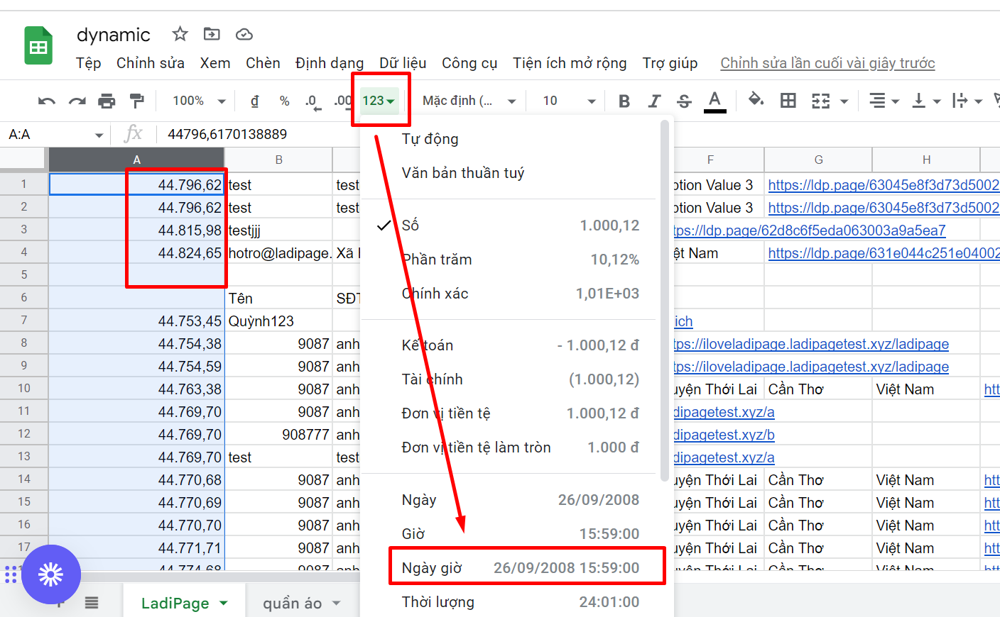
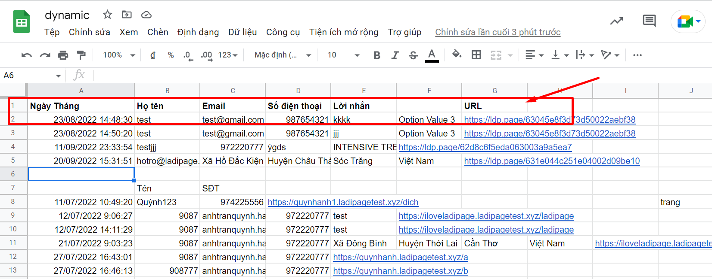

# Lưu data về Google Sheet

## **Bước 1: Tạo tài khoản liên kết.**

**Cách 1 : Tạo tài khoản liên kết từ mục Cài đặt** \
Truy cập trang [builder.ladipage.com](http://builder.ladipage.com/), chọn menu **Cài đặt -> Tích hợp-> Tài khoản liên kết**. Sau đó lựa chọn Loại tài khoản là **Google sheet**&#x20;

<figure><figcaption></figcaption></figure>

**Cách 2 : Tạo tài khoản liên kết từ mục Landing Pages -> Cấu hình form**

Truy cập trang [builder.ladipage.com](http://builder.ladipage.com/), chọn menu Landing Pages **-> Cấu hình form-> Tạo cấu hình form -> Form data -> Tạo tài khoản liên kết .**&#x53;au đó lựa chọn Loại tài khoản là **LadiFlow**

<figure><figcaption>
Chọn Tạo cấu hình form -> Form data 
</figcaption></figure>

<figure><figcaption>
Chọn Tạo tài khoản liên kết
</figcaption></figure>

<figure><figcaption></figcaption></figure>

**Cách 3 :** Truy cập builder chỉnh sửa trang landingpage muốn lưu data về **Google sheet**, ở phần **Form đăng ký--> mục Lưu data--> bấm Thêm mới ---> chọn Tạo liên kết -->Loại tài khoản là Google sheet.**

\

<figure><figcaption></figcaption></figure>

**Bước 2:** Bấm **Tiếp Tục** để hiện thị ra danh sách các tài khoản Google để kết nố&#x69;**.**



\
Chọn tài khoản muốn kết nối và **Cho phép truy cập.**




Lưu ý : Trong trường hợp bạn kết nối tài khoản google sheet lần đầu tiên, bạn cần tích chọn đầy đủ các mục trong popup thông tin hiển thị từ phía google   . Cụ thể :&#x20;




## Bước 3: **Tạo** cấu hình lưu trữ form.&#x20;

Vào lại trang builder.ladipage.com, chọn menu **Landing Pages -> Cấu hình Form -> Tạo cấu hình form.** Bấm nút **Chọn** để sử dụng tài khoản liên kết bạn muốn dùng.

<figure><figcaption></figcaption></figure>

## **Bước 4: Thiết lập Bảng tính và Trang Tính cho liên kết Google sheet.**

**Trường hợp 1:** Nếu bạn chưa tạo một bảng tính nào, thì có thể lựa chọn Tạo bảng tính, và nhập tên tùy ý. Lúc này hệ thống sẽ tự động tạo một sheet để kết nối và bạn có thể tìm thấy sheet này trong phần quản lý Drive của tài khoản Gmail.

.png>)

**Trường hợp 2:** Nếu bạn đã có sẵn một bảng tính đã tạo và muốn kết nối với bảng tính đó, bạn chọn phần "Chọn bảng tính tự nhập" và điền ID của bảng tính và chọn trang tính bạn muốn data đổ về.



ID của bảng tính có thể tìm thấy trên đường dẫn như ví dụ trong hình dưới đây, và ví dụ bạn muốn lưu data về trang tính "quần áo" thì ở phần chọn trang tính ở trên bạn sẽ chọn đúng trang tính "quần áo"

<figure><figcaption></figcaption></figure>


1. LadiPage hỗ trợ lưu tracking các dữ liệu liên quan đến quảng cáo, thiết bị hệ điều hành đã sử dụng submit dữ liệu : user-agent, fbc, fbp, event-id&#x20;

Bạn bật tính năng Lưu dữ liệu tracking và các trường dữ liệu tracking sẽ về kênh lưu trữ&#x20;

2.  Thứ tự gửi dữ liệu về kênh lưu trữ : dữ liệu tracking sẽ về sau cột IP và ID\_Form submit dữ liệu, theo thứ tự  user-agent, fbc, fbp, event-id&#x20;



<figure><figcaption></figcaption></figure>

Nhập **Tên cấu hình** để lưu lại cấu hình form vừa tạo và bấm nút **Hoàn tất.**

Bạn có thể chọn **thêm tài khoản liên kết** khác cho Cấu hình này. Mỗi cấu hình được chứa tối đa 3 tài khoản liên kết, tương đương với 3 nguồn lưu trữ thông tin khách hàng đồng thời nhận được từ form đăng ký trên Landing Page.

## **Bước 5: Thiết lập Lưu data cho form**

Quay trở lại form trên trang Landing Page, chọn toàn form bạn đang muốn cài đặt và chọn **"Lưu data":**

<figure><figcaption></figcaption></figure>

## **Bước 6:Sử dụng cấu hình form**

Chọn cấu hình phù hợp trong danh sách cấu hình form đã được cài đặt ở bước 3, sau đó bấm **Cập nhật** để hoàn thành.

Data trả về Google sheet sẽ có các thông tin:

* Thời gian data đăng ký thành công: Cột data này là mặc định LadiPage trả về, và ở cột đầu tiên của trang tính.
* Các trường form đăng ký.
* Ngay sau cột các trường của form là URL trang landing page.
* IP khách hàng sau 5 cột sheet so với URL trang landing page.

<figure><figcaption></figcaption></figure>

Nếu bạn muốn thay đổi thứ tự các cột trả về sheet, bạn có thể tùy chỉnh vị trí phần tử của trường trên form đăng ký.

<figure><figcaption></figcaption></figure>


**Lưu ý:**&#x20;

* Tên trang tính không để dấu cách trước và sau tên.

Ví dụ  tên sai: " quần áo "  tên đúng: "quần áo"

* Nếu bạn thay đổi tên trang tính hoặc tên bảng tính bạn cần liên kết lại để đảm bảo kết nối cấu hình form với google sheet trước đó.
* Trên sheet không để hàng trống, nếu có hàng trống thì data sẽ trả lên trước hàng trống đó.&#x20;


<figure><figcaption></figcaption></figure>


* Nếu cột thời gian trên sheet bị dạng số, không phải ngày/ tháng/ năm, bạn kiểm tra lại định dạng của sheet đang sử dụng và chuyển về định dạng đúng như bên dưới.


<figure><figcaption></figcaption></figure>


LadiPage sẽ chỉ trả data về trang tính, vì vậy để theo dõi data được thuận tiện, bạn nên thêm hàng tiêu đề cho các cột của data.


<figure><figcaption></figcaption></figure>
