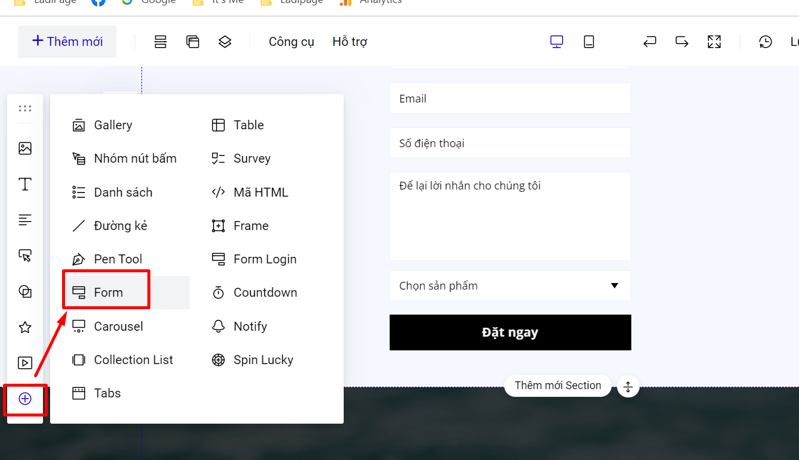
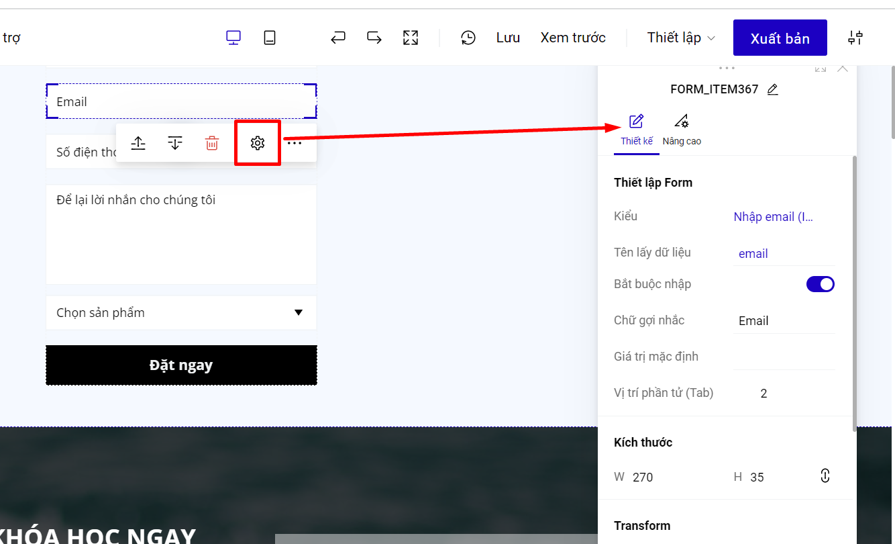

# 2. Cài đặt chung cho Form

## Tạo form đăng ký.

Để tạo form, bạn vào phần **Thêm mới- Phần tử** và chọn Form:

.png>)

Hoặc bạn tạo form từ thanh công cụ nhanh:

<figure><figcaption></figcaption></figure>

## Thêm trường dữ liệu cho form&#x20;

Một form đăng ký sẽ gồm nhiều trường thông tin, bạn hoàn toàn có thể thêm bớt các trường thông tin này trong thiết lập của form. Khi bắt đầu thêm, form đăng ký mẫu hiện ra với những trường cơ bản, sau đó bạn chọn thêm trường để sử dụng các trường khác bạn muốn.&#x20;

Nếu bạn tạo nhóm form với các phần tử khác, bạn bấm chuột trái 2-3 lần để chọn đúng form đăng ký nhé.

.png>)

## Thiết lập cho từng trường của Form

Đối với mỗi một trường thông tin, bạn có thể tuỳ chỉnh Xoá, Sửa chữ, hoặc cài đặt để người truy cập Bắt buộc nhập hay khôn&#x67;**.** Bạn chọn vào từng trường thông tin muốn chỉnh sửa, chọn biểu tượng Thiết lập.

<figure><figcaption></figcaption></figure>

**Tên lấy dữ liệu:** dùng để kết nối trường của form LadiPage và các nền tảng khác. Một số trường sẽ sử dụng tên lấy dữ liệu mặc định, và không thể thay đổi.&#x20;

Dưới đây là các trường không thể thay đổi tên lấy dữ liệu.

<figure><figcaption></figcaption></figure>

**Chữ gợi nhắc:** là phần hiển thị gợi ý tên trường của form, khi khách hàng bấm vào trường để điền thông tin, thì chữ gợi nhắc này sẽ thay thế bằng nội dung khách hàng điền.

**Giá trị mặc định:** là giá trị nhập sẵn trong form trường hợp bạn muốn khách điền thông tin theo giá trị đó, giá trị này khách hàng có thể xóa đi nhập giá trị khác.

**Vị trí phần tử:** là thứ tự trả về kênh lưu trữ của trường so với các trường còn lại của form. Vị trí phần tử không được quá số trường trên form đăng ký.

## Thiết lập chung cho Form

Bạn có thể thiết lập cho toàn form đăng ký bằng cách vào phần thiết lập của form--> Thiết kế.

<figure><figcaption></figcaption></figure>

* Tùy chỉnh căn chỉnh cho các trường của form.
* Thiết lập chữ: Thiết lập cho toàn bộ form theo 1 font chữ, màu chữ và cỡ chữ, không thể thiết lập riêng font chữ và cỡ chữ cho 1 trường của form.
* Đổ màu nền cho trường của form.
* Bo góc cho form đăng ký.

Những thông tin khách hàng thu thập được từ form sẽ được chuyển thẳng về các kênh lưu trữ của bạn, LadiPage cam kết không lưu những thông tin này của bạn. Xem tiếp các bước cài đặt lưu thông tin từ form tại đây:&#x20;


[cac-buoc-cai-dat-luu-data](../cac-buoc-cai-dat-luu-data/)


